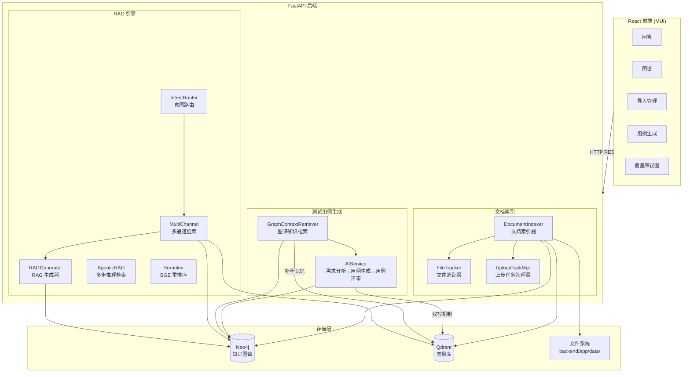
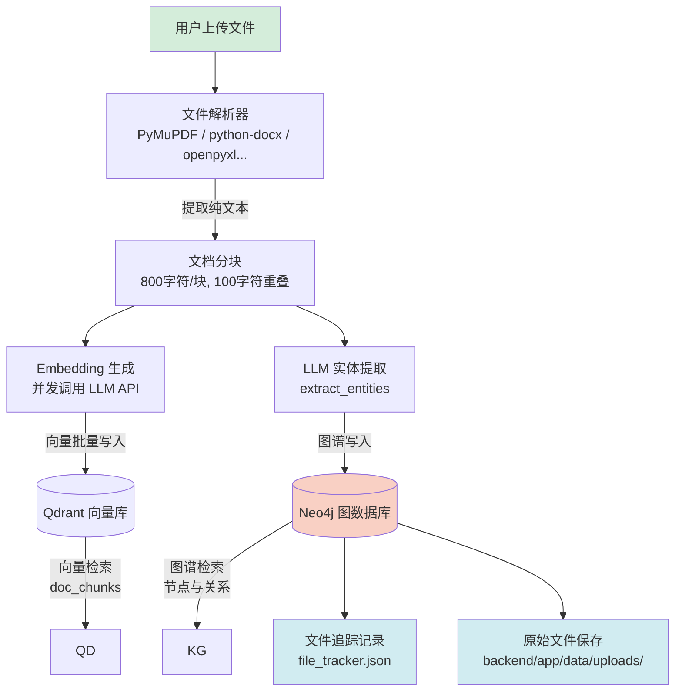
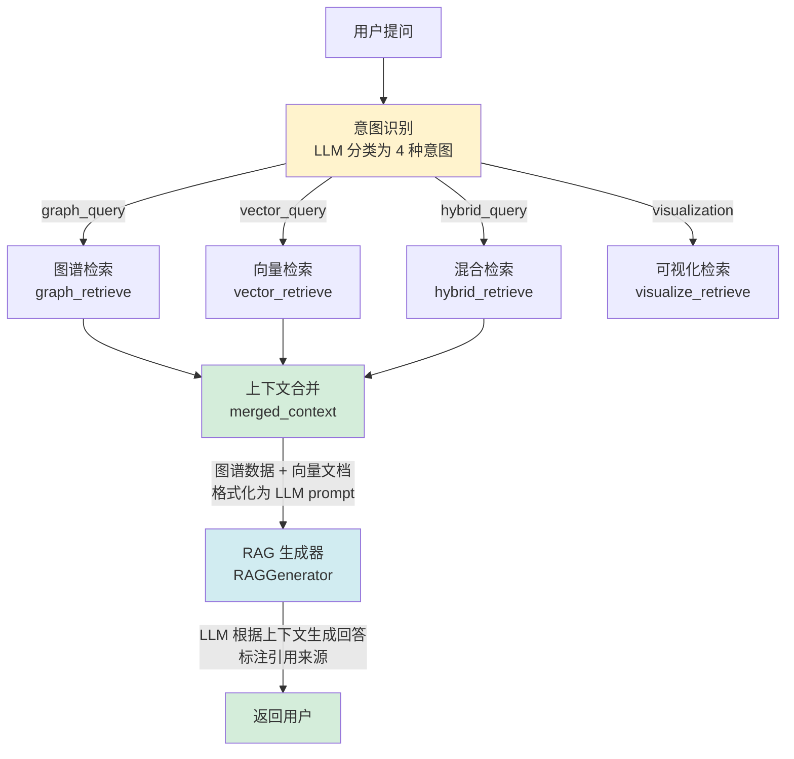
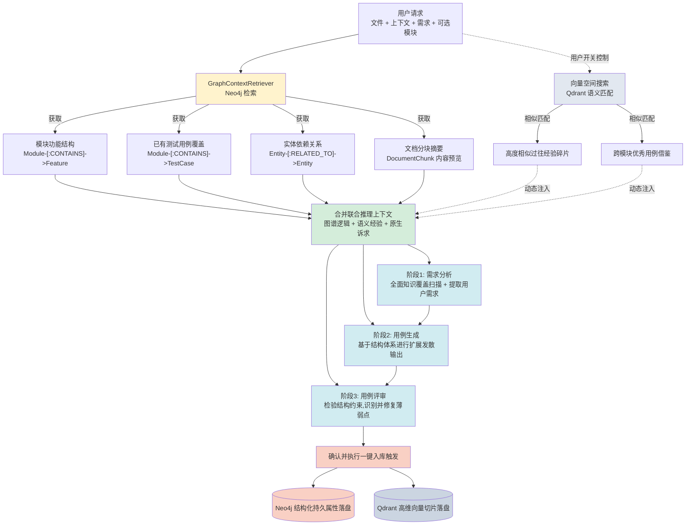

# OpenMelon 操作手册

完整的系统架构、环境配置、功能使用、API 参考和运维指南。

---

## 0. 新手先看这个

如果你不想先看架构，只想先把系统用起来，请直接照下面两种方式之一操作。

### 0.1 最短上手路径（本机开发 / uv）

```bash
cp .env.example .env
# 至少填写：
# LLM_PROVIDER=qwen
# API_KEY=你的大模型密钥

docker compose up -d neo4j
cd backend
uv sync
uvicorn app.main:app --reload --host 0.0.0.0 --port 8000
```

如果你更习惯分终端操作，可以直接用下面这组命令：

```bash
# 终端 1：依赖服务
cd OpenMelon
docker compose up -d neo4j

# 如果启用了外部向量库，再执行：
docker compose up -d qdrant

# 终端 2：后端
cd OpenMelon/backend
uv sync
uvicorn app.main:app --reload --host 0.0.0.0 --port 8000

# 终端 3：前端
cd OpenMelon/frontend
npm install
npm run dev
```

新开一个终端：

```bash
cd frontend
npm install
npm run dev
```

打开：

- 前端：`http://localhost:3000`
- API 文档：`http://localhost:8000/docs`
- Neo4j：`http://localhost:7474`

### 0.2 最短上手路径（Docker 开发模式）

```bash
cp .env.example .env
# 至少填写：
# LLM_PROVIDER=qwen
# API_KEY=你的大模型密钥

docker compose build app
docker compose -f docker-compose.yml -f docker-compose.dev.yml up -d
docker compose logs -f app
```

开发模式会把本地 `backend/app`、`backend/config` 挂载进容器，并启用后端热更新。
前端仍建议在本机执行 `npm run dev`，这样热更新和调试体验更好。

### 0.3 第一次进入系统先做什么

1. 进「导入管理」上传一个文档
2. 等待状态变成“已索引”
3. 进「问答」页面直接提问
4. 进「图谱总览」看自动生成的关系图
5. 进「测试用例生成」体验 AI 生成用例

### 0.4 最少要懂的 5 件事

| 你关心的问题 | 结论 |
|------|------|
| 没有文档能不能问答？ | 可以打开页面，但几乎没有知识可查，建议先上传文档 |
| `.env` 至少要填什么？ | 最少填 `LLM_PROVIDER` 和 `API_KEY` |
| 一定要用 Qdrant 吗？ | 不一定。默认不开启外部向量库；开启后才会使用 Qdrant |
| 启动后先看哪里确认正常？ | 先看 `http://localhost:8000/docs` 和 `http://localhost:3000` 能不能打开 |
| 高频改后端时该用什么？ | 优先用 `docker compose -f docker-compose.yml -f docker-compose.dev.yml up -d` 或本机 `uvicorn --reload` |

### 0.5 启动成功检查清单

| 检查项 | 正常表现 |
|------|------|
| 后端 | 日志出现 `OpenMelon 服务启动完成` |
| 前端 | 浏览器能打开 `http://localhost:3000` |
| Neo4j | `http://localhost:7474` 能登录 |
| 索引能力 | 上传文件后状态能变成 `completed` 或页面显示“已索引” |
| 问答能力 | 在「问答」页面输入问题后能返回答案 |

## 目录

0. [新手先看这个](#0-新手先看这个)
1. [系统架构与数据流](#1-系统架构与数据流)
2. [安装与启动](#2-安装与启动)
3. [环境配置详解](#3-环境配置详解)
4. [文档索引](#4-文档索引)
5. [智能问答](#5-智能问答)
6. [图谱可视化](#6-图谱可视化)
7. [测试用例生成](#7-测试用例生成)
   7.6 [Prompt & Skill Hub 管理](#76-prompt--skill-hub-管理)
   7.7 [模板与技能编写规范](#77-模板与技能编写规范)
8. [覆盖率分析](#8-覆盖率分析)
9. [导入管理](#9-导入管理)
10. [会话管理](#10-会话管理)
11. [节点类型配置](#11-节点类型配置)
12. [系统监控与日志](#12-系统监控与日志)
13. [故障排查](#13-故障排查)
14. [数据维护与清理](#14-数据维护与清理)

---

## 1. 系统架构与数据流

### 1.1 整体架构

> 说明：图中的 `Qdrant` 是**可选外部向量库**。默认不开启；只有在 `.env` 设置 `USE_EXTERNAL_VECTOR=true` 后才会参与文档向量检索。



### 1.2 写入流：文档索引

上传文件后，系统自动完成以下处理流水线：



**处理步骤说明**：

| 步骤 | 说明 |
|------|------|
| 文件解析 | 根据文件格式调用对应解析器，提取纯文本内容 |
| 文档分块 | 将文本按 800 字符切分，相邻块重叠 100 字符防止语义断裂 |
| Embedding | 并发调用 LLM API 为每个分块生成向量表示 |
| 向量写入 | 批量写入专用向量库 Qdrant 的 `doc_chunks` 集合集合中 |
| 实体提取 | LLM 从文本中识别实体（模块、功能、接口、人员等） |
| 图谱构建 | 在 Neo4j 中创建实体节点和 `RELATED_TO` 关系 |
| 文件追踪 | 记录到 `file_tracker.json`，包含文件名、类型、分块数、时间 |

### 1.3 读取流：智能问答



### 1.4 四种意图详解

| 意图 | 触发时机 | 检索方式 | 典型问题 |
|------|---------|---------|---------|
| `graph_query` | 问实体属性、关系 | 图谱子图查询 | "登录模块包含哪些功能？" |
| `vector_query` | 问概念、流程、方法 | 向量相似度搜索 | "如何实现用户注册？" |
| `hybrid_query` | 问影响分析、覆盖率 | 图谱 + 向量合并 | "修改订单状态会影响什么？" |
| `visualization` | 要求画图、关系图 | 图谱全图/子图 | "画出用户管理的结构图" |

### 1.5 测试用例生成流（图谱与向量联合驱动）



---

## 2. 安装与启动

### 2.1 Docker 方式

#### 2.1.1 Docker 开发模式（推荐后端开发）

```bash
# 1. 配置环境变量
cp .env.example .env
# 编辑 .env，设置 LLM_PROVIDER 和 API_KEY

# 2. 首次构建应用镜像
docker compose build app

# 3. 使用开发覆盖配置启动
docker compose -f docker-compose.yml -f docker-compose.dev.yml up -d

# 4. 查看应用日志
docker compose logs -f app
```

> 开发模式会挂载本地 `backend/app`、`backend/config`，并在容器内使用 `uvicorn --reload` 启动。
> 日常修改后端代码时通常不需要 rebuild；只有 `backend/pyproject.toml` 或 `uv.lock` 变更时，才需要重新执行 `docker compose build app`。
> 如果你要启用外部向量库，请同时启动 `qdrant`，并在 `.env` 中设置 `USE_EXTERNAL_VECTOR=true`。
>
> ```bash
> docker compose up -d qdrant
> ```

#### 2.1.2 Docker 生产模式

```bash
# 1. 配置环境变量
cp .env.example .env

# 2. 全量启动
docker compose up -d

# 3. 查看应用日志
docker compose logs -f app
```

> 生产模式不挂载本地源码，容器运行的是后端镜像内代码。
> 当前 Docker 镜像不再包含前端静态资源，前端需要独立开发或独立部署。
> 修改了 `backend/app`、`backend/config` 或 `backend/pyproject.toml` 后，需要重新 build 并在开发态重建后端容器。
>
> ```bash
> docker compose build app
> docker compose up -d --force-recreate app
> ```

**Neo4j 容器配置**：

| 配置项 | 值 | 说明 |
|--------|-----|------|
| 镜像版本 | `neo4j:5.15.0` | 包含 APOC 和 GDS 插件 |
| 页缓存 | 512M | 图数据缓存 |
| 堆内存 | 1G | JVM 堆上限 |
| 健康检查 | 30s 启动等待 + 10s 间隔 | 确保数据库就绪后应用才启动 |
| 数据持久化 | `neo4j_data` / `neo4j_logs` 卷 | 容器重启不丢失数据 |

### 2.2 本地开发（uv）

```bash
# 先启动 Neo4j
docker compose up -d neo4j

# 终端 1: 启动后端
conda activate openmlon
cd backend
uvicorn app.main:app --reload --host 0.0.0.0 --port 8000

# 终端 2: 启动前端
cd frontend && npm install && npm run dev
# 访问 http://localhost:3000，API 请求自动代理到 8000
```

> 如果后端 `.env` 开启了 `USE_EXTERNAL_VECTOR=true`，本地开发前还要执行 `docker compose up -d qdrant`。

#### 2.2.1 三终端启动顺序

```bash
# 终端 1：依赖服务（项目根目录）
docker compose up -d neo4j

# 可选：启用外部向量库时再执行
docker compose up -d qdrant

# 终端 2：后端
cd backend
uv sync
uvicorn app.main:app --reload --host 0.0.0.0 --port 8000

# 终端 3：前端
cd frontend
npm install
npm run dev
```

### 2.3 前后端独立部署

```bash
# 终端 1：后端
cd backend
uvicorn app.main:app --host 0.0.0.0 --port 8000

# 终端 2：前端
cd frontend
cp .env.production.example .env.production
npm run build
```

> 前端构建产物默认在 `frontend/dist/`，建议单独交给静态站点或 Nginx 部署。
> 如果你是在本机联调，也可以继续直接执行 `npm run dev`。
> 如果前端需要连接独立域名的后端，请在 `frontend/.env.production` 中设置 `VITE_API_BASE_URL`。完整示例见 [docs/FRONTEND_DEPLOYMENT.md](/Users/xiabo/SoftwareTest/CarbonPy/OpenMelon/docs/FRONTEND_DEPLOYMENT.md)。
> Nginx 可直接参考 [deploy/nginx/openmelon-frontend.conf](/Users/xiabo/SoftwareTest/CarbonPy/OpenMelon/deploy/nginx/openmelon-frontend.conf)。

### 2.4 停止服务

```bash
# 后端: Ctrl+C（最多等 5 秒后强制退出）
# Neo4j:
docker compose down
```

### 2.5 选型建议

| 场景 | 推荐方式 |
|------|------|
| 高频改后端代码 | `docker compose -f docker-compose.yml -f docker-compose.dev.yml up -d` |
| 本机调试 Python 环境 | `cd backend && uvicorn app.main:app --reload --host 0.0.0.0 --port 8000` |
| 接近部署环境验证 | `docker compose up -d`（后端） + 前端独立构建部署 |

---

## 3. 环境配置详解

所有配置通过 `.env` 文件管理，修改后需重启后端生效。完整配置模板见 [.env.example](.env.example)。

### 3.1 OpenMelon 主模块 LLM 配置（必填）

| 变量 | 必填 | 默认值 | 说明 |
|------|------|--------|------|
| `LLM_PROVIDER` | 否 | `openai_compat` | 可选: `openai_compat` / `openai` / `qwen` / `deepseek` / `mimo` |
| `API_KEY` | **是** | — | LLM API 密钥 |
| `API_BASE_URL` | 否 | 按 Provider 自动填充 | 留空即可，除非需要自定义网关 |
| `CHAT_MODEL` | 否 | 按 Provider 自动填充 | 对话模型名称 |
| `EMBEDDING_MODEL` | 否 | 按 Provider 自动填充 | 嵌入模型名称 |
| `EMBEDDING_DIM` | 否 | 按 Provider 自动填充 | 向量维度（本项目建议统一 1024） |

**主模块决策树（问答/检索/索引）**：

```text
开始
 └─ 读取 LLM_PROVIDER
     ├─ 若是别名（openai-compatible / openai_compatible）
     │    └─ 映射为 openai_compat
     └─ 得到最终 provider（openai_compat / openai / qwen / deepseek / mimo）

然后分别判断这 4 项：API_BASE_URL / CHAT_MODEL / EMBEDDING_MODEL / EMBEDDING_DIM
 ├─ .env 里有显式值？ -> 用显式值
 └─ 没填（空）？      -> 用 provider 默认值
```

一句话：**手填优先，未填写才用 Provider 默认值**。

**新手建议**：

- 第一次部署优先选 `qwen` 或 `openai_compat`
- 如果选 `deepseek` / `mimo`，问答可以正常用，但文档索引依赖 Embedding，建议额外明确配置 `EMBEDDING_MODEL` 和 `EMBEDDING_DIM`

**自动填充规则**：

| LLM_PROVIDER | API_BASE_URL | CHAT_MODEL | EMBEDDING_MODEL | EMBEDDING_DIM |
|-------------|-------------|------------|-----------------|---------------|
| `openai_compat` | `https://one-api.miotech.com/v1` | qwen-plus | text-embedding-v3 | 1024 |
| `openai` | `https://api.openai.com/v1` | gpt-4o-mini | text-embedding-3-small | 1024（通过 dimensions 统一） |
| `qwen` | `https://dashscope.aliyuncs.com/compatible-mode/v1` | qwen-plus | text-embedding-v3 | 1024 |
| `deepseek` | `https://api.deepseek.com/v1` | deepseek-chat | — | — |
| `mimo` | `https://open.mimo.work/v1` | mimo-v2-flash | — | — |

### 3.2 Neo4j 配置

| 变量 | 默认值 | 说明 |
|------|--------|------|
| `NEO4J_URI` | `neo4j://localhost:7687` | 连接地址 |
| `NEO4J_USER` | `neo4j` | 用户名 |
| `NEO4J_PASSWORD` | `password` | 密码 |
| `NEO4J_DATABASE` | `neo4j` | 数据库名 |

### 3.3 外部向量库配置（可选）

默认情况下，系统**不会强制使用 Qdrant**。只有在你明确开启下面配置后，后端才会把文档向量写入 Qdrant 并优先从外部向量库检索。

| 变量 | 默认值 | 说明 |
|------|--------|------|
| `USE_EXTERNAL_VECTOR` | `false` | 是否启用外部向量库 |
| `VECTOR_PROVIDER` | `qdrant` | 当前支持 `qdrant` |
| `QDRANT_HOST` | `localhost` | Qdrant 地址 |
| `QDRANT_PORT` | `6333` | Qdrant HTTP 端口 |
| `QDRANT_API_KEY` | 空 | 如你的 Qdrant 开启认证则填写 |
| `VECTOR_FALLBACK_TO_NEO4J` | `true` | 外部检索失败时是否自动降级 |

**什么时候需要开启**：

- 文档量很大，想把向量检索能力从图数据库分离出去
- 已经准备好独立的 Qdrant 服务
- 希望后续方便管理和清理向量集合

### 3.4 检索参数

| 变量 | 默认值 | 说明 |
|------|--------|------|
| `RETRIEVAL_TOP_K` | `5` | 向量检索返回的 Top-K 结果数 |
| `RETRIEVAL_DEPTH` | `2` | 图谱检索深度（度关系数） |
| `RERANKER_TOP_K` | `5` | Reranker 重排后返回的 Top-K |
| `RERANKER_SCORE_THRESHOLD` | `0.3` | Reranker 最低评分阈值 |
| `HYBRID_GRAPH_WEIGHT` | `0.4` | 混合检索中图谱权重（建议与向量之和为 1.0） |
| `HYBRID_VECTOR_WEIGHT` | `0.6` | 混合检索中向量权重 |

### 3.5 生成参数

| 变量 | 默认值 | 说明 |
|------|--------|------|
| `GENERATION_TEMPERATURE` | `0.3` | LLM 生成温度（0-2，越高越随机） |
| `GENERATION_MAX_TOKENS` | `2000` | LLM 最大生成 token 数 |
| `AGENTIC_MAX_STEPS` | `3` | Agentic 模式最大迭代次数 |
| `AGENTIC_CONFIDENCE_THRESHOLD` | `0.7` | 答案充分性评估阈值（0-1） |
| `INTENT_CONFIDENCE_THRESHOLD` | `0.5` | 意图分类置信度阈值 |

### 3.6 BGE Reranker

| 变量 | 默认值 | 说明 |
|------|--------|------|
| `USE_RERANKER` | `true` | 设为 `false` 可禁用 |
| `RERANKER_MODEL_NAME` | `BAAI/bge-reranker-v2-m3` | 支持中英文 |
| `RERANKER_DEVICE` | `cpu` | 可选 `cuda`（需 GPU） |

> Reranker 仅影响 `vector_query` 和 `hybrid_query` 两种意图。加载失败时自动降级为无重排模式。

### 3.7 testcase_gen 独立 LLM 配置

测试用例生成模块默认使用统一的 `API_KEY`。如需独立配置（例如视觉和文本使用不同模型）：

| 优先级 | 变量 | 使用场景 |
|--------|------|---------|
| 最高 | `CUSTOM_API_KEY` + `CUSTOM_BASE_URL` + `CUSTOM_MODEL_NAME` | 统一自定义模型 |
| 次之 | `QWEN_API_KEY` + `QWEN_MODEL_NAME` | 视觉模型（图像分析） |
| 第三 | `DEEPSEEK_API_KEY` + `DEEPSEEK_MODEL_NAME` | 文本模型（用例编写） |
| 兜底 | `API_KEY` | 与 OpenMelon 主模块共用 |

**testcase_gen 决策树（分视觉/文本两条链路）**：

```text
视觉链路（图片/PDF 理解）：
CUSTOM_API_KEY 有吗？
 ├─ 有 -> 用 CUSTOM_API_KEY + CUSTOM_BASE_URL + CUSTOM_MODEL_NAME
 └─ 没有 ->
      QWEN_API_KEY 有吗？
       ├─ 有 -> 用 QWEN_API_KEY + QWEN_BASE_URL + QWEN_MODEL_NAME
       └─ 没有 -> 回退到主模块统一 API_KEY/API_BASE_URL

文本链路（生成/评审用例）：
CUSTOM_API_KEY 有吗？
 ├─ 有 -> 用 CUSTOM_API_KEY + CUSTOM_BASE_URL + CUSTOM_MODEL_NAME
 └─ 没有 ->
      DEEPSEEK_API_KEY 有吗？
       ├─ 有 -> 用 DEEPSEEK_API_KEY + DEEPSEEK_BASE_URL + DEEPSEEK_MODEL_NAME
       └─ 没有 -> 回退到主模块统一 API_KEY/API_BASE_URL
```

一句话：**CUSTOM >（视觉走 QWEN / 文本走 DEEPSEEK）> 主模块统一配置**。

**示例：使用 SiliconFlow 网关**
```env
CUSTOM_API_KEY=sk-siliconflow-key
CUSTOM_BASE_URL=https://api.siliconflow.cn/v1
CUSTOM_MODEL_NAME=deepseek-ai/DeepSeek-V3
```

### 3.8 如何快速判断当前命中哪个模型（推荐）

只要做下面 2 步，就能快速确认当前生效配置。

**步骤 1：看 `.env`（静态配置）**

重点看这些字段：

- 主模块：`LLM_PROVIDER`、`CHAT_MODEL`、`EMBEDDING_MODEL`、`EMBEDDING_DIM`
- testcase_gen：`CUSTOM_*`、`QWEN_*`、`DEEPSEEK_*`

快速判断：

- 如果 `CUSTOM_API_KEY` 非空：testcase_gen 视觉/文本都优先走 `CUSTOM_*`
- 如果 `CUSTOM_API_KEY` 为空：
  - 视觉链路优先看 `QWEN_API_KEY`
  - 文本链路优先看 `DEEPSEEK_API_KEY`
- 主模块始终按 `LLM_PROVIDER +（手填优先）` 规则生效

**步骤 2：看启动日志（运行时结果）**

后端启动后检查日志是否出现以下信息：

```text
LLM Provider: ...
Embedding 自检: model=..., dim=..., dimensions_enforced=...
```

解释：

- `LLM Provider`：主模块当前实际命中的 Provider
- `Embedding 自检.model`：当前实际 Embedding 模型
- `Embedding 自检.dim`：当前向量维度目标值
- `dimensions_enforced=True`：`text-embedding-3*` 已按 `EMBEDDING_DIM` 强制统一维度
- `dimensions_enforced=False`：当前模型不走该参数（如 BGE），但仍会按模型自身维度执行

> 建议：每次改模型配置后都重启一次后端，并核对这两行日志，避免“以为改了但没生效”。

### 3.9 企业通知 Webhook

| 变量 | 说明 |
|------|------|
| `DINGTALK_WEBHOOK` | 钉钉机器人 Webhook URL |
| `DINGTALK_SECRET` | 钉钉加签密钥（可选） |
| `FEISHU_WEBHOOK` | 飞书机器人 Webhook URL |
| `WECOM_WEBHOOK` | 企微机器人 Webhook URL |

推送 API：
```bash
curl -X POST "http://localhost:8000/api/webhook/dingtalk" \
  -H "Content-Type: application/json" \
  -d '{"question": "问题内容", "answer": "回答内容"}'
```

### 3.10 请求限流

| 变量 | 默认值 | 说明 |
|------|--------|------|
| `RATE_LIMIT_RPM` | `60` | 每分钟最大请求数 |
| `RATE_LIMIT_BURST` | `10` | 突发容量（令牌桶算法） |

超限请求返回 HTTP 429。

---

## 4. 文档索引

### 4.1 支持的文件格式（16 种）

| 类型 | 格式 | 解析器 |
|------|------|--------|
| PDF | `.pdf` | PyMuPDF (fitz) |
| Word | `.docx`, `.doc` | python-docx |
| Excel | `.xlsx` | openpyxl |
| Excel 97 | `.xls` | xlrd |
| XMind | `.xmind` | xmind |
| PPT | `.pptx` | python-pptx |
| 文本 | `.md`, `.txt`, `.rst` | 直接读取 |
| 数据 | `.csv`, `.json`, `.yaml`, `.xml` | 对应解析器 |
| 网页 | `.html`, `.htm` | BeautifulSoup |
| 电子书 | `.epub` | zipfile + xml.etree |

### 4.2 上传方式

**前端上传**（推荐）：
1. 进入「导入管理」页面
2. 选择上传模式（单文件/文件夹）
3. 拖拽或点击选择文件
4. 可选填文档类型和模块名
5. 点击「开始导入」

**API 上传**：
```bash
# 上传文件，返回 task_id
curl -X POST "http://localhost:8000/api/upload/async" \
  -F "files=@document.pdf" \
  -F "doc_type=需求文档" \
  -F "module=用户管理"

# 查询处理进度
curl "http://localhost:8000/api/upload/status/{task_id}"

# 查看所有任务
curl "http://localhost:8000/api/upload/tasks"

# 查询支持的文件格式
curl "http://localhost:8000/api/upload/formats"
```

任务状态：`pending` → `processing` → `completed` / `failed`

### 4.3 重新索引

在「导入管理」中点击文件行的「重新索引」按钮，系统从 `backend/app/data/uploads/` 读取原始文件重新执行完整索引流程。旧数据通过 MERGE 方式更新。

### 4.4 删除文件

- 单条删除：点击文件行的「删除」按钮
- 批量删除：勾选多个文件后点击「批量删除」
- 删除操作清理 file_tracker 记录，但不删除 Neo4j 数据和原始文件

---

## 5. 智能问答

### 5.1 使用方式

在问答页面底部输入框输入问题，按 Enter 或点击发送。系统自动执行：

```
用户提问 → 意图识别 → 实体提取 → 多通道检索 → 上下文合并 → LLM 生成回答
```

### 5.2 三种检索方式

**图谱检索 (graph_query)**
- 适用：问实体属性和关系（"XX 有哪些功能"、"XX 的参数是什么"）
- 原理：在 Neo4j 中查找匹配节点及其关系网络
- 返回：实体属性 + 关系结构

**向量检索 (vector_query)**
- 适用：问概念、流程、方法（"如何实现"、"设计思路"、"最佳实践"）
- 原理：将问题转为向量，在向量索引中搜索最相似的文档块
- 返回：相关文档片段（按相似度排序，经 Reranker 重排后返回）

**混合检索 (hybrid_query)**
- 适用：需要结构化 + 内容的问题（"影响范围"、"覆盖率"）
- 原理：同时执行图谱和向量检索，按权重合并结果

### 5.3 Agentic RAG 多步推理

通过 API 参数 `use_agentic=true` 启用，适合复杂问题：

```bash
curl -X POST "http://localhost:8000/api/query?use_agentic=true" \
  -H "Content-Type: application/json" \
  -d '{"question": "修改数据审核流程会对哪些模块产生影响？"}'
```

**工作流程**：
1. 使用原始问题进行初始向量检索
2. LLM 评估已检索内容的充分性（打分 0-1）
3. 分数 ≥ 0.7 → 直接生成回答
4. 分数 < 0.7 → LLM 改写查询，重新检索（最多 3 轮）
5. 基于所有累积上下文生成最终回答

每轮自动去重已检索文档，推理步骤会返回给前端展示。

### 5.4 回答引用

每个回答底部显示数据来源标签：
- `Vector: filename` — 来自向量检索的文档
- `Graph` — 来自图谱查询
- `Method: graph/vector/hybrid/visualization` — 使用的检索方式

---

## 6. 图谱可视化

### 6.1 全图浏览

切换到「图谱总览」页面，图谱自动加载所有节点和关系。支持拖拽画布、鼠标滚轮缩放、点击节点高亮关联。

### 6.2 实体搜索

在搜索框输入实体名，按 Enter 或点击「搜索」，展示该实体的 2 度关系子图。

### 6.3 筛选器

| 筛选器 | 说明 |
|--------|------|
| 文档类型 | 按已索引文件的文档类型过滤 |
| 模块 | 按已索引文件的模块名过滤 |
| 显示分块 | 勾选后显示 DocumentChunk 节点（默认隐藏） |

### 6.4 节点详情

点击节点后显示悬浮式玻璃态详情面板，展示节点类型和所有属性。点击图谱空白区域关闭面板。

### 6.5 节点颜色

| 节点类型 | 颜色 | 说明 |
|---------|------|------|
| Product | 蓝色 | 产品节点 |
| Module | 绿色 | 模块节点 |
| Feature | 黄色 | 功能节点 |
| API | 红色 | 接口节点 |
| TestCase | 紫色 | 测试用例节点 |
| Defect | 橙色 | 缺陷节点 |
| Entity | 灰色 | 通用实体（兜底） |
| DocumentChunk | 青色 | 文档分块 |

---

## 7. 测试用例生成

### 7.1 三阶段流水线

基于 AutoGen 多智能体框架，每个阶段由独立智能体负责：

| 阶段 | 智能体 | 输入 | 输出 |
|------|--------|------|------|
| 阶段 1 | RequirementAnalyzer | 文件内容 + 上下文 + 图谱知识 | 结构化需求分析报告 |
| 阶段 2 | TestCaseGenerator | 需求分析结果 + 图谱功能结构 | 10-20 个测试用例 |
| 阶段 3 | TestCaseReviewer | 生成的用例 + 图谱覆盖率 | 评审改进后的最终用例 |

### 7.2 两种生成模式

**文件生成**：上传图像（`.png/.jpg`）、PDF（`.pdf`）或 OpenAPI 文档（`.json/.yaml`），系统自动解析内容。

**文本描述**：直接在输入框填写上下文信息和测试需求，无需上传文件。

### 7.3 知识图谱与向量空间联合驱动

测试生成时，系统不仅自动从 Neo4j 检索关联知识，还会根据界面上的「**使用参考检索**」智能胶囊开关，启用 Qdrant 向量空间层进行全端语义联想，注入到 LLM 推理上下文中：

| 检索内容 | 引擎 | 提取规则 | 用途 |
|---------|------|----------|------|
| 模块功能结构 | Neo4j | 默认挂载 | 指导用例覆盖完整的功能点 |
| 已有用例网络 | Neo4j | 默认挂载 | 避免重复，识别覆盖盲区和结构 |
| 实体关联交互 | Neo4j | 默认挂载 | 发现隐性的跨模块交互场景 |
| **高度相似残简**| **Qdrant** | **启用开关** | 基于 Top-K 向量捕捉的无定形经验碎片 |
| **优秀用例借鉴**| **Qdrant** | **启用开关** | 借用过往跨模块相似领域的成熟用例 |

> 图谱检索或向量检索失败皆不阻断主流程，系统具备自动降级至本地上下文推理的安全机制。

### 7.4 页面操作

1. 左侧：选择生成模式、上传文件/输入文本、填写需求
2. 点击「生成测试用例」按钮
3. 右侧实时展示：
   - 阶段时间线（需求分析 → 用例生成 → 用例评审）
   - 每个阶段的 Markdown 流式输出
   - 完成后的结果统计卡片
4. 生成完成后可以：
   - 切换列表视图/导图视图
   - 按模块、优先级筛选
   - 点击「存入向量库」直接且永久保存
   - 点击「用例导出」可选择导出结构化 Excel 表格文件下载，或原生脑图格式文件（.xmind）下载

### 7.5 双核向量存储与提取

为了解决复杂网络下信息孤岛的问题，生成的产物支持一键点击「存入向量库」。
底层采用 **双模式同步落盘** 机制：不仅在主知识图谱 Neo4j 中作为 `TestCaseVector` 节点进行挂载，同时将其大语言模型对应的高维 Embedding 同步流转到独立的 Qdrant 集群服务器，为未来的语义检索开启长效通路。且该操作支持跨表去重（基于名称+描述 MD5 哈希校验防重）。

**API 接口**：

```bash
# 检查向量库状态
curl "http://localhost:8000/api/test-cases/vector/status"

# 存入向量库（现强制仅接收标准的结构化结果进行入库，拒绝分析流程的原始数据污染图谱）
curl -X POST "http://localhost:8000/api/test-cases/store-vector" \
  -H "Content-Type: application/json" \
  -d '{"test_cases": [{"id": "TC001", "title": "正常登录", "priority": "P1", "steps": [{"step_number": 1, "description": "xxx"}]}], "module": "用户管理"}'

# 导出 Excel
curl -X POST "http://localhost:8000/api/test-cases/export" \
  -H "Content-Type: application/json" \
  -d '[{"title": "正常登录", "steps": [...]}]' --output test_cases.xlsx

# 导出原生 XMind 脑图文件
curl -X POST "http://localhost:8000/api/test-cases/export-xmind-json" \
  -H "Content-Type: application/json" \
  -d '[{"title": "正常登录", "steps": [...]}]' --output test_cases.xmind

# 生成思维导图数据
curl -X POST "http://localhost:8000/api/test-cases/generate-mindmap" \
  -H "Content-Type: application/json" \
  -d '{"test_cases": [{"id": "TC001", "title": "正常登录", "module": "登录"}]}'
```

### 7.6 Prompt & Skill Hub 管理

系统现在已经支持通过「设置 > Prompt Hub」管理测试用例生成模板和专项技能。

当前能力包括：

- 查看所有模板和技能
- 新增模板和技能
- 编辑模板和技能
- 删除非默认模板和普通技能
- 设置默认模板
- 启停模板和技能
- 页面内提供字段级填写提示，帮助用户直接按规范编写模板和技能
- 技能分类支持下拉选择、中文自定义输入、默认分类保护和非默认分类删除
- 管理页支持模板/技能分栏切换、搜索、分类筛选和长列表独立滚动

运行时行为：

- 测试用例生成页会优先从 `/api/prompt-hub/options` 拉取模板和技能选项
- 如果当前已选模板被删除或停用，页面会自动回退到默认模板
- 如果当前已选技能被删除或停用，页面会自动移除失效技能
- 技能分类会在管理页和生成侧以中文名称展示，便于大量技能场景下快速识别

相关配置文件与接口：

- 持久化配置：[backend/app/data/prompt_hub.json](/Users/xiabo/SoftwareTest/CarbonPy/OpenMelon/backend/app/data/prompt_hub.json)
- 后端读取与校验：[backend/app/services/prompt_hub_tracker.py](/Users/xiabo/SoftwareTest/CarbonPy/OpenMelon/backend/app/services/prompt_hub_tracker.py)
- 管理接口：[backend/app/api/routers/prompt_hub.py](/Users/xiabo/SoftwareTest/CarbonPy/OpenMelon/backend/app/api/routers/prompt_hub.py)

### 7.7 模板与技能编写规范

先记住一个最重要的分工：

- 模板决定“怎么写”
- 技能决定“多覆盖什么”

也就是说：

- 模板控制整体写法风格、信息密度、场景组织方式
- 技能用于补某一类专项测试覆盖

两者都不能破坏当前固定的 Markdown 输出协议。

#### 7.7.1 模板字段怎么写

模板对象示例：

```json
{
  "id": "default-compact",
  "name": "精简版",
  "description": "强调去冗余和高信息密度。",
  "content": "请以精简、直接、高信息密度的风格编写测试用例。在保证结构完整和场景覆盖充分的前提下，避免重复表述和无意义铺垫。步骤聚焦关键操作，预期结果只保留最核心、最可验证的断言。",
  "review_summary": "精简风格，强调高信息密度和去冗余，但不改变标准输出协议。",
  "enabled": true,
  "is_default": false,
  "sort_order": 200
}
```

字段含义：

- `id`：稳定标识，创建后尽量不要改。
- `name`：给用户看的模板名。
- `description`：短说明，展示在管理表格和选择器里。
- `content`：真正注入生成器 Prompt 的模板正文。
- `review_summary`：给评审器看的简短摘要，不要复制全文。
- `enabled`：是否允许在前端被选择。
- `is_default`：是否为默认模板，系统必须且仅能有一个启用中的默认模板。
- `sort_order`：排序权重。

#### 7.7.2 技能字段怎么写

技能对象示例：

```json
{
  "id": "boundary-basic",
  "name": "边界值测试",
  "description": "增强上下限、临界值、空值、极端值覆盖。",
  "content": "请额外补充边界值和临界条件测试，重点关注最小值、最大值、刚好超过上限、刚好低于下限、空值、空字符串、超长输入、特殊字符、非法格式、列表为空、集合仅一项和多项切换等场景。",
  "review_summary": "补充边界值、临界值、空值、超长和格式边界相关测试覆盖。",
  "enabled": true,
  "category": "coverage",
  "sort_order": 100
}
```

字段含义：

- `id`：稳定标识。
- `name`：给用户看的技能名。
- `description`：一句短说明。
- `content`：注入生成器 Prompt 的专项增强指令。
- `review_summary`：给评审器的简短摘要。
- `enabled`：是否允许被选择。
- `category`：技能分类 ID；管理页中会以下拉 + 中文分类名展示，也支持直接输入新中文分类并自动创建。
- `sort_order`：排序权重。

技能分类补充约束：

- 默认分类不能删除。
- 已被技能使用的分类不能删除。
- 建议优先使用中文分类名，例如“覆盖增强”“安全与权限”“异常稳定性”。

#### 7.7.3 模板正文 `content` 怎么写

推荐写法应满足：

1. 先写风格目标
2. 再写信息取舍规则
3. 再写场景组织原则
4. 最后强调保持标准结构

模板正文适合描述：

- 希望更详细还是更精简
- 是否强调 Given/When/Then 式因果组织
- 步骤和预期结果的表达粒度
- 多角色、多状态、多分支场景的拆分要求

推荐写法：

```text
请以精简、直接、高信息密度的风格编写测试用例。在保证结构完整和场景覆盖充分的前提下，避免重复表述和无意义铺垫。步骤聚焦关键操作，预期结果只保留最核心、最可验证的断言。
```

不推荐写法：

```text
请随意组织格式，只要内容完整即可。可以用列表、代码块或 JSON 表达。
```

#### 7.7.4 技能正文 `content` 怎么写

技能正文推荐遵循：

1. 明确这是“额外补充”的覆盖方向
2. 点名要补哪些典型场景
3. 尽量写成具体场景清单，而不是抽象口号

推荐写法：

```text
请额外补充认证与权限相关测试，重点关注未登录访问、登录态失效、角色差异、权限不足、越权操作、资源归属不匹配和敏感操作保护等场景。若需求涉及管理员、普通用户、审核人或创建人等角色，必须覆盖角色差异测试。
```

不推荐写法：

```text
请把安全问题都测一下。
```

#### 7.7.5 `review_summary` 怎么写

`review_summary` 只用于让评审器知道当前模板或技能的意图。

它应该：

- 比 `content` 更短
- 只保留意图摘要
- 不重复所有场景细节

推荐写法：

```text
补充登录态、鉴权、越权、角色差异和资源访问限制相关测试覆盖。
```

#### 7.7.6 常见错误

- 模板里改协议，例如要求输出 JSON、YAML 或 Gherkin
- 技能写得太泛，例如“请加强异常情况”
- `review_summary` 直接复制全文
- 一个技能同时覆盖多个主题

#### 7.7.7 新增前检查清单

新增模板前，至少检查：

- 是否只描述了写法风格
- 是否没有改输出协议
- 是否没有要求自由格式
- `review_summary` 是否足够短

新增技能前，至少检查：

- 是否只覆盖一个主题
- 是否写清了典型场景
- 是否没有改输出协议
- 是否没有和现有技能高度重复

---

## 8. 覆盖率分析

### 8.1 数据来源

基于 Neo4j 图谱中 `Module -[:CONTAINS]-> Feature` 和 `Module -[:CONTAINS]-> TestCase` 关系计算。需要先索引包含功能和用例信息的文档。

### 8.2 页面结构

| 区域 | 内容 |
|------|------|
| 指标卡片 | 模块总数、功能总数、用例总数、风险模块数 |
| 总览环图 | 平均覆盖率 |
| 覆盖率排行 | 横向条形图，展示 Top 模块 |
| 模块明细表 | 模块名、功能数、用例数、覆盖率进度条 |

### 8.3 状态标识

| 覆盖率 | 颜色 | 状态 |
|--------|------|------|
| ≥ 80% | 绿色 | 健康 |
| 50–79% | 黄色 | 关注 |
| < 50% | 红色 | 风险 |

### 8.4 API

```bash
curl http://localhost:8000/api/graph/coverage
```

---

## 9. 导入管理

### 9.1 页面结构

**左侧 — 导入工作台**：
- 单文件/文件夹模式切换
- 拖拽上传区
- 文档类型和所属模块（可选）
- 上传进度条
- 待导入文件列表

**右侧 — 索引清单**：
- 统计卡片（索引文件数、分块总数、覆盖模块数）
- 筛选工具栏（日期、状态、搜索框）
- 文件列表（支持全选、批量操作）

### 9.2 可执行操作

| 操作 | 说明 |
|------|------|
| 重新索引 | 从 `backend/app/data/uploads/` 读取原始文件重新处理 |
| 删除 | 清理 file_tracker 记录 |
| 批量删除 | 勾选多个文件后一次性删除 |
| 生成用例 | 从已索引文件直接跳转到用例生成页面 |

---

## 10. 会话管理

问答页面顶部的"历史会话"区域支持多会话并行管理：

### 10.1 基本操作

| 操作 | 方式 |
|------|------|
| **新建会话** | 点击「+ 新建会话」按钮，或直接在输入框发送消息（自动创建） |
| **切换会话** | 点击会话列表中的任意一条 |
| **删除会话** | 鼠标悬停在会话上，点击 🗑 图标，弹出确认对话框后删除 |
| **重命名会话** | 鼠标悬停在会话上，点击 ✏️ 图标，输入新标题后按 Enter 保存 |
| **折叠/展开** | 点击「历史会话」标题，可折叠或展开会话列表 |

### 10.2 智能标题

- 系统自动将用户的**首条提问**（截取前 50 字）作为会话标题
- 会话列表按**最后更新时间倒序**排列，最新对话始终在最上方
- 每条会话显示相对时间（如"3分钟前"、"昨天"）和消息条数

### 10.3 相关 API

```bash
GET    /api/sessions                        # 获取会话列表（含 title, updated_at, message_count）
PATCH  /api/sessions/{session_id}/rename     # 重命名会话
DELETE /api/history/{session_id}             # 删除会话
GET    /api/history/{session_id}             # 获取会话聊天记录
```

> **注意**：会话数据存储在内存中，服务重启后丢失。会话历史仅用于前端展示和上下文追问，不参与知识检索。

---

## 11. 节点类型配置

### 11.1 类型分类

| 类别 | 说明 | 示例 |
|------|------|------|
| `fixed` | 系统固定类型，自动创建唯一约束 | Product, Module, Feature, API, TestCase, Defect, Person |
| `fallback` | 兜底类型（仅一个） | Entity |
| `extendable` | 动态扩展类型 | 用户自定义 |

### 11.2 配置管理

**服务端配置**：`backend/config/node_types.json`，通过「设置 > 节点类型配置」页面管理。

**前端样式覆盖**：存储在浏览器 `localStorage`，可调整填充色、边框色、尺寸。

**API 接口**：
```bash
GET    /api/graph/node-types            # 获取所有类型
POST   /api/graph/node-types            # 新增类型
PUT    /api/graph/node-types/{type}     # 更新类型
DELETE /api/graph/node-types/{type}     # 删除类型（保留类型不可删）
```

### 11.3 约束限制

- 保留类型不可删除：Product, Module, Feature, API, TestCase, Defect, Person, DocumentChunk, Entity
- 类型名必须以字母开头，仅含字母、数字、下划线
- 新增 `fixed` 类型后需重启服务以创建 Neo4j 唯一约束
- 前端样式覆盖优先于服务端默认配置

---

## 12. 系统监控与日志

### 12.1 日志文件

| 文件 | 路径 | 内容 |
|------|------|------|
| 运行日志 | `backend/app/logs/openmelon.log` | 启动、请求、业务日志 |
| 错误日志 | `backend/app/logs/openmelon_error.log` | ERROR 级别 |
| 用例生成日志 | `backend/app/testcase_gen/logs/testcase_generator.log` | 用例生成流水线日志 |

### 12.2 通过 API 查看日志

```bash
# 查看最近 100 行运行日志
curl "http://localhost:8000/api/logs?filename=openmelon.log&lines=100"

# 查看错误日志
curl "http://localhost:8000/api/logs?filename=openmelon_error.log&lines=100"

# 列出所有日志文件
curl http://localhost:8000/api/logs/list
```

### 12.3 OpenMelon 性能指标

```bash
curl http://localhost:8000/api/metrics
```

返回：总查询次数、成功率、平均/P95/P99 耗时、模型调用次数等。

```bash
# 重置指标
curl -X POST http://localhost:8000/api/metrics/reset
```

### 12.4 testcase_gen 性能监控

```bash
# 性能统计
curl http://localhost:8000/api/test-cases/performance/stats

# 缓存统计
curl http://localhost:8000/api/test-cases/performance/cache

# 清空缓存
curl -X DELETE http://localhost:8000/api/test-cases/performance/cache
```

### 12.5 请求日志格式

每个 HTTP 请求自动记录方法、路径、状态码和耗时：
```
POST /api/upload/async 200 8ms
GET /api/query 200 3200ms
```

---

## 13. 故障排查

### 13.1 上传文件卡住

检查终端日志中的 `[upload-task]` 和 `[indexer]` 输出，定位卡在哪一步（解析/分块/Embedding/写入）。

### 13.2 向量维度不匹配

**错误**：`Index query vector has 1024 dimensions, but indexed vectors have 1536`

**原因**：之前用 OpenAI（1536 维）索引的数据，现在切换到 qwen（1024 维）。

**解决**：重启服务（自动重建索引），然后重新上传文件。

### 13.3 Neo4j 连接失败

```bash
# 检查状态
docker ps | grep neo4j

# 重启
docker compose up -d neo4j
```

### 13.4 Docker 启动时报 `node_types.json` 不存在

**错误**：`FileNotFoundError: /app/config/node_types.json`

**原因**：

- 生产模式镜像没有重新 build，容器还在跑旧镜像
- 或者当前没有使用带源码挂载的 Docker 开发模式

**解决**：

```bash
# 开发模式
docker compose build app
docker compose -f docker-compose.yml -f docker-compose.dev.yml up -d --force-recreate app

# 生产模式
docker compose build app
docker compose up -d --force-recreate app
```

然后检查容器内文件是否存在：

```bash
docker compose exec app ls -l /app/config
```

### 13.5 实体重复报错

**错误**：`IndexEntryConflictException`

已修复为 MERGE 模式，自动去重。如仍出现，手动检查 Neo4j 中是否有脏数据。

### 13.6 重新索引失败

确保原始文件存在于 `backend/app/data/uploads/` 目录中。上传时自动保存，手动删除后无法重新索引。

### 13.7 BGE Reranker 加载失败

可能原因：未安装依赖、首次下载模型超时、内存不足。

```bash
# 安装依赖
pip install FlagEmbedding>=1.3 sentence-transformers>=3.0

# 或禁用 Reranker
# .env 中设置: USE_RERANKER=false
```

> Reranker 加载失败不影响主流程，自动降级为无重排模式。

### 13.7 向量库不可用

**错误**：前端显示「向量库 不可用」

可能原因：
1. Neo4j 版本不支持 `db.index.vector.listIndexes()` 存储过程
2. 向量索引未创建成功

**解决**：更新后端代码（已兼容 Neo4j 5.x 的 `SHOW INDEXES` 语法），重启后端服务。

### 13.8 存入向量库失败

可能原因：`app.state` 获取 `_neo4j_writer` 方式错误。

**解决**：确保后端代码使用 `getattr(req.app.state, "_neo4j_writer", None)` 而非 `.get()` 方法。

---

## 14. 数据维护与清理

### 14.1 删除向量存储数据

系统采用分布式存储，不同类型的向量数据存储位置不同，请根据需要选择操作方案。

#### A. 文档分块向量 (Qdrant)
用于智能问答和 RAG 检索。

*   **可视化管理 (推荐)**: 
    访问 `http://localhost:6333/dashboard`，在 `doc_chunks` 集合下可直接通过 UI 搜索、过滤和删除特定 Point（向量点）。
*   **全量清空 (API)**:
    ```bash
    # 注意：这会彻底删除并清空 doc_chunks 集合
    curl -X DELETE "http://localhost:6333/collections/doc_chunks"
    ```
*   **按模块/文件删除 (API)**:
    ```bash
    curl -X POST "http://localhost:6333/collections/doc_chunks/points/delete" \
      -H "Content-Type: application/json" \
      -d '{
        "filter": {
          "must": [{"key": "module", "match": {"value": "待删除模块名"}}]
        }
      }'
    ```

#### B. 测试用例向量 (Neo4j)
用于相似用例加速检索和去重。

*   **可视化管理**: 
    访问 `http://localhost:7474` (Neo4j Browser)，使用 Cypher 语句进行操作。
*   **查询当前数量**:
    ```cypher
    MATCH (tc:TestCaseVector) RETURN count(tc)
    ```
*   **全量删除**:
    ```cypher
    MATCH (tc:TestCaseVector) DETACH DELETE tc
    ```
*   **按模块删除**:
    ```cypher
    MATCH (tc:TestCaseVector {module: '模块名'}) DETACH DELETE tc
    ```

> [!CAUTION]
> 删除操作不可逆。在执行全量删除前，请确保已备份重要数据或确认数据可再生（如可以通过重新导入文档或重新生成用例来恢复）。
