# OpenMelon 操作手册

完整的系统架构、环境配置、功能使用、API 参考和运维指南。

---

## 0. 新手先看这个

如果你不想先看架构，只想先把系统用起来，请直接照下面两种方式之一操作。

### 0.1 最短上手路径（本机开发 / uv）

```bash
cp .env.example .env
# 至少填写：
# LLM_PROVIDER=qwen
# API_KEY=你的大模型密钥
```

分三个终端依次启动：

```bash
# 终端 1：依赖服务（项目根目录）
cd OpenMelon
docker compose up -d neo4j

# 如果启用了外部向量库，再执行：
docker compose up -d qdrant

# 终端 2：后端
cd OpenMelon/backend
uv sync
uvicorn app.main:app --reload --host 0.0.0.0 --port 8000

# 终端 3：前端
cd OpenMelon/frontend
npm install
npm run dev
```

打开：

- 前端：`http://localhost:3000`
- API 文档：`http://localhost:8000/docs`
- Neo4j：`http://localhost:7474`

### 0.2 最短上手路径（Docker 一键启动）

```bash
cp .env.example .env
# 至少填写：
# LLM_PROVIDER=qwen
# API_KEY=你的大模型密钥

docker compose up -d --build
docker compose logs -f app
```

该命令会构建并启动前端、主后端、Reranker Sidecar、Neo4j 和 Qdrant。首次构建 Reranker 镜像会下载重依赖，耗时较长；后续会复用缓存。

### 0.3 第一次进入系统先做什么

1. 进「导入管理」上传一个文档
2. 等待状态变成“已索引”
3. 进「问答」页面直接提问
4. 进「图谱总览」看自动生成的关系图
5. 进「测试用例生成」体验 AI 生成用例
6. 如需接口执行，进「API 自动化」同步接口资产并用 API Agent 生成冒烟测试

### 0.4 项目页面介绍

如果你第一次接触 OpenMelon，先按页面来理解系统会更快。

| 页面 | 主要作用 | 常见操作 | 适合谁先看 |
|------|------|------|------|
| 导入管理 | 负责文档进入系统前的上传、索引、重建和删除 | 上传 PDF / Word / Markdown、查看索引状态、重新索引 | 所有人 |
| 图谱总览 | 把文档知识结构可视化成关系图 | 搜索实体、按模块/类型筛选、点击节点看详情 | 想理解结构关系的人 |
| 问答 | 直接基于知识库提问，系统自动选择图谱、向量或混合检索 | 输入问题、查看引用来源、切换历史会话 | 业务同学、测试、产品 |
| 测试用例生成 | 基于文档、上下文和 Prompt Hub 生成测试用例 | 上传文件或输入文本、切换模板/技能、导出 Excel/XMind | 测试、研发、需求分析 |
| API 自动化 | 维护项目-模块-接口资产台账，将接口资产交给 API Agent 生成冒烟用例并执行回写 | 导入/同步 OpenAPI、预览差异、维护接口资产、按模块或接口生成 Agent 冒烟 DSL、保存/载入项目测试任务、执行、确认沉淀 | 测试、研发、接口负责人 |
| 数据仪表盘 | 汇聚全链路的覆盖率分析与自动化测试健康度大屏，左侧分区导航切换不同视图 | 查看覆盖率总览、API 执行概览、UI 自动化总览（规划中） | 测试负责人、项目负责人 |
| 索引治理 | 统一治理业务源、Neo4j 图谱索引和 Qdrant 向量库内容 | 一致性扫描、明细查看、状态同步、孤儿清理、Qdrant 异步回填 | 管理员、维护者 |
| 设置 | 统一配置中心，左侧分区导航切换多个子页 | 节点类型配置、运行配置、Prompt Hub、项目与环境、治理中心、AI/RAG 观测、日志中心 | 管理员、维护者 |

建议的理解顺序（完美贴合系统的数据流动漏斗）：

1. 先看「导入管理」，理解资产是怎么进入系统的。
2. 再看「图谱总览」，查阅知识点是否被正确沉淀。
3. 然后看「问答」，体验利用 AI 快速查询业务逻辑。
4. 再看「测试用例生成」，理解业务文档如何转成测试资产。
5. 看「API 自动化」，理解接口文档如何沉淀为项目接口资产，并由 API Agent 生成冒烟用例执行。
6. 最后看「数据仪表盘」「索引治理」和「设置」，掌握整个测试生态的全局统计与底层管控。

### 0.5 页面截图

以下截图用于说明常见工作流，可能会随 UI 迭代与局部视觉优化略有差异。

#### 问答


#### 图谱总览


#### 导入管理


#### 测试用例生成


#### 数据仪表盘


#### API 自动化


#### 索引治理


#### 设置中心


#### 设置 - 节点类型配置


#### 设置 - 项目与环境


#### 设置 - 运行配置


#### 设置 - Prompt Hub


#### 设置 - 治理中心


#### 设置 - 日志中心


#### 设置 - AI/RAG 观测


### 0.6 最少要懂的 5 件事

| 你关心的问题 | 结论 |
|------|------|
| 没有文档能不能问答？ | 可以打开页面，但几乎没有知识可查，建议先上传文档 |
| `.env` 至少要填什么？ | 最少填 `LLM_PROVIDER` 和 `API_KEY` |
| 一定要用 Qdrant 吗？ | 不一定。默认不开启外部向量库；开启后才会使用 Qdrant |
| 启动后先看哪里确认正常？ | 先看 `http://localhost:8000/docs` 和 `http://localhost:3000` 能不能打开 |
| 高频改后端时该用什么？ | 优先用 `docker compose -f docker-compose.yml -f docker-compose.dev.yml up -d` 或本机 `uvicorn --reload` |

### 0.7 启动成功检查清单

| 检查项 | 正常表现 |
|------|------|
| 后端 | 日志出现 `OpenMelon 服务启动完成` |
| 前端 | 浏览器能打开 `http://localhost:3000` |
| Neo4j | `http://localhost:7474` 能登录 |
| 索引能力 | 上传文件后状态能变成 `completed` 或页面显示“已索引” |
| 问答能力 | 在「问答」页面输入问题后能返回答案 |

## 目录

- [0. 新手先看这个](#0-新手先看这个)
  - [0.1 最短上手路径（本机开发 / uv）](#01-最短上手路径本机开发--uv)
  - [0.2 最短上手路径（Docker 开发模式）](#02-最短上手路径docker-开发模式)
  - [0.3 第一次进入系统先做什么](#03-第一次进入系统先做什么)
  - [0.4 项目页面介绍](#04-项目页面介绍)
  - [0.5 页面截图](#05-页面截图)
  - [0.6 最少要懂的 5 件事](#06-最少要懂的-5-件事)
  - [0.7 启动成功检查清单](#07-启动成功检查清单)
- [1. 系统架构与数据流](#1-系统架构与数据流)
  - [1.6 测试资产闭环总览](#16-测试资产闭环总览)
- [2. 安装与启动](#2-安装与启动)
- [3. 环境配置详解](#3-环境配置详解)
- [4. 文档索引](#4-文档索引)
- [5. 智能问答](#5-智能问答)
- [6. 图谱可视化](#6-图谱可视化)
- [7. 测试用例生成](#7-测试用例生成)
  - [7.6 Prompt & Skill Hub 管理](#76-prompt--skill-hub-管理)
  - [7.7 模板与技能编写规范](#77-模板与技能编写规范)
- [8. API 自动化](#8-api-自动化)
  - [8.3 项目接口资产台账](#83-项目接口资产台账)
  - [8.4 API Agent 冒烟测试](#84-api-agent-冒烟测试)
  - [8.5 项目级认证、前置依赖与清理流程](#85-项目级认证前置依赖与清理流程)
  - [8.6 接口资产维护](#86-接口资产维护)
  - [8.9 API DSL 是什么](#89-api-dsl-是什么)
  - [8.11 项目策略与安全边界](#811-项目策略与安全边界)
  - [8.12 AI 修复与历史知识复用](#812-ai-修复与历史知识复用)
  - [8.13 知识沉淀质量门](#813-知识沉淀质量门)
  - [8.16 治理中心联动](#816-治理中心联动)
  - [8.17 当前边界与 TODO](#817-当前边界与-todo)
- [9. 数据仪表盘与覆盖率分析](#9-数据仪表盘与覆盖率分析)
  - [9.5 索引治理](#95-索引治理)
- [10. 导入管理](#10-导入管理)
- [11. 会话管理](#11-会话管理)
- [12. 节点类型配置](#12-节点类型配置)
- [13. 系统监控、日志中心与 AI/RAG 观测](#13-系统监控日志中心与-airag-观测)
  - [13.7 日志中心](#137-日志中心)
  - [13.8 AI/RAG 观测](#138-airag-观测)
- [14. 故障排查](#14-故障排查)
- [15. 数据维护与清理](#15-数据维护与清理)
  - [15.1 推荐入口：索引治理](#151-推荐入口索引治理)

---

## 1. 系统架构与数据流

### 1.1 整体架构

> 说明：图中的 `Qdrant` 是**可选外部向量库**。默认不开启；只有在 `.env` 设置 `USE_EXTERNAL_VECTOR=true` 后才会参与文档向量检索。


### 1.2 写入流：文档索引

上传文件后，系统自动完成以下处理流水线：

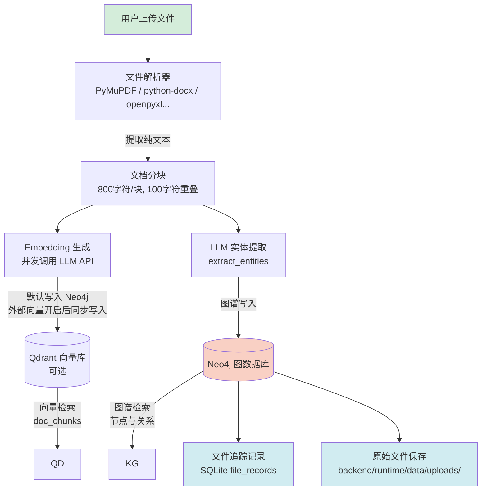

**处理步骤说明**：

| 步骤 | 说明 |
|------|------|
| 文件解析 | 根据文件格式调用对应解析器，提取纯文本内容 |
| 文档分块 | 将文本按 800 字符切分，相邻块重叠 100 字符防止语义断裂 |
| Embedding | 并发调用 LLM API 为每个分块生成向量表示 |
| 向量写入 | 默认写入 Neo4j/共享存储中的向量索引；开启 `USE_EXTERNAL_VECTOR=true` 后同步写入 Qdrant 的 `doc_chunks` 集合并优先外部检索 |
| 实体提取 | LLM 从文本中识别实体（模块、功能、接口、人员等） |
| 图谱构建 | 在 Neo4j 中创建实体节点和 `RELATED_TO` 关系 |
| 文件追踪 | 记录到共享 SQLite 的 `file_records` 表，包含文件名、类型、分块数、时间 |

### 1.3 读取流：智能问答

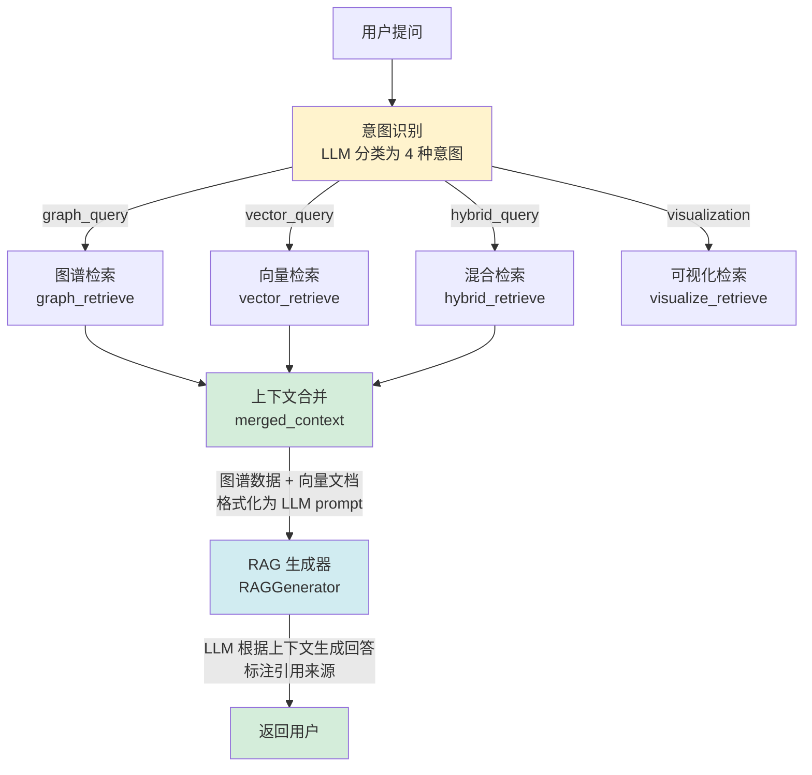

### 1.4 四种意图详解

| 意图 | 触发时机 | 检索方式 | 典型问题 |
|------|---------|---------|---------|
| `graph_query` | 问实体属性、关系 | 图谱子图查询 | "登录模块包含哪些功能？" |
| `vector_query` | 问概念、流程、方法 | 向量相似度搜索 | "如何实现用户注册？" |
| `hybrid_query` | 问影响分析、覆盖率 | 图谱 + 向量合并 | "修改订单状态会影响什么？" |
| `visualization` | 要求画图、关系图 | 图谱全图/子图 | "画出用户管理的结构图" |

### 1.5 测试用例生成流（图谱与向量联合驱动）

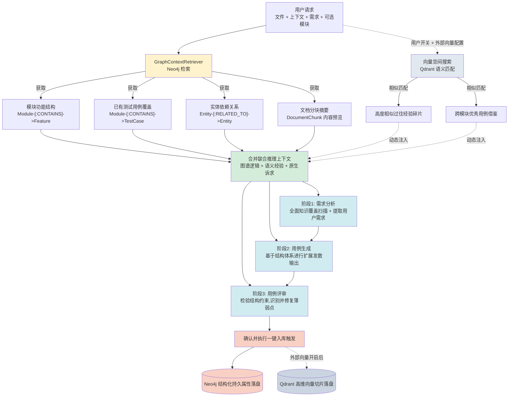

### 1.6 测试资产闭环总览

OpenMelon 当前不是单点问答工具，而是围绕“文档知识 -> 测试资产 -> 自动化执行 -> 治理复用”的闭环运转。理解这个闭环后，再看后面的导入、用例生成、API 自动化、仪表盘和治理中心会更直观。

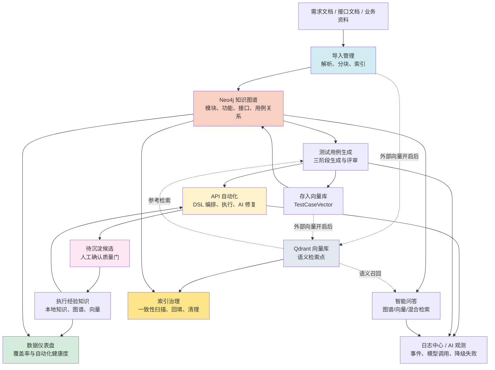

---

## 2. 安装与启动

### 2.1 Docker 方式

#### 2.1.1 Docker 一键启动（推荐完整体验）

```bash
# 1. 配置环境变量
cp .env.example .env
# 编辑 .env，设置 LLM_PROVIDER 和 API_KEY

# 2. 构建并启动完整服务
# 包含前端、主后端、Reranker Sidecar、Neo4j 和 Qdrant
docker compose up -d --build

# 3. 查看应用日志
docker compose logs -f app
```

> 首次构建 Reranker 镜像会下载 `torch`、`FlagEmbedding`、`sentence-transformers` 等重依赖，耗时较长；后续会复用 Docker/uv 缓存。
> 如果只需要启动基础依赖给本机后端使用，可以执行 `docker compose up -d neo4j qdrant`。

#### 2.1.2 Docker 后端开发模式

```bash
# 1. 配置环境变量
cp .env.example .env
# 编辑 .env，设置 LLM_PROVIDER 和 API_KEY

# 2. 使用开发覆盖配置启动后端相关服务
docker compose -f docker-compose.yml -f docker-compose.dev.yml up -d --build

# 3. 查看应用日志
docker compose logs -f app
```

> 开发模式会挂载本地 `backend/app`、`backend/config`，并在容器内使用 `uvicorn --reload` 启动。
> 日常修改后端代码时通常不需要 rebuild；只有 `backend/pyproject.toml` 或 `uv.lock` 变更时，才需要重新执行 `docker compose up -d --build --force-recreate app`。

#### 2.1.3 重新构建指定服务

```bash
# 只重建主后端
docker compose up -d --build --force-recreate app

# 只重建 Reranker Sidecar
docker compose up -d --build --force-recreate reranker

# 只重建前端
docker compose up -d --build --force-recreate web
```

**Neo4j 容器配置**：

| 配置项 | 值 | 说明 |
|--------|-----|------|
| 镜像版本 | `neo4j:5.15.0` | 包含 APOC 和 GDS 插件 |
| 页缓存 | 512M | 图数据缓存 |
| 堆内存 | 1G | JVM 堆上限 |
| 健康检查 | 30s 启动等待 + 10s 间隔 | 确保数据库就绪后应用才启动 |
| 数据持久化 | `neo4j_data` / `neo4j_logs` 卷 | 容器重启不丢失数据 |

### 2.2 本地开发（uv）

```bash
# 先启动 Neo4j
docker compose up -d neo4j

# 终端 1: 启动后端
conda activate openmlon
cd backend
uvicorn app.main:app --reload --host 0.0.0.0 --port 8000

# 终端 2: 启动前端
cd frontend && npm install && npm run dev
# 访问 http://localhost:3000，API 请求自动代理到 8000
```

> 如果后端 `.env` 开启了 `USE_EXTERNAL_VECTOR=true`，本地开发前还要执行 `docker compose up -d qdrant`。

#### 2.2.1 三终端启动顺序

```bash
# 终端 1：依赖服务（项目根目录）
docker compose up -d neo4j

# 可选：启用外部向量库时再执行
docker compose up -d qdrant

# 终端 2：后端
cd backend
uv sync
uvicorn app.main:app --reload --host 0.0.0.0 --port 8000

# 终端 3：前端
cd frontend
npm install
npm run dev
```

### 2.3 前后端独立部署

```bash
# 终端 1：后端
cd backend
uvicorn app.main:app --host 0.0.0.0 --port 8000

# 终端 2：前端
cd frontend
cp .env.production.example .env.production
npm run build
```

> 前端构建产物默认在 `frontend/dist/`，建议单独交给静态站点或 Nginx 部署。
> 如果你是在本机联调，也可以继续直接执行 `npm run dev`。
> 如果前端需要连接独立域名的后端，请在 `frontend/.env.production` 中设置 `VITE_API_BASE_URL`。完整示例见 [docs/Knowledge/FRONTEND_DEPLOYMENT.md](docs/Knowledge/FRONTEND_DEPLOYMENT.md)。
> Nginx 可直接参考 [deploy/nginx/openmelon-frontend.conf](/Users/xiabo/SoftwareTest/CarbonPy/OpenMelon/deploy/nginx/openmelon-frontend.conf)。

### 2.4 停止服务

```bash
# 后端: Ctrl+C（最多等 5 秒后强制退出）
# Neo4j:
docker compose down
```

### 2.5 选型建议

| 场景 | 推荐方式 |
|------|------|
| 高频改后端代码 | `docker compose -f docker-compose.yml -f docker-compose.dev.yml up -d` |
| 本机调试 Python 环境 | `cd backend && uvicorn app.main:app --reload --host 0.0.0.0 --port 8000` |
| 接近部署环境验证 | `docker compose up -d`（后端） + 前端独立构建部署 |

### 2.6 开发检查与清理

项目根目录提供了统一检查脚本，适合提交前确认后端测试、前端 lint、前端测试和前端构建都能通过。

```bash
# 一键运行后端测试、前端 lint/test/build
scripts/check.sh

# 如果本机没有全局 npm，但已有 Node 可执行文件和 frontend/node_modules
OPENMELON_NODE_BIN=/path/to/node scripts/check.sh

# 清理本地测试缓存、Python 字节码和前端构建产物
scripts/clean_artifacts.sh
```

---

## 3. 环境配置详解

当前版本建议优先通过“设置 -> 运行配置”管理后端配置。完整配置模板见 [.env.example](.env.example)。

配置保存后的生效分两类：

- `热更新`：保存后刷新进程内参数，只影响后续新请求
- `需重启`：已经写入 `.env`，但需要重启后端才能完全生效

`.env` 仍然是最终配置载体，但不再建议只靠手工编辑理解全部配置状态。

**运行配置保存流**：

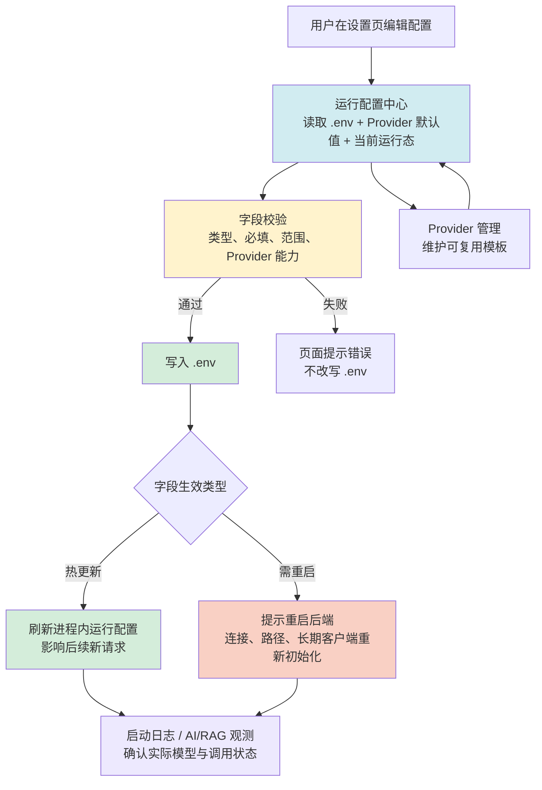

### 3.0 生产安全配置

生产环境建议显式设置以下配置，避免开发默认值进入线上：

```bash
APP_ENV=production
DEBUG=false
CORS_ALLOW_ORIGINS=https://your-openmelon.example.com
```

`APP_ENV=production` 且未配置 `CORS_ALLOW_ORIGINS` 时，后端不会默认放开任意跨域来源；`DEBUG=false` 时，接口不会向客户端返回内部异常详情。

### 3.1 OpenMelon 主模块 LLM 配置（必填）

建议优先在「设置 -> 运行配置 -> 主模块 LLM」中维护以下字段，页面会展示当前值来源、Provider 默认值和保存后的生效类型。手工编辑 `.env` 仍然有效，但保存后需按页面提示区分热更新和重启生效。

| 变量 | 必填 | 默认值 | 说明 |
|------|------|--------|------|
| `LLM_PROVIDER` | 否 | `openai_compat` | 可选: `openai_compat` / `openai` / `qwen` / `deepseek` / `mimo` |
| `API_KEY` | **是** | — | LLM API 密钥 |
| `API_BASE_URL` | 否 | 按 Provider 自动填充 | 留空即可，除非需要自定义网关 |
| `CHAT_MODEL` | 否 | 按 Provider 自动填充 | 对话模型名称 |
| `EMBEDDING_MODEL` | 否 | 按 Provider 自动填充 | 嵌入模型名称 |
| `EMBEDDING_DIM` | 否 | 按 Provider 自动填充 | 向量维度（本项目建议统一 1024） |

**主模块决策树（问答/检索/索引）**：

```text
开始
 └─ 读取 LLM_PROVIDER
     ├─ 若是别名（openai-compatible / openai_compatible）
     │    └─ 映射为 openai_compat
     └─ 得到最终 provider（openai_compat / openai / qwen / deepseek / mimo）

然后分别判断这 4 项：API_BASE_URL / CHAT_MODEL / EMBEDDING_MODEL / EMBEDDING_DIM
 ├─ .env 里有显式值？ -> 用显式值
 └─ 没填（空）？      -> 用 provider 默认值
```

一句话：**手填优先，未填写才用 Provider 默认值**。

**新手建议**：

- 第一次部署优先选 `qwen` 或 `openai_compat`
- 如果选 `deepseek` / `mimo`，问答可以正常用，但文档索引依赖 Embedding，建议额外明确配置 `EMBEDDING_MODEL` 和 `EMBEDDING_DIM`

### 3.1.1 Provider 管理和运行参数的关系

设置页“运行配置 -> Provider 管理”维护的是 Provider 模板库，不会直接改动当前 `.env`。

可以这样理解：

- `Provider 管理`：沉淀可复用模板
- `主模块 LLM`：决定当前实际生效配置

新增自定义 Provider 后，它会出现在主模块 LLM 的可选项中，但仍需要你在主模块分组里保存后才会变成当前运行参数。

### 3.1.2 自定义 Provider 存储位置

自定义 Provider 不保存在 `.env`，而是持久化到运行时文件：

`backend/runtime/data/json/llm_providers.json`

**自动填充规则**：

| LLM_PROVIDER | API_BASE_URL | CHAT_MODEL | EMBEDDING_MODEL | EMBEDDING_DIM |
|-------------|-------------|------------|-----------------|---------------|
| `openai_compat` | `https://one-api.miotech.com/v1` | qwen-plus | text-embedding-v3 | 1024 |
| `openai` | `https://api.openai.com/v1` | gpt-4o-mini | text-embedding-3-small | 1024（通过 dimensions 统一） |
| `qwen` | `https://dashscope.aliyuncs.com/compatible-mode/v1` | qwen-plus | text-embedding-v3 | 1024 |
| `deepseek` | `https://api.deepseek.com/v1` | deepseek-chat | — | — |
| `mimo` | `https://open.mimo.work/v1` | mimo-v2-flash | — | — |

### 3.2 Neo4j 配置

| 变量 | 默认值 | 说明 |
|------|--------|------|
| `NEO4J_URI` | `neo4j://localhost:7687` | 连接地址 |
| `NEO4J_USER` | `neo4j` | 用户名 |
| `NEO4J_PASSWORD` | `password` | 密码 |
| `NEO4J_DATABASE` | `neo4j` | 数据库名 |

### 3.3 外部向量库配置（可选）

默认情况下，系统**不会强制使用 Qdrant**。只有在你明确开启下面配置后，后端才会把文档向量写入 Qdrant 并优先从外部向量库检索。

| 变量 | 默认值 | 说明 |
|------|--------|------|
| `USE_EXTERNAL_VECTOR` | `false` | 是否启用外部向量库 |
| `VECTOR_PROVIDER` | `qdrant` | 当前支持 `qdrant` |
| `QDRANT_HOST` | `localhost` | Qdrant 地址 |
| `QDRANT_PORT` | `6333` | Qdrant HTTP 端口 |
| `QDRANT_API_KEY` | 空 | 如你的 Qdrant 开启认证则填写 |
| `VECTOR_FALLBACK_TO_NEO4J` | `true` | 外部检索失败时是否自动降级 |

**什么时候需要开启**：

- 文档量很大，想把向量检索能力从图数据库分离出去
- 已经准备好独立的 Qdrant 服务
- 希望后续方便管理和清理向量集合

### 3.4 检索参数

| 变量 | 默认值 | 说明 |
|------|--------|------|
| `RETRIEVAL_TOP_K` | `5` | 向量检索返回的 Top-K 结果数 |
| `RETRIEVAL_DEPTH` | `2` | 图谱检索深度（度关系数） |
| `RERANKER_TOP_K` | `5` | Reranker 重排后返回的 Top-K |
| `RERANKER_SCORE_THRESHOLD` | `0.3` | Reranker 最低评分阈值 |
| `HYBRID_GRAPH_WEIGHT` | `0.4` | 混合检索中图谱权重（建议与向量之和为 1.0） |
| `HYBRID_VECTOR_WEIGHT` | `0.6` | 混合检索中向量权重 |

### 3.5 生成参数

| 变量 | 默认值 | 说明 |
|------|--------|------|
| `GENERATION_TEMPERATURE` | `0.3` | LLM 生成温度（0-2，越高越随机） |
| `GENERATION_MAX_TOKENS` | `2000` | LLM 最大生成 token 数 |
| `AGENTIC_MAX_STEPS` | `3` | Agentic 模式最大迭代次数 |
| `AGENTIC_CONFIDENCE_THRESHOLD` | `0.7` | 答案充分性评估阈值（0-1） |
| `INTENT_CONFIDENCE_THRESHOLD` | `0.5` | 意图分类置信度阈值 |

### 3.6 BGE Reranker

Reranker 用于在向量检索后对候选文档块二次排序。当前支持三种模式：

| 模式 | 配置 | 适用场景 |
|------|------|------|
| 关闭 | `USE_RERANKER=false` 或 `RERANKER_BACKEND=disabled` | 最快启动，完全跳过重排 |
| 本地进程 | `RERANKER_BACKEND=local` | 后端进程内直接加载 BGE/FlagEmbedding，适合已安装 reranker extra 的本机调试 |
| Sidecar | `RERANKER_BACKEND=sidecar` | 主后端保持轻量，通过独立 `reranker` 服务执行本地 BGE 重排，推荐 Docker 场景 |

| 变量 | 默认值 | 说明 |
|------|--------|------|
| `USE_RERANKER` | `true` | 是否启用重排能力 |
| `RERANKER_BACKEND` | `local` | 可选 `local` / `sidecar` / `disabled` |
| `RERANKER_URL` | `http://localhost:8010` | Sidecar 模式下的 reranker 服务地址；Docker Compose 中主后端默认使用 `http://reranker:8010` |
| `RERANKER_TIMEOUT_SECONDS` | `5.0` | Sidecar 请求超时时间 |
| `RERANKER_MODEL_NAME` | `BAAI/bge-reranker-v2-m3` | 支持中英文 |
| `RERANKER_DEVICE` | `cpu` | 可选 `cuda`（需 GPU） |

> Reranker 仅影响 `vector_query` 和 `hybrid_query` 两种意图。Sidecar 或本地模型不可用时会自动保留原始向量检索顺序，不阻断问答主流程。

**本机 local 模式安装：**

```bash
cd backend
uv sync --extra reranker
```

**Docker sidecar 模式启动：**

```bash
docker compose up -d --build
```

主后端仍对外暴露 `8000`，`reranker` 只在 Docker 内网提供 `8010`。如只重启 sidecar，可执行 `docker compose up -d --force-recreate reranker`。

### 3.7 testcase_gen 独立 LLM 配置

测试用例生成模块默认使用统一的 `API_KEY`。如需独立配置（例如视觉和文本使用不同模型）：

| 优先级 | 变量 | 使用场景 |
|--------|------|---------|
| 最高 | `CUSTOM_API_KEY` + `CUSTOM_BASE_URL` + `CUSTOM_MODEL_NAME` | 统一自定义模型 |
| 次之 | `QWEN_API_KEY` + `QWEN_MODEL_NAME` | 视觉模型（图像分析） |
| 第三 | `DEEPSEEK_API_KEY` + `DEEPSEEK_MODEL_NAME` | 文本模型（用例编写） |
| 兜底 | `API_KEY` | 与 OpenMelon 主模块共用 |

**testcase_gen 决策树（分视觉/文本两条链路）**：

```text
视觉链路（图片/PDF 理解）：
CUSTOM_API_KEY 有吗？
 ├─ 有 -> 用 CUSTOM_API_KEY + CUSTOM_BASE_URL + CUSTOM_MODEL_NAME
 └─ 没有 ->
      QWEN_API_KEY 有吗？
       ├─ 有 -> 用 QWEN_API_KEY + QWEN_BASE_URL + QWEN_MODEL_NAME
       └─ 没有 -> 回退到主模块统一 API_KEY/API_BASE_URL

文本链路（生成/评审用例）：
CUSTOM_API_KEY 有吗？
 ├─ 有 -> 用 CUSTOM_API_KEY + CUSTOM_BASE_URL + CUSTOM_MODEL_NAME
 └─ 没有 ->
      DEEPSEEK_API_KEY 有吗？
       ├─ 有 -> 用 DEEPSEEK_API_KEY + DEEPSEEK_BASE_URL + DEEPSEEK_MODEL_NAME
       └─ 没有 -> 回退到主模块统一 API_KEY/API_BASE_URL
```

一句话：**CUSTOM >（视觉走 QWEN / 文本走 DEEPSEEK）> 主模块统一配置**。

**示例：使用 SiliconFlow 网关**
```env
CUSTOM_API_KEY=sk-siliconflow-key
CUSTOM_BASE_URL=https://api.siliconflow.cn/v1
CUSTOM_MODEL_NAME=deepseek-ai/DeepSeek-V3
```

### 3.8 如何快速判断当前命中哪个模型（推荐）

只要做下面 2 步，就能快速确认当前生效配置。

**步骤 1：看 `.env`（静态配置）**

重点看这些字段：

- 主模块：`LLM_PROVIDER`、`CHAT_MODEL`、`EMBEDDING_MODEL`、`EMBEDDING_DIM`
- testcase_gen：`CUSTOM_*`、`QWEN_*`、`DEEPSEEK_*`

快速判断：

- 如果 `CUSTOM_API_KEY` 非空：testcase_gen 视觉/文本都优先走 `CUSTOM_*`
- 如果 `CUSTOM_API_KEY` 为空：
  - 视觉链路优先看 `QWEN_API_KEY`
  - 文本链路优先看 `DEEPSEEK_API_KEY`
- 主模块始终按 `LLM_PROVIDER +（手填优先）` 规则生效

**步骤 2：看运行配置页面或启动日志（运行时结果）**

在设置页“运行配置”里可以直接看到：

- 当前主模块 Provider
- 是否命中已知 Provider
- 当前 Base URL / Chat Model / Embedding Model 来源
- 字段属于 `热更新` 还是 `需重启`

如果仍需从后端确认，再看启动日志：

后端启动后检查日志是否出现以下信息：

```text
LLM Provider: ...
Embedding 自检: model=..., dim=..., dimensions_enforced=...
```

解释：

- `LLM Provider`：主模块当前实际命中的 Provider
- `Embedding 自检.model`：当前实际 Embedding 模型
- `Embedding 自检.dim`：当前向量维度目标值
- `dimensions_enforced=True`：`text-embedding-3*` 已按 `EMBEDDING_DIM` 强制统一维度
- `dimensions_enforced=False`：当前模型不走该参数（如 BGE），但仍会按模型自身维度执行

> 建议：先看运行配置页面的生效摘要，再根据字段是否属于 `热更新` 或 `需重启` 决定是否重启后端。

### 3.9 企业通知 Webhook

| 变量 | 说明 |
|------|------|
| `DINGTALK_WEBHOOK` | 钉钉机器人 Webhook URL |
| `DINGTALK_SECRET` | 钉钉加签密钥（可选） |
| `FEISHU_WEBHOOK` | 飞书机器人 Webhook URL |
| `WECOM_WEBHOOK` | 企微机器人 Webhook URL |

推送 API：
```bash
curl -X POST "http://localhost:8000/api/webhook/dingtalk" \
  -H "Content-Type: application/json" \
  -d '{"question": "问题内容", "answer": "回答内容"}'
```

### 3.10 请求限流

| 变量 | 默认值 | 说明 |
|------|--------|------|
| `RATE_LIMIT_RPM` | `60` | 每分钟最大请求数 |
| `RATE_LIMIT_BURST` | `10` | 突发容量（令牌桶算法） |

超限请求返回 HTTP 429。

---

## 4. 文档索引

### 4.1 支持的文件格式（16 种）

| 类型 | 格式 | 解析器 |
|------|------|--------|
| PDF | `.pdf` | PyMuPDF (fitz) |
| Word | `.docx`, `.doc` | python-docx |
| Excel | `.xlsx` | openpyxl |
| Excel 97 | `.xls` | xlrd |
| XMind | `.xmind` | xmind |
| PPT | `.pptx` | python-pptx |
| 文本 | `.md`, `.txt`, `.rst` | 直接读取 |
| 数据 | `.csv`, `.json`, `.yaml`, `.xml` | 对应解析器 |
| 网页 | `.html`, `.htm` | BeautifulSoup |
| 电子书 | `.epub` | zipfile + xml.etree |

### 4.2 上传方式

**前端上传**（推荐）：
1. 进入「导入管理」页面
2. 选择上传模式（单文件/文件夹）
3. 拖拽或点击选择文件
4. 可选填文档类型和模块名
5. 点击「开始导入」

**API 上传**：
```bash
# 上传文件，返回 task_id
curl -X POST "http://localhost:8000/api/upload/async" \
  -F "files=@document.pdf" \
  -F "doc_type=需求文档" \
  -F "module=用户管理"

# 查询处理进度
curl "http://localhost:8000/api/upload/status/{task_id}"

# 查看所有任务
curl "http://localhost:8000/api/upload/tasks"

# 查询支持的文件格式
curl "http://localhost:8000/api/upload/formats"
```

任务状态：`pending` → `processing` → `completed` / `failed`

### 4.3 重新索引

在「导入管理」中点击文件行的「重新索引」按钮，系统从 `backend/runtime/data/uploads/` 读取原始文件重新执行完整索引流程。旧数据通过 MERGE 方式更新。

### 4.4 删除文件

- 单条删除：点击文件行的「删除」按钮
- 批量删除：勾选多个文件后点击「批量删除」
- 删除操作清理 `file_records` 文件追踪记录，但不删除 Neo4j 数据和原始文件

---

## 5. 智能问答

### 5.1 使用方式

在问答页面底部输入框输入问题，按 Enter 或点击发送。系统自动执行：

```
用户提问 → 意图识别 → 实体提取 → 多通道检索 → 上下文合并 → LLM 生成回答
```

### 5.2 三种检索方式

**图谱检索 (graph_query)**
- 适用：问实体属性和关系（"XX 有哪些功能"、"XX 的参数是什么"）
- 原理：在 Neo4j 中查找匹配节点及其关系网络
- 返回：实体属性 + 关系结构

**向量检索 (vector_query)**
- 适用：问概念、流程、方法（"如何实现"、"设计思路"、"最佳实践"）
- 原理：将问题转为向量，在向量索引中搜索最相似的文档块
- 返回：相关文档片段（按相似度排序，经 Reranker 重排后返回）

**混合检索 (hybrid_query)**
- 适用：需要结构化 + 内容的问题（"影响范围"、"覆盖率"）
- 原理：同时执行图谱和向量检索，按权重合并结果

### 5.3 Agentic RAG 多步推理

通过 API 参数 `use_agentic=true` 启用，适合复杂问题：

```bash
curl -X POST "http://localhost:8000/api/query?use_agentic=true" \
  -H "Content-Type: application/json" \
  -d '{"question": "修改数据审核流程会对哪些模块产生影响？"}'
```

**工作流程**：
1. 使用原始问题进行初始向量检索
2. LLM 评估已检索内容的充分性（打分 0-1）
3. 分数 ≥ 0.7 → 直接生成回答
4. 分数 < 0.7 → LLM 改写查询，重新检索（最多 3 轮）
5. 基于所有累积上下文生成最终回答

每轮自动去重已检索文档，推理步骤会返回给前端展示。

### 5.4 回答引用

每个回答底部显示数据来源标签：
- `Vector: filename` — 来自向量检索的文档
- `Graph` — 来自图谱查询
- `Method: graph/vector/hybrid/visualization` — 使用的检索方式

---

## 6. 图谱可视化

### 6.1 全图浏览

切换到「图谱总览」页面，图谱自动加载所有节点和关系。支持拖拽画布、鼠标滚轮缩放、点击节点高亮关联。

### 6.2 实体搜索

在搜索框输入实体名，按 Enter 或点击「搜索」，展示该实体的 2 度关系子图。

### 6.3 筛选器

| 筛选器 | 说明 |
|--------|------|
| 文档类型 | 按已索引文件的文档类型过滤 |
| 模块 | 按已索引文件的模块名过滤 |
| 显示分块 | 勾选后显示 DocumentChunk 节点（默认隐藏） |

### 6.4 节点详情

点击节点后显示悬浮式玻璃态详情面板，展示节点类型和所有属性。点击图谱空白区域关闭面板。

### 6.5 节点颜色

| 节点类型 | 颜色 | 说明 |
|---------|------|------|
| Product | 蓝色 | 产品节点 |
| Module | 绿色 | 模块节点 |
| Feature | 黄色 | 功能节点 |
| API | 红色 | 接口节点 |
| TestCase | 紫色 | 测试用例节点 |
| Defect | 橙色 | 缺陷节点 |
| Entity | 灰色 | 通用实体（兜底） |
| DocumentChunk | 青色 | 文档分块 |

---

## 7. 测试用例生成

### 7.1 三阶段流水线

基于 AutoGen 多智能体框架，每个阶段由独立智能体负责：

| 阶段 | 智能体 | 输入 | 输出 |
|------|--------|------|------|
| 阶段 1 | RequirementAnalyzer | 文件内容 + 上下文 + 图谱知识 | 结构化需求分析报告 |
| 阶段 2 | TestCaseGenerator | 需求分析结果 + 图谱功能结构 | 10-20 个测试用例 |
| 阶段 3 | TestCaseReviewer | 生成的用例 + 图谱覆盖率 | 评审改进后的最终用例 |

### 7.2 两种生成模式

**文件生成**：上传图像（`.png/.jpg`）、PDF（`.pdf`）或 OpenAPI 文档（`.json/.yaml`），系统自动解析内容。

**文本描述**：直接在输入框填写上下文信息和测试需求，无需上传文件。

### 7.3 知识图谱与向量空间联合驱动

测试生成时，系统不仅自动从 Neo4j 检索关联知识，还会根据界面上的「**使用参考检索**」智能胶囊开关，在外部向量库已开启时启用 Qdrant 向量空间层进行全端语义联想，并注入到 LLM 推理上下文中：

| 检索内容 | 引擎 | 提取规则 | 用途 |
|---------|------|----------|------|
| 模块功能结构 | Neo4j | 默认挂载 | 指导用例覆盖完整的功能点 |
| 已有用例网络 | Neo4j | 默认挂载 | 避免重复，识别覆盖盲区和结构 |
| 实体关联交互 | Neo4j | 默认挂载 | 发现隐性的跨模块交互场景 |
| **高度相似片段**| **Qdrant** | **启用开关** | 基于 Top-K 向量捕捉的无定形经验碎片 |
| **优秀用例借鉴**| **Qdrant** | **启用开关** | 借用过往跨模块相似领域的成熟用例 |

> 图谱检索或向量检索失败皆不阻断主流程，系统具备自动降级至本地上下文推理的安全机制。

### 7.4 页面操作

1. 左侧：选择生成模式、上传文件/输入文本、填写需求
2. 点击「生成测试用例」按钮
3. 右侧实时展示：
   - 阶段时间线（需求分析 → 用例生成 → 用例评审）
   - 每个阶段的 Markdown 流式输出
   - 完成后的结果统计卡片
4. 生成完成后可以：
   - 切换列表视图/导图视图
   - 按模块、优先级筛选
   - 点击「存入向量库」直接且永久保存
   - 点击「用例导出」可选择导出结构化 Excel 表格文件下载，或原生脑图格式文件（.xmind）下载

### 7.5 双核向量存储与提取

为了解决复杂网络下信息孤岛的问题，生成的产物支持一键点击「存入向量库」。
底层采用 **双模式兼容落盘** 机制：默认会在主知识图谱 Neo4j 中作为 `TestCaseVector` 节点进行挂载；当开启 `USE_EXTERNAL_VECTOR=true` 并配置 Qdrant 后，会将其大语言模型对应的高维 Embedding 同步写入独立的 Qdrant 集群，为未来的语义检索开启长效通路。该操作支持跨表去重（基于名称+描述 MD5 哈希校验防重），外部向量库不可用时也不会阻断主流程。

**API 接口**：

```bash
# 检查向量库状态
curl "http://localhost:8000/api/test-cases/vector/status"

# 存入向量库（现强制仅接收标准的结构化结果进行入库，拒绝分析流程的原始数据污染图谱）
curl -X POST "http://localhost:8000/api/test-cases/store-vector" \
  -H "Content-Type: application/json" \
  -d '{"test_cases": [{"id": "TC001", "title": "正常登录", "priority": "P1", "steps": [{"step_number": 1, "description": "xxx"}]}], "module": "用户管理"}'

# 导出 Excel
curl -X POST "http://localhost:8000/api/test-cases/export" \
  -H "Content-Type: application/json" \
  -d '[{"title": "正常登录", "steps": [...]}]' --output test_cases.xlsx

# 导出原生 XMind 脑图文件
curl -X POST "http://localhost:8000/api/test-cases/export-xmind-json" \
  -H "Content-Type: application/json" \
  -d '[{"title": "正常登录", "steps": [...]}]' --output test_cases.xmind

# 生成思维导图数据
curl -X POST "http://localhost:8000/api/test-cases/generate-mindmap" \
  -H "Content-Type: application/json" \
  -d '{"test_cases": [{"id": "TC001", "title": "正常登录", "module": "登录"}]}'
```

### 7.6 Prompt & Skill Hub 管理

系统现在已经支持通过「设置 > Prompt Hub」管理测试用例生成模板和专项技能。

当前能力包括：

- 查看所有模板和技能
- 新增模板和技能
- 编辑模板和技能
- 删除非默认模板和普通技能
- 设置默认模板
- 启停模板和技能
- 页面内提供字段级填写提示，帮助用户直接按规范编写模板和技能
- 技能分类支持下拉选择、中文自定义输入、默认分类保护和非默认分类删除
- 管理页支持模板/技能分栏切换、搜索、分类筛选和长列表独立滚动

运行时行为：

- 测试用例生成页会优先从 `/api/prompt-hub/options` 拉取模板和技能选项
- 如果当前已选模板被删除或停用，页面会自动回退到默认模板
- 如果当前已选技能被删除或停用，页面会自动移除失效技能
- 技能分类会在管理页和生成侧以中文名称展示，便于大量技能场景下快速识别

相关存储与接口：

- 持久化配置：共享 SQLite `backend/runtime/data/openmelon.db` 中的 `prompt_hub_meta`、`prompt_templates`、`prompt_skill_categories`、`prompt_skills` 表
- 迁移兼容源：[backend/runtime/data/prompt_hub.json](/Users/xiabo/SoftwareTest/CarbonPy/OpenMelon/backend/runtime/data/prompt_hub.json) 仅在空库初始化时读取，不再作为正常写入目标
- 后端读取与校验：[backend/app/services/prompt_hub_tracker.py](/Users/xiabo/SoftwareTest/CarbonPy/OpenMelon/backend/app/services/prompt_hub_tracker.py)
- 管理接口：[backend/app/api/routers/prompt_hub.py](/Users/xiabo/SoftwareTest/CarbonPy/OpenMelon/backend/app/api/routers/prompt_hub.py)

### 7.7 模板与技能编写规范

先记住一个最重要的分工：

- 模板决定“怎么写”
- 技能决定“多覆盖什么”

也就是说：

- 模板控制整体写法风格、信息密度、场景组织方式
- 技能用于补某一类专项测试覆盖

两者都不能破坏当前固定的 Markdown 输出协议。

#### 7.7.1 模板字段怎么写

模板对象示例：

```json
{
  "id": "default-compact",
  "name": "精简版",
  "description": "强调去冗余和高信息密度。",
  "content": "请以精简、直接、高信息密度的风格编写测试用例。在保证结构完整和场景覆盖充分的前提下，避免重复表述和无意义铺垫。步骤聚焦关键操作，预期结果只保留最核心、最可验证的断言。",
  "review_summary": "精简风格，强调高信息密度和去冗余，但不改变标准输出协议。",
  "enabled": true,
  "is_default": false,
  "sort_order": 200
}
```

字段含义：

- `id`：稳定标识，创建后尽量不要改。
- `name`：给用户看的模板名。
- `description`：短说明，展示在管理表格和选择器里。
- `content`：真正注入生成器 Prompt 的模板正文。
- `review_summary`：给评审器看的简短摘要，不要复制全文。
- `enabled`：是否允许在前端被选择。
- `is_default`：是否为默认模板，系统必须且仅能有一个启用中的默认模板。
- `sort_order`：排序权重。

#### 7.7.2 技能字段怎么写

技能对象示例：

```json
{
  "id": "boundary-basic",
  "name": "边界值测试",
  "description": "增强上下限、临界值、空值、极端值覆盖。",
  "content": "请额外补充边界值和临界条件测试，重点关注最小值、最大值、刚好超过上限、刚好低于下限、空值、空字符串、超长输入、特殊字符、非法格式、列表为空、集合仅一项和多项切换等场景。",
  "review_summary": "补充边界值、临界值、空值、超长和格式边界相关测试覆盖。",
  "enabled": true,
  "category": "coverage",
  "sort_order": 100
}
```

字段含义：

- `id`：稳定标识。
- `name`：给用户看的技能名。
- `description`：一句短说明。
- `content`：注入生成器 Prompt 的专项增强指令。
- `review_summary`：给评审器的简短摘要。
- `enabled`：是否允许被选择。
- `category`：技能分类 ID；管理页中会以下拉 + 中文分类名展示，也支持直接输入新中文分类并自动创建。
- `sort_order`：排序权重。

技能分类补充约束：

- 默认分类不能删除。
- 已被技能使用的分类不能删除。
- 建议优先使用中文分类名，例如“覆盖增强”“安全与权限”“异常稳定性”。

#### 7.7.3 模板正文 `content` 怎么写

推荐写法应满足：

1. 先写风格目标
2. 再写信息取舍规则
3. 再写场景组织原则
4. 最后强调保持标准结构

模板正文适合描述：

- 希望更详细还是更精简
- 是否强调 Given/When/Then 式因果组织
- 步骤和预期结果的表达粒度
- 多角色、多状态、多分支场景的拆分要求

推荐写法：

```text
请以精简、直接、高信息密度的风格编写测试用例。在保证结构完整和场景覆盖充分的前提下，避免重复表述和无意义铺垫。步骤聚焦关键操作，预期结果只保留最核心、最可验证的断言。
```

不推荐写法：

```text
请随意组织格式，只要内容完整即可。可以用列表、代码块或 JSON 表达。
```

#### 7.7.4 技能正文 `content` 怎么写

技能正文推荐遵循：

1. 明确这是“额外补充”的覆盖方向
2. 点名要补哪些典型场景
3. 尽量写成具体场景清单，而不是抽象口号

推荐写法：

```text
请额外补充认证与权限相关测试，重点关注未登录访问、登录态失效、角色差异、权限不足、越权操作、资源归属不匹配和敏感操作保护等场景。若需求涉及管理员、普通用户、审核人或创建人等角色，必须覆盖角色差异测试。
```

不推荐写法：

```text
请把安全问题都测一下。
```

#### 7.7.5 `review_summary` 怎么写

`review_summary` 只用于让评审器知道当前模板或技能的意图。

它应该：

- 比 `content` 更短
- 只保留意图摘要
- 不重复所有场景细节

推荐写法：

```text
补充登录态、鉴权、越权、角色差异和资源访问限制相关测试覆盖。
```

#### 7.7.6 常见错误

- 模板里改协议，例如要求输出 JSON、YAML 或 Gherkin
- 技能写得太泛，例如“请加强异常情况”
- `review_summary` 直接复制全文
- 一个技能同时覆盖多个主题

#### 7.7.7 新增前检查清单

新增模板前，至少检查：

- 是否只描述了写法风格
- 是否没有改输出协议
- 是否没有要求自由格式
- `review_summary` 是否足够短

新增技能前，至少检查：

- 是否只覆盖一个主题
- 是否写清了典型场景
- 是否没有改输出协议
- 是否没有和现有技能高度重复

---

## 8. API 自动化

API 自动化模块用于把接口规范沉淀为项目级接口资产，再由 API Agent 基于模块或接口资产生成可执行的冒烟测试 DSL。当前已完成的是 **API Agent v1 + P4 运维与诊断增强**：能围绕项目-模块-接口台账做导入、同步、筛选、计划生成、推荐解释、依赖发现、业务链路自动编排、项目级配置向导、策略校验、执行、Agent 失败诊断、调度/CI 入口、SQLite/PG 迁移准备检查、结果回写和测试任务复用；更复杂的跨系统业务语义推理和可视化自由编排仍属于后续增强。

### 8.1 模块定位

| 能力 | 说明 |
|------|------|
| 项目接口资产台账 | 按项目维护模块、接口、风险等级、状态、最近执行结果和失败摘要 |
| 规范变更预览确认 | 支持 OpenAPI / Swagger JSON/YAML 获取、解析、差异预览和确认同步，避免每次重复导入 |
| 接口资产维护 | 支持编辑接口摘要、描述、模块归属、风险等级、状态，支持隐藏、标记废弃和恢复 |
| Agent 冒烟测试 | 从模块或选中接口生成 smoke DSL，默认跳过隐藏、废弃、移除、阻断和未确认高风险接口 |
| Agent 推荐解释 | 在 Agent 测试页展示当前范围、风险、待补配置、认证提醒和依赖候选 |
| 依赖发现 | 识别登录、创建、详情、更新、删除等接口关系，自动补充变量提取和 `depends_on` |
| 业务链路自动编排 | 按登录 -> 创建 -> 详情/更新 -> 查询 -> 删除的启发式顺序组织 DSL 步骤 |
| 项目测试任务 | 将 Agent 生成或编排过的 DSL 保存为项目级任务，后续可直接载入、覆盖或删除 |
| 执行结果回写 | API 执行完成后回写接口资产的最近测试时间、状态码、通过/失败状态和失败摘要 |
| API DSL 生成 | 将选中的接口转换为 API 测试 DSL，描述请求步骤、参数、断言、变量提取和执行顺序 |
| 环境管理 | 支持项目、环境、Base URL、Header、变量、超时和失败策略配置 |
| 执行与报告 | 支持单步执行、批量执行、后台执行、失败步骤重跑、历史记录查看和报告导出 |
| AI 辅助 | 支持 AI DSL 补全、Agent 失败诊断摘要、修复补丁生成和低风险受控自动修复重跑 |
| 调度/CI 入口 | 支持手动触发项目级定时执行、规格同步 DSL 生成，并提供 CI 可调用命令 |
| 存储迁移准备 | 提供 SQLite -> PG readiness 检查，展示 JSONB 映射风险、表规模和归档建议 |
| 策略与审计 | 支持项目级自动化边界、接口白名单/黑名单、风险识别、策略审计和人工待处理队列 |
| 知识沉淀 | 执行完成后生成待沉淀候选，人工确认后再写入知识库、向量库和 Neo4j 图谱 |

### 8.2 整体流程

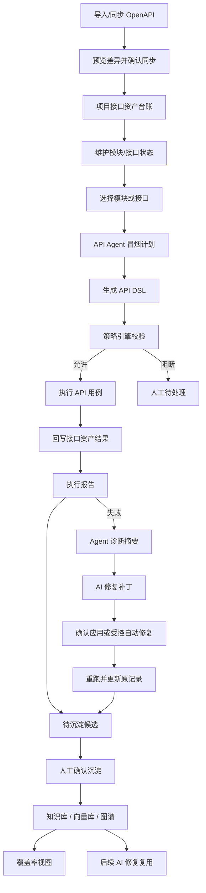

### 8.3 项目接口资产台账

接口资产台账是 API 自动化现在的主入口。导入 OpenAPI 后，系统会把规范版本、模块和接口拆成项目内可长期维护的资产，而不是只生成一次性 DSL。

| 区域 | 作用 |
|------|------|
| 规范版本 | 记录 OpenAPI 来源、版本哈希和同步状态 |
| 模块资产 | 按 tag 或路径归类接口，作为 Agent 选择测试范围的入口 |
| 接口资产 | 记录 method、path、operationId、摘要、描述、风险等级、状态和最近测试结果 |
| 差异预览 | 在同步前预览新增、变更、移除，确认后再写入台账 |
| 执行回写 | 最近执行时间、通过/失败、状态码和失败摘要会回写到对应接口 |

推荐做法：

1. 每个项目维护一份主 OpenAPI 来源。
2. 接口文档变化后先预览差异，再确认同步。
3. 用模块视角管理测试范围，用接口视角处理风险、状态和失败结果。
4. 不再把“导入接口文档”当成每次测试前的重复动作。

### 8.4 API Agent 冒烟测试

当前 API Agent 的定位是“基于接口资产生成可执行冒烟测试”，不是完全自主的业务测试专家。它会从模块或选中接口中挑选可执行接口，生成 smoke DSL，并交给现有 Runner 执行。

| 规则 | 当前行为 |
|------|------|
| 选择范围 | 支持按模块生成，也支持勾选多个接口生成 |
| 测试意图 | 支持 smoke 冒烟测试和 negative 参数负向测试 |
| 默认跳过 | `hidden`、`deprecated`、`removed`、`blocked` 接口不会进入计划 |
| 风险控制 | 高风险接口需要显式确认后才允许进入计划 |
| 策略边界 | 仍受项目级 allowlist、blocklist、环境类型和最大请求数限制 |
| 项目认证 | 支持 bearer、api_key、basic 认证配置；Agent 会把认证注入业务接口步骤 |
| 前置依赖 | 支持项目级 `setup_steps`，可配置登录、初始化数据、变量提取等前置步骤 |
| 清理流程 | 支持项目级 `cleanup_steps`，主流程结束或失败中断后会尽量执行清理步骤 |
| 配置向导 | 项目配置页支持认证方式、登录前置、清理步骤模板生成和变量引用检查 |
| 变更影响 | OpenAPI diff 后会标记新增/变更/移除接口，并推荐需要重测的接口 |
| 结果关联 | DSL 步骤会携带 `module_id`、`interface_id`、`interface_key`，便于执行后回写 |
| 推荐解释 | 页面会提示当前选择范围、风险接口、缺失 Base URL、认证/登录配置和可串联依赖 |
| 链路编排 | smoke DSL 会优先排序登录、创建、详情/更新、查询和删除接口，并在可推断时补充 `depends_on` |
| 变量提取 | 登录接口会补充 `access_token` 提取占位；创建接口会补充资源 ID 提取占位，供后续路径参数引用 |
| 依赖图确认 | 编排执行页会根据 `depends_on` 以轻量画布展示步骤节点、依赖箭头、后续步骤和禁用/缺失依赖风险 |

生成后的 DSL 仍然可以在编排工作台里继续编辑，例如补充鉴权 Header、变量提取、断言或请求体。

#### 项目测试任务复用

Agent 生成 DSL 后，可以在「Agent 测试」页顶部的「项目测试任务」面板保存为项目级任务。保存后的任务绑定当前项目，后续进入同一项目时可以直接载入到编排执行阶段，不必再次选择模块、勾接口或重新生成 DSL。

| 操作 | 说明 |
|------|------|
| 保存当前 DSL | 将当前 Agent 生成或手工调整后的 DSL 保存为项目测试任务，支持填写名称、说明和标签 |
| 载入任务 | 将已保存任务恢复到 DSL 编辑器，并跳转到「编排执行」继续检查和运行 |
| 搜索/标签筛选 | 按任务名称、说明、标签、步骤方法和路径快速定位可复用任务 |
| 复制任务 | 将已有任务复制为同项目的新任务，适合在稳定冒烟任务上派生变更回归或负向任务 |
| 删除任务 | 删除不再复用的项目测试任务，不影响已产生的执行历史 |

任务卡片会展示版本、来源、标签、步骤数量和最近执行摘要。最近执行摘要包括执行次数、最近状态、通过率、最近执行时间、耗时和关联 run id，方便判断这个任务是否仍然值得复用。

适合沉淀的内容包括：稳定模块冒烟、关键接口集合、变更影响回归、带前置登录和清理步骤的常用链路。临时调试脚本或环境强绑定的排障脚本建议先保留在执行历史中，确认稳定后再保存为测试任务。

负向测试当前会基于 OpenAPI 参数和 JSON Body schema 生成少量代表性用例，例如：

- 缺少必填 query/header 参数。
- 枚举字段传入非法值。
- integer、number、boolean、array、object 字段传入错误类型。
- JSON Body 缺少必填字段。

负向步骤默认断言常见 4xx 状态码，生成后仍建议人工检查业务系统实际错误码约定。

自动依赖发现是启发式能力，不会替代人工确认。当前规则重点覆盖：

- 登录、鉴权、token 类接口优先执行，并为后续接口补充 `Authorization: Bearer {{access_token}}` 占位。
- 创建类 POST 接口会尝试从 `data.id` 提取资源 ID，例如 `order_id`。
- 带路径参数的详情、更新、删除接口会优先复用前置创建步骤提取出的资源 ID。
- 如果路径参数仍是 `example_xxx`，Agent 推荐区会提示需要补充前置依赖或手工绑定变量。

生成 DSL 后，进入「编排执行」会看到画布式依赖图确认面板。画布会把每个 API step 渲染成节点，并按 `depends_on` 画出箭头；面板同时统计步骤数、依赖边、起点步骤和禁用步骤。如果某条 `depends_on` 指向不存在的步骤，或后续步骤依赖了已禁用的前置步骤，面板会在运行前提示风险。点击画布节点可快速切换单步执行目标。

### 8.5 项目级认证、前置依赖与清理流程

项目配置中可以维护认证方式、前置步骤和清理步骤，用于解决“每个模块接口测试前都要先登录、拿 token、初始化数据，跑完后还要清理测试数据”的问题。

| 配置 | 说明 |
|------|------|
| `auth_config.type` | 支持 `none`、`bearer`、`api_key`、`basic` |
| `token_variable` / `value_variable` | 引用前置步骤提取出的变量，例如 `access_token` 或 `api_key` |
| `setup_steps` | 一组 API DSL step，Agent 生成冒烟脚本时会插入到业务接口步骤之前 |
| `cleanup_steps` | 一组 API DSL step，主流程结束后执行；主流程失败且中断时也会尽量执行 |
| `extractions` | 前置步骤可从响应 body/header/cookie 中提取变量给后续接口使用 |

在「项目配置 -> 认证依赖」中，推荐优先使用配置向导生成草稿：

- 认证向导可生成 Bearer、API Key Header、API Key Query 和 Basic Auth 配置。
- 登录前置模板会生成登录步骤、`access_token` 提取和 Bearer 认证配置。
- 清理步骤模板会生成常见删除/回滚接口，并默认接受 200、204、404。
- 变量引用检查会扫描认证、前置和清理步骤中的变量引用，提示缺少的环境变量；前置步骤已经提取出的变量不会被误判为缺失。
- 点击「保存当前配置」后，项目级认证/前置/清理配置和当前环境变量会一起保存。

典型登录场景：

1. 在环境变量里维护 `username`、`password`。
2. 在 `setup_steps` 中配置登录接口，请求体引用 `{{username}}` 和 `{{password}}`。
3. 登录步骤用 `extractions` 提取 `access_token`。
4. `auth_config` 设为 bearer，并将 `token_variable` 指向 `access_token`。
5. Agent 生成模块或接口冒烟 DSL 时，会先执行登录，再给业务接口加上 `Authorization: Bearer {{access_token}}`。
6. 如果业务接口会创建数据，可在 `cleanup_steps` 中配置删除或回滚接口，引用业务步骤提取出的 ID。

> 如果项目启用了接口白名单、请求数上限或生产环境限制，前置步骤和清理步骤本身也会经过策略校验；登录、初始化、删除、回滚等接口需要纳入允许范围。

### 8.6 接口资产维护

接口资产支持第一批维护能力，适合处理“这个接口暂时不测”“接口废弃了”“摘要不清楚”“风险等级需要人工调整”等场景。

| 操作 | 说明 |
|------|------|
| 新增模块 | 可在项目接口资产台账中补录手工模块 |
| 新增手工接口 | 可在指定模块下补录 method/path/summary/risk 等接口信息 |
| 编辑摘要/描述 | OpenAPI 接口和手工接口都支持 |
| 调整模块 | 可把接口移动到其他模块，方便按业务组织 |
| 调整风险等级 | 可设为 low / medium / high，用于 Agent 和策略判断 |
| 调整状态 | 支持 active、deprecated、removed、blocked 等状态 |
| 隐藏接口 | 隐藏后默认不进入 Agent 测试计划 |
| 恢复 active | 可把废弃或隐藏接口恢复到可测试状态 |
| 删除手工接口 | 仅手工接口支持物理删除，OpenAPI 同步接口不允许直接删除 |

限制：

- OpenAPI 同步而来的接口可以维护摘要、描述、模块、风险等级、状态和隐藏标记。
- OpenAPI 同步而来的接口不能直接编辑 method/path，避免和规范源产生冲突。
- 手工接口允许编辑 method/path/operationId/tags，并支持物理删除。
- OpenAPI 接口的删除类需求先通过隐藏、废弃、阻断或规范同步移除处理。

### 8.7 阶段三：编排与执行 (IDE 级工作台)

进入核心的「编排与执行」阶段后，系统提供了一个专业的三栏式（Split Pane）无缝工作台：

| 区域 | 作用 |
|------|------|
| 顶部全局配置带 | 配置 Base URL、当前单步执行目标、Bearer Token、全局请求头及测试任务保存 |
| 抽屉式蓝图 | 点击“展开蓝图”，可查看基于依赖关系自动生成的全局拓扑视图（支持拖拽和平移缩放） |
| 左侧大纲与流程 | 展现加入当前批次的接口列表，支持选中查看明细，支持拖拽卡片上下调整全局执行顺序 |
| 中部步骤精细配置 | 核心编辑区。配置当前选中接口的 Headers、Query、Body，并支持追加“断言模板”与“提取模板” |
| 右侧上下文变量池 | 自动侦测并展示前置步骤提取出的可用变量。选择下拉框的“插入位置”后，点击变量方块即可一键注入至当前步骤 |
| 底部 AI 修复卡片 | 仅在接口执行失败时弹出，展示 AI 诊断原因并提供可一键应用的修复补丁 |

### 8.8 推荐操作路径

1. 在「设置 -> 项目与环境」准备项目、环境、Base URL、Header 和变量。
2. 在「API 自动化」导入或同步 OpenAPI，先查看差异预览，再确认写入接口资产台账。
3. 如接口需要鉴权或登录，在项目配置中维护认证 JSON 和前置步骤 JSON。
4. 在接口资产区按模块或接口筛选，处理需要隐藏、废弃、恢复或调整风险等级的接口。
5. 选择一个模块或多个接口，让 API Agent 生成 smoke DSL；需要参数校验覆盖时，可生成负向测试 DSL。
6. 对稳定范围点击「保存当前 DSL」，沉淀为项目测试任务，后续可直接载入复用。
7. 规范同步后如有新增或变更接口，可点击变更影响测试，优先重测受影响接口。
8. 在编排工作台中检查 DSL，补充请求体、断言和变量提取。
9. 点击执行，查看报告和接口资产上的最近测试结果。
10. 若执行失败，先看「执行结果与诊断」中的 Agent 诊断摘要，再生成 AI 修复草稿或重跑失败步骤。
11. 确认结果可信后，进入待处理队列点击「确认沉淀」，将成功链路或修复经验写入知识库。
12. 稳定项目可在执行历史区使用调度/CI 入口触发定时执行或规格同步，并定期查看 SQLite/PG 迁移准备状态。

### 8.9 API DSL 是什么

DSL 全称是 **Domain-Specific Language**，中文通常叫 **领域特定语言**。

在 API 自动化模块中，API DSL 是一份结构化测试脚本，用来描述：

- 测试用例名称和目标项目。
- API 执行步骤。
- 请求方法、路径、Header、Query、Path 参数和 Body。
- 响应断言，例如状态码、响应体包含、JSON Path、响应时间。
- 变量提取，例如从登录响应中提取 token 给后续步骤使用。
- 执行环境和变量替换规则。

简化理解：

```text
接口文档 -> 接口资产 -> API DSL -> API Runner -> 执行报告
```

### 8.10 支持的接口来源

| 来源 | 说明 |
|------|------|
| OpenAPI / Swagger JSON/YAML | 标准接口规范 |
| Swagger UI `/docs` 页面 | 系统会尝试自动发现真实 OpenAPI 地址 |
| Postman Collection | 支持 Postman 导出的集合文件 |
| Apifox / ApiPost | 支持常见导出请求树 |
| HAR | 从浏览器网络记录中抽取接口 |
| Markdown / TXT / CSV | 从文本接口说明或地址列表中抽取接口 |
| Word / Excel | 从文档或表格形式的接口说明中抽取接口 |
| 普通 HTML 页面 | 尝试抽取页面中的接口地址和说明 |

### 8.11 项目策略与安全边界

API 自动化不是无限制自动执行。系统会先经过策略引擎判断。

| 策略项 | 说明 |
|------|------|
| AI 自动执行 | 是否允许 AI 或定时任务自动触发执行 |
| AI 自动修复 | 是否允许低风险失败自动应用安全补丁并重跑 |
| 覆盖历史记录 | 是否允许重跑结果覆盖原执行记录 |
| 最大自动修复次数 | 限制一次记录最多自动修复多少次 |
| 最大重跑次数 | 限制自动重跑次数 |
| 最大请求数 | 限制单次执行最多请求多少接口 |
| 接口白名单 | 只允许自动执行白名单内接口 |
| 接口黑名单 | 命中后直接阻断 |
| 风险覆盖 | 手工指定某个接口的风险等级 |

默认原则：

- GET / HEAD 通常属于低风险。
- POST / PUT / PATCH 需要结合环境和接口语义判断。
- DELETE、支付、权限、用户资料、生产环境写操作属于高风险。
- 高风险接口必须进入人工确认或待处理队列。

### 8.12 AI 修复与历史知识复用

当执行失败时，系统可以生成 AI 修复补丁。

AI 修复会参考：

- 当前 API DSL。
- 执行报告。
- 失败诊断。
- 项目策略。
- 已确认沉淀的历史失败和有效修复经验。

执行结果页会先展示 Agent 诊断摘要：按失败类别、风险等级、影响步骤和修复建议汇总，并在每个失败步骤下展示诊断明细。用户可以从诊断摘要直接生成修复草稿，或返回编排页定位相关步骤。

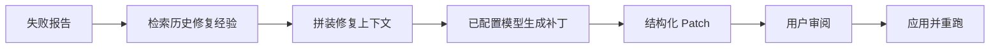

### 8.13 知识沉淀质量门

执行完成后，系统不会默认把每次执行直接写入向量库。因为环境错误、断言错误或误执行都可能污染后续 AI 修复知识。

当前机制是：

1. 执行完成后自动生成 `knowledge_ingest_candidate` 待处理项。
2. 用户查看执行报告，确认结果可信。
3. 点击“确认沉淀”。
4. 系统写入本地知识、向量库和 Neo4j 图谱。
5. 后续 AI 修复可检索复用这些经验。

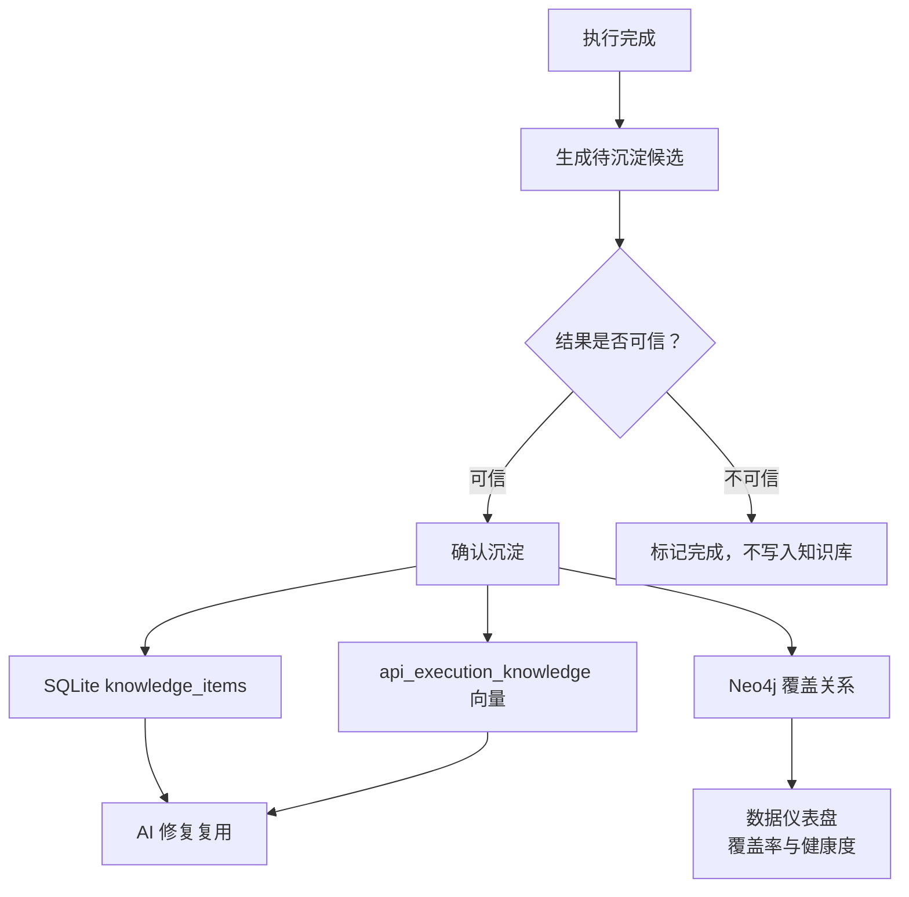

### 8.14 常见问题

| 问题 | 排查方向 |
|------|------|
| URL 解析失败 | 确认接口文档地址可访问，Swagger UI 页面优先确认 `/openapi.json` 是否存在 |
| 执行报 DNS 错误 | 检查 Base URL 是否拼写错误，例如 `localhost` 是否写成了 `locahost` |
| Agent 没有选中某个接口 | 检查接口是否被隐藏、废弃、移除、阻断，或是否属于高风险但未确认 |
| 前置登录没有执行 | 检查项目 `setup_steps` 是否保存成功，以及 Agent 生成的 DSL 是否包含登录步骤 |
| Token 没有注入 | 检查登录步骤的 `extractions` 名称是否和 `auth_config.token_variable` 一致 |
| 清理步骤没有执行 | 检查项目 `cleanup_steps` 是否保存成功；单步执行和失败步骤局部重跑不会自动执行清理步骤 |
| 同步后接口不见了 | 查看差异预览和接口状态，OpenAPI 中已移除的接口会被标记为 removed |
| 策略阻断执行 | 查看项目策略、接口白名单/黑名单、环境类型和接口风险等级 |
| AI 修复没有补丁 | 可能失败原因不适合自动修复，需要手工调整参数、环境或断言 |
| 覆盖率没有 API 数据 | 需要先确认执行结果可信并点击“确认沉淀”写入图谱关系 |
| 向量经验没有被复用 | 确认知识候选已沉淀，且向量库或本地知识检索中存在相似失败/修复记录 |

### 8.15 执行历史管理

执行历史位于「API 自动化」页面底部的「执行历史」区域，存储在 `backend/runtime/data/openmelon.db` 的 `runs` 表中。

**搜索与筛选**

| 控件 | 说明 |
|------|------|
| 项目下拉框 | 按项目过滤历史记录 |
| 执行状态下拉框 | 按状态筛选（通过/失败/执行中/排队中/已取消） |
| 搜索框 | 按 run_id、用例名称模糊搜索，回车或点击刷新生效 |
| 刷新按钮 | 重新拉取最新历史列表 |

**单条操作**

| 操作 | 说明 |
|------|------|
| 载入到编辑器 | 将该记录的 DSL 脚本载入阶段三编排工作台，可修改后重新执行 |
| 重跑 | 用原始执行参数重新执行该记录，结果覆盖原记录 |
| 受控修复 | 仅对失败记录可用，触发 AI 修复并重跑（受项目策略约束） |
| 删除记录 | 点击垃圾桶图标，弹出确认对话框后删除单条记录 |

**批量操作**

表格最左列为复选框，勾选后可进行批量操作：

1. 勾选一条或多条记录，或点击表头复选框全选当前页所有记录。
2. 表格上方出现红色操作栏，显示已选中数量。
3. 点击「批量删除」，弹出确认对话框，确认后一次性删除所有选中记录。

**清空全部历史**

搜索栏右侧有「清空全部」按钮：

1. 点击「清空全部」。
2. 弹出带红色警告标题的确认对话框。
3. 确认后，系统调用后端接口将 `runs` 表全部记录删除，并自动取消正在排队或执行中的任务。
4. 操作完成后页面自动刷新，显示清空条数。

> 执行历史删除不可撤销，且不影响已确认沉淀至知识库的内容。

**调度 / CI / 存储准备**

执行历史区顶部提供轻量运维入口：

| 操作 | 说明 |
|------|------|
| 触发定时执行 | 调用 `POST /api/api-execution/automation/scheduled-runs/trigger`，扫描已开启定时执行且允许 AI 执行的项目，并把符合策略的项目执行入队 |
| 同步规格 DSL | 调用 `POST /api/api-execution/automation/spec-sync/trigger`，对接口资产有变化的项目重新生成项目级 DSL |
| 迁移检查 | 调用 `GET /api/api-execution/storage/migration-readiness`，查看 SQLite 表规模、JSON 字段风险、PG JSONB 映射建议和执行历史归档策略 |
| CI 命令 | 页面展示对应 `curl` 命令，可放到流水线或外部调度系统中调用 |

当前没有内置常驻调度器；推荐由外部 CI、cron 或平台调度调用上述触发接口，仍由项目策略决定是否允许执行。

### 8.16 治理中心联动

「设置 -> 治理中心」是 API 自动化和知识沉淀后的日常维护入口，负责把待处理任务、知识状态、模板资产和资产健康集中到一个页面。它不是替代 API 自动化工作台，而是处理“跑完之后是否可信、是否沉淀、是否需要治理”的后半段。

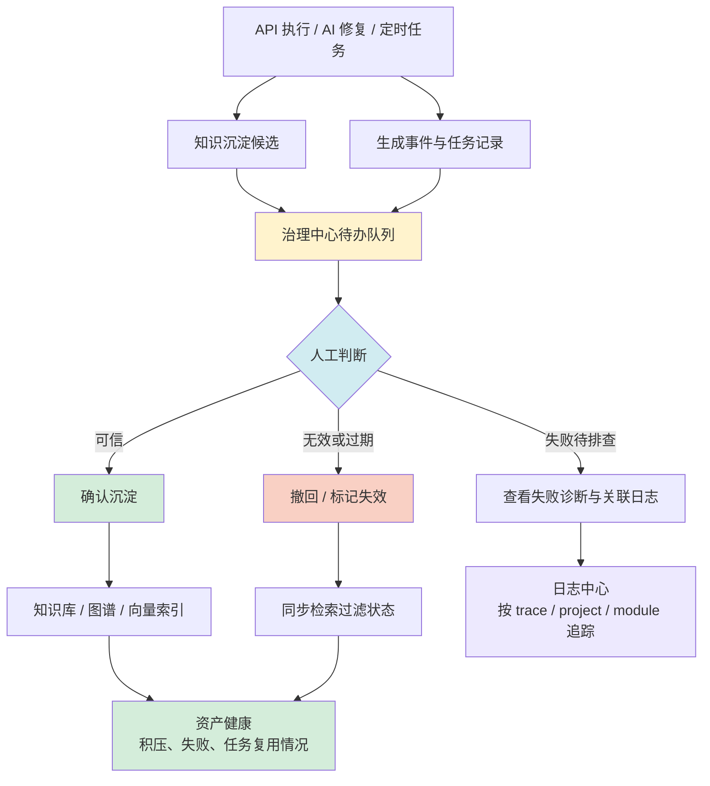

| 区域 | 主要用途 |
|------|------|
| 待办队列 | 处理待确认知识、失败诊断、策略阻断和定时任务异常 |
| 知识库 | 查看已沉淀、失效、撤回的 API 自动化知识资产 |
| 模板库 | 管理测试任务、复用片段和项目级模板资产 |
| 资产健康 | 查看积压、失败、写入异常和一致性风险 |

治理中心中的高风险动作不会静默执行；确认沉淀、撤回、删除、同步状态等操作都会写入日志中心，方便后续按项目、模块或 trace 追踪。

### 8.17 当前边界与 TODO

当前 API Agent 已经支持“项目接口资产 -> 模块/接口选择 -> Agent 推荐解释 -> 冒烟/负向 DSL -> 依赖发现与链路编排 -> 项目测试任务复用 -> 执行 -> Agent 诊断/修复 -> 结果回写”的闭环，但还不是完整自治 Agent。P4 已收口在配置体验、依赖图确认、失败诊断、调度/CI 入口和 SQLite/PG 迁移准备；后续增强建议放到 P5：

| 优先级 | TODO | 说明 |
|------|------|------|
| P5 | React Flow / vis-network 可视化编排 | 将当前轻量依赖图升级为可拖拽编辑、手动连线和复杂链路编排画布 |
| P5 | 语义级依赖学习 | 从响应 schema、历史成功链路和知识库持续学习更准确的前后置关系 |
| P5 | 参数组合策略 | 针对枚举、边界值、业务状态机生成更系统的组合用例 |
| P5 | 跨系统链路编排 | 支持多服务、多项目、多环境的端到端业务流自动编排 |

## 9. 数据仪表盘与覆盖率分析

### 9.1 数据来源

数据仪表盘当前聚合图谱覆盖率、API 自动化健康度，以及 UI 自动化概览占位。覆盖率核心仍基于 Neo4j 图谱中 `Module -[:CONTAINS]-> Feature` 和 `Module -[:CONTAINS]-> TestCase` 关系计算；API 自动化健康度来自执行历史、项目策略和已确认沉淀的知识资产。

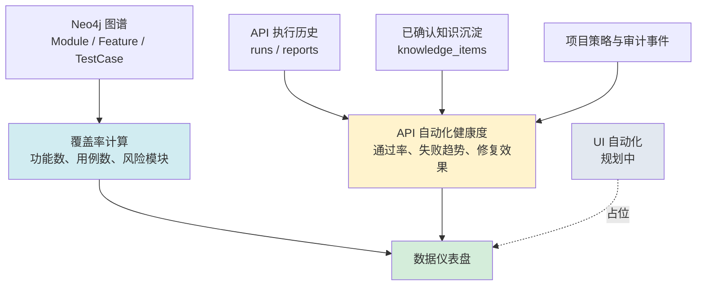

### 9.2 页面结构

| 区域 | 内容 |
|------|------|
| 左侧分区导航 | 在覆盖率视图、API 执行概览和 UI 自动化概览之间切换 |
| 覆盖率视图 | 模块总数、功能总数、用例总数、风险模块、平均覆盖率、覆盖率排行和模块明细 |
| API 执行概览 | 执行总数、通过率、失败分布、平均耗时、最近执行记录、失败诊断入口和任务统计 |
| UI 自动化概览 | 规划中，用于后续接入 UI 测试执行结果 |

### 9.3 状态标识

| 覆盖率 | 颜色 | 状态 |
|--------|------|------|
| ≥ 80% | 绿色 | 健康 |
| 50–79% | 黄色 | 关注 |
| < 50% | 红色 | 风险 |

### 9.4 API

```bash
curl http://localhost:8000/api/graph/coverage
```

### 9.5 索引治理

「索引治理」位于主导航中「数据仪表盘」之后，用于检查和治理业务源、Neo4j 图谱索引与 Qdrant 向量库之间的一致性。

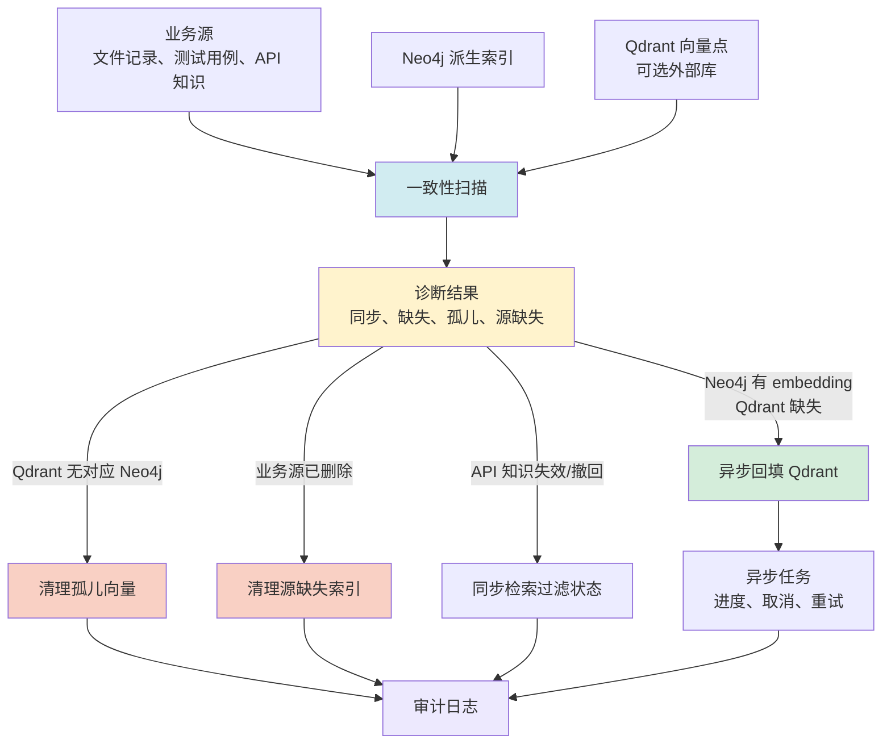

#### 9.5.1 适用场景

| 场景 | 建议操作 |
|------|------|
| 问答或测试生成召回不到预期知识 | 先执行「一致性扫描」，查看是否存在缺失向量或状态未同步 |
| Qdrant 中存在不再对应 Neo4j 节点的 point | 查看「孤儿」数量，确认后执行孤儿向量清理 |
| API 知识已被删除或撤回，但检索仍可能命中旧内容 | 执行「同步失效 / 撤回状态到检索过滤」或清理源缺失索引 |
| Neo4j 有 embedding，但 Qdrant 缺少向量点 | 点击对应资产的「重建」，启动 Qdrant 异步回填任务 |
| 需要排查具体差异样本 | 点击资产行的「明细」查看缺失向量和孤儿向量样本 |

#### 9.5.2 页面区域

| 区域 | 说明 |
|------|------|
| 顶部状态区 | 展示整体健康状态、Neo4j 索引节点数、Qdrant 向量点数、一致性风险和受控资产类型 |
| 数据流说明 | 展示业务源 → Neo4j → Qdrant → RAG 检索的治理链路 |
| 过滤区 | 按资产类型或关键词筛选文档知识、测试用例、API 自动化知识 |
| 异步任务 | 展示 Qdrant 重建任务的状态、进度、取消和失败重试入口 |
| 索引资产清单 | 对比业务源、Neo4j、Qdrant 的数量与明细差异 |
| 治理动作 | 提供状态同步、Qdrant 回填、孤儿向量清理等快捷操作 |
| 扫描结果 | 展示最近一次诊断结论和建议动作 |

#### 9.5.3 受控资产类型

| 资产 | 业务来源 | Neo4j | Qdrant | 说明 |
|------|------|------|------|------|
| 文档知识 | 导入管理 / 文档解析 | `DocumentChunk` | `doc_chunks` | 普通文档解析后的 chunk 索引 |
| 测试用例 | 测试用例生成结果 | `TestCaseVector` | `test_cases` | 点击「存入向量库」后的测试用例向量 |
| API 自动化知识 | API 执行候选确认沉淀 | `DocumentChunk` | `doc_chunks` | API 成功执行或修复经验经人工确认后的知识 |

#### 9.5.4 可执行治理动作

| 操作 | 作用 | 风险边界 |
|------|------|------|
| 一致性扫描 | 重新统计和诊断三边一致性 | 只读操作，不修改数据 |
| 明细 | 查看单个资产的缺失向量和孤儿向量样本 | 只读操作，最多返回前 100 条样本 |
| 同步失效 / 撤回状态 | 将 API 知识的 `invalid`、`revoked`、`deleted` 状态同步到 Neo4j/Qdrant 检索索引 | 不删除数据，只影响后续检索过滤 |
| 重建 | 从 Neo4j 已有 embedding 异步回填 Qdrant | 不重新生成 embedding，不删除业务记录；任务可取消和失败重试 |
| 清理孤儿 | 删除 Qdrant 中找不到对应 Neo4j 节点的 point | 删除向量点，不删除业务源和 Neo4j 节点 |
| 清理源缺失 | 删除 API 知识业务源已不存在的 Neo4j/Qdrant 派生索引 | 当前仅支持 API 自动化知识；确认后不可自动回滚 |

> 清理、重建、取消、重试都需要二次确认，并会写入日志中心的「索引治理」审计分类。

#### 9.5.5 异步重建任务

Qdrant 回填通过后台任务执行：

1. 点击资产行的「重建」。
2. 确认后任务进入「异步任务」区域。
3. 页面展示任务状态、已处理数量、总数和进度条。
4. 任务执行中可以点击「取消」；取消不会回滚已写入批次。
5. 任务失败或取消后可以点击「重试」重新发起。

#### 9.5.6 审计日志

索引治理动作会写入统一事件日志，可在「设置 -> 日志中心」按模块「索引治理」筛选。常见事件包括：

| 事件 | 说明 |
|------|------|
| `index_governance_scanned` | 一致性扫描完成 |
| `index_governance_status_synced` | API 知识状态同步完成 |
| `index_governance_orphans_cleaned` | 孤儿向量清理完成 |
| `index_governance_source_orphans_cleaned` | 源缺失索引清理完成 |
| `index_governance_qdrant_rebuild_queued` | Qdrant 重建任务已排队 |
| `index_governance_qdrant_rebuild_started` | Qdrant 重建任务开始 |
| `index_governance_qdrant_rebuilt` | Qdrant 重建任务完成 |
| `index_governance_qdrant_rebuild_failed` | Qdrant 重建任务失败 |

---

## 10. 导入管理

### 10.1 页面结构

**左侧 — 导入工作台**：
- 单文件/文件夹模式切换
- 拖拽上传区
- 文档类型和所属模块（可选）
- 上传进度条
- 待导入文件列表

**右侧 — 索引清单**：
- 统计卡片（索引文件数、分块总数、覆盖模块数）
- 筛选工具栏（日期、状态、搜索框）
- 文件列表（支持全选、批量操作）

### 10.2 可执行操作

| 操作 | 说明 |
|------|------|
| 重新索引 | 从 `backend/runtime/data/uploads/` 读取原始文件重新处理 |
| 删除 | 同步清理文件追踪记录、本地物理文件以及向量库（Qdrant）中的文档碎片。注意：出于知识沉淀与防止关系网断裂的考虑，该操作**不会**删除 Neo4j 中的关联图谱节点。 |
| 批量删除 | 勾选多个文件后一次性删除 |
| 生成用例 | 从已索引文件直接跳转到用例生成页面 |

---

## 11. 会话管理

问答页面顶部的"历史会话"区域支持多会话并行管理：

### 11.1 基本操作

| 操作 | 方式 |
|------|------|
| **新建会话** | 点击「+ 新建会话」按钮，或直接在输入框发送消息（自动创建） |
| **切换会话** | 点击会话列表中的任意一条 |
| **删除会话** | 鼠标悬停在会话上，点击 🗑 图标，弹出确认对话框后删除 |
| **重命名会话** | 鼠标悬停在会话上，点击 ✏️ 图标，输入新标题后按 Enter 保存 |
| **折叠/展开** | 点击「历史会话」标题，可折叠或展开会话列表 |

### 11.2 智能标题

- 系统自动将用户的**首条提问**（截取前 50 字）作为会话标题
- 会话列表按**最后更新时间倒序**排列，最新对话始终在最上方
- 每条会话显示相对时间（如"3分钟前"、"昨天"）和消息条数

### 11.3 相关 API

```bash
GET    /api/sessions                        # 获取会话列表（含 title, updated_at, message_count）
PATCH  /api/sessions/{session_id}/rename     # 重命名会话
DELETE /api/history/{session_id}             # 删除会话
GET    /api/history/{session_id}             # 获取会话聊天记录
```

> **注意**：会话数据存储在内存中，服务重启后丢失。会话历史仅用于前端展示和上下文追问，不参与知识检索。

---

## 12. 节点类型配置

### 12.1 类型分类

| 类别 | 说明 | 示例 |
|------|------|------|
| `fixed` | 系统固定类型，自动创建唯一约束 | Product, Module, Feature, API, TestCase, Defect, Person |
| `fallback` | 兜底类型（仅一个） | Entity |
| `extendable` | 动态扩展类型 | 用户自定义 |

### 12.2 配置管理

**服务端配置**：共享 SQLite `backend/runtime/data/openmelon.db` 中的 `graph_node_types` 表，通过「设置 > 节点类型配置」页面管理。

**初始化种子**：`backend/config/node_types.json` 仅在空库初始化时读取，不再作为页面 CRUD 的写入目标。

**前端样式覆盖**：存储在浏览器 `localStorage`，可调整填充色、边框色、尺寸。

**API 接口**：
```bash
GET    /api/graph/node-types            # 获取所有类型
POST   /api/graph/node-types            # 新增类型
PUT    /api/graph/node-types/{type}     # 更新类型
DELETE /api/graph/node-types/{type}     # 删除类型（保留类型不可删）
```

### 12.3 约束限制

- 保留类型不可删除：Product, Module, Feature, API, TestCase, Defect, Person, DocumentChunk, Entity
- 类型名必须以字母开头，仅含字母、数字、下划线
- 新增 `fixed` 类型后需重启服务以创建 Neo4j 唯一约束
- 前端样式覆盖优先于服务端默认配置

---

## 13. 系统监控、日志中心与 AI/RAG 观测

这一章分两层：文件日志用于排查后端进程级问题；日志中心和 AI/RAG 观测用于在页面内追踪业务事件、自动化任务和模型调用链路。

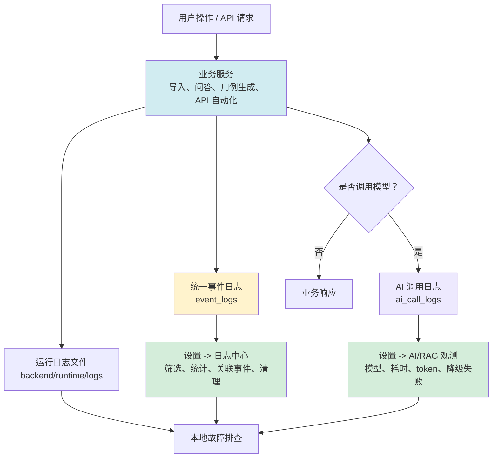

### 13.1 日志文件

| 文件 | 路径 | 内容 |
|------|------|------|
| 运行日志 | `backend/runtime/logs/openmelon.log` | 启动、请求、业务日志 |
| 错误日志 | `backend/runtime/logs/openmelon_error.log` | ERROR 级别 |
| 用例生成日志 | `backend/runtime/logs/openmelon.log` 中 logger 名为 `testcase_generator` 的记录 | 用例生成流水线日志 |

### 13.2 通过 API 查看日志

```bash
# 查看最近 100 行运行日志
curl "http://localhost:8000/api/logs?filename=openmelon.log&lines=100"

# 查看错误日志
curl "http://localhost:8000/api/logs?filename=openmelon_error.log&lines=100"

# 列出所有日志文件
curl http://localhost:8000/api/logs/list
```

### 13.3 OpenMelon 性能指标

```bash
curl http://localhost:8000/api/metrics
```

返回：总查询次数、成功率、平均/P95/P99 耗时、模型调用次数等。

```bash
# 重置指标
curl -X POST http://localhost:8000/api/metrics/reset
```

### 13.4 testcase_gen 性能监控

```bash
# 性能统计
curl http://localhost:8000/api/test-cases/performance/stats

# 缓存统计
curl http://localhost:8000/api/test-cases/performance/cache

# 清空缓存
curl -X DELETE http://localhost:8000/api/test-cases/performance/cache
```

### 13.5 请求日志格式

每个 HTTP 请求自动记录方法、路径、状态码和耗时：
```
POST /api/upload/async 200 8ms
GET /api/query 200 3200ms
```

### 13.6 本地运行期存储

OpenMelon 的本地运行期数据统一使用共享 SQLite 数据库：

| 文件 | 说明 |
|------|------|
| `backend/runtime/data/openmelon.db` | 本地运行期主库 |
| `backend/runtime/data/openmelon.db-wal` | SQLite WAL 日志文件 |
| `backend/runtime/data/openmelon.db-shm` | SQLite 共享内存辅助文件 |

当前写入共享 SQLite 的数据包括：

- API 自动化项目、环境、接口资产、执行记录、策略审计、自动化任务、知识候选和报告制品元数据
- 统一事件日志（`event_logs`）和 AI 调用观测日志（`ai_call_logs`）
- 导入管理的文件追踪记录（`file_records` 表）
- Prompt Hub 模板、技能、技能分类和版本元信息
- 图谱节点类型配置（`graph_node_types` 表）

旧 JSON 文件如 `backend/runtime/data/file_tracker.json`、`backend/runtime/data/prompt_hub.json` 等只作为空库初始化和迁移兼容源保留，正常写入不再回写 JSON。

> SQLite 主库和 WAL/SHM 文件属于运行期产物，已通过 `.gitignore` 排除，不应提交到代码仓库。

API 自动化已提供只读迁移准备检查：

```bash
curl "http://127.0.0.1:8000/api/api-execution/storage/migration-readiness"
```

该接口不会修改数据，会返回当前 SQLite 表规模、`runs` / `event_logs` / `ai_call_logs` 数量、JSON 字段风险、PG JSONB 映射建议和执行历史归档策略。当前推荐的迁移原则是：`project_id`、`status`、`run_at`、`method`、`path` 等稳定检索字段拆列，`script`、`results`、`execution_options`、OpenAPI 片段和扩展配置保留 JSONB；认证、环境变量和 headers 迁移前需要做敏感值扫描或改为 Secret 引用。

### 13.7 日志中心

「设置 -> 日志中心」读取共享 SQLite 中的统一事件日志，适合排查“某个操作发生了什么、是否被策略阻断、关联任务在哪一步失败”。

| 能力 | 说明 |
|------|------|
| 事件列表 | 按时间倒序查看执行、策略、任务、知识写入、索引治理等事件 |
| 多维筛选 | 按项目、模块、级别、事件类型、关键词和时间范围过滤 |
| 摘要统计 | 查看错误数、模块分布、事件类型分布和最近错误时间 |
| 关联事件 | 根据 trace、run、task、knowledge 等引用查找同一链路的相关事件 |
| 清理策略 | 按保留天数、最大行数、级别、项目和模块清理事件日志 |

日志保留默认由 `EVENT_LOG_RETENTION_DAYS` 和 `EVENT_LOG_MAX_ROWS` 控制，可在运行配置中心维护。错误级别事件会优先保留，避免关键故障被常规清理过早删除。

### 13.8 AI/RAG 观测

「设置 -> AI/RAG 观测」读取 `ai_call_logs`，用于确认模型调用是否命中预期 Provider、耗时是否异常、token 是否过高，以及是否发生降级或失败。

| 字段 | 用途 |
|------|------|
| feature / operation | 判断调用来自问答、索引、测试用例生成、API 修复等哪个能力 |
| model / provider | 确认实际调用模型和 Provider |
| latency / token | 分析耗时和 token 成本 |
| status / degraded | 判断是否成功、失败或进入降级路径 |
| trace_id | 与日志中心事件关联，串起完整请求链路 |

如果排查“模型没按预期生效”，建议顺序是：先看运行配置中心的当前值来源，再看 AI/RAG 观测里的实际调用记录，最后用日志中心按 trace 追踪上下游事件。

---

## 14. 故障排查

### 14.1 上传文件卡住

检查终端日志中的 `[upload-task]` 和 `[indexer]` 输出，定位卡在哪一步（解析/分块/Embedding/写入）。

### 14.2 向量维度不匹配

**错误**：`Index query vector has 1024 dimensions, but indexed vectors have 1536`

**原因**：之前用 OpenAI（1536 维）索引的数据，现在切换到 qwen（1024 维）。

**解决**：重启服务（自动重建索引），然后重新上传文件。

### 14.3 Neo4j 连接失败

```bash
# 检查状态
docker ps | grep neo4j

# 重启
docker compose up -d neo4j
```

### 14.4 Docker 启动时报 `node_types.json` 不存在

**错误**：`FileNotFoundError: /app/config/node_types.json`

**原因**：

- 生产模式镜像没有重新 build，容器还在跑旧镜像
- 或者当前没有使用带源码挂载的 Docker 开发模式
- 空 SQLite 库首次启动需要读取 `node_types.json` 作为初始化种子

**解决**：

```bash
# 开发模式
docker compose -f docker-compose.yml -f docker-compose.dev.yml up -d --build --force-recreate app

# 默认 Docker 模式
docker compose up -d --build --force-recreate app
```

然后检查容器内文件是否存在：

```bash
docker compose exec app ls -l /app/config
```

### 14.5 实体重复报错

**错误**：`IndexEntryConflictException`

已修复为 MERGE 模式，自动去重。如仍出现，手动检查 Neo4j 中是否有脏数据。

### 14.6 重新索引失败

确保原始文件存在于 `backend/runtime/data/uploads/` 目录中。上传时自动保存，手动删除后无法重新索引。

### 14.7 BGE Reranker 加载失败

可能原因：未安装依赖、首次下载模型超时、内存不足。

```bash
# 安装依赖
pip install FlagEmbedding>=1.3 sentence-transformers>=3.0

# 或禁用 Reranker
# .env 中设置: USE_RERANKER=false
```

> Reranker 加载失败不影响主流程，自动降级为无重排模式。

### 14.8 向量库不可用

**错误**：前端显示「向量库 不可用」

可能原因：
1. Neo4j 版本不支持 `db.index.vector.listIndexes()` 存储过程
2. 向量索引未创建成功

**解决**：更新后端代码（已兼容 Neo4j 5.x 的 `SHOW INDEXES` 语法），重启后端服务。

### 14.9 存入向量库失败

可能原因：`app.state` 获取 `_neo4j_writer` 方式错误。

**解决**：确保后端代码使用 `getattr(req.app.state, "_neo4j_writer", None)` 而非 `.get()` 方法。

---

## 15. 数据维护与清理

### 15.1 推荐入口：索引治理

常规情况下，请优先使用「索引治理」页面维护 Neo4j 与 Qdrant 的一致性：

- 用「一致性扫描」确认是否存在缺失向量、孤儿向量或源缺失索引。
- 用「明细」查看单个资产的差异样本。
- 用「重建」从 Neo4j 已有 embedding 异步回填 Qdrant。
- 用「清理孤儿」或「清理源缺失」处理明确可删除的残留索引。

只有在索引治理无法覆盖、需要直接操作底层数据库或做灾难恢复时，才建议使用下面的手工方式。

### 15.2 删除向量存储数据

系统采用分布式存储，不同类型的向量数据存储位置不同，请根据需要选择操作方案。

#### A. 文档分块向量 (Qdrant)
用于智能问答和 RAG 检索。

*   **可视化管理 (推荐)**: 
    访问 `http://localhost:6333/dashboard`，在 `doc_chunks` 集合下可直接通过 UI 搜索、过滤和删除特定 Point（向量点）。
*   **全量清空 (API)**:
    ```bash
    # 注意：这会彻底删除并清空 doc_chunks 集合
    curl -X DELETE "http://localhost:6333/collections/doc_chunks"
    ```
*   **按模块/文件删除 (API)**:
    ```bash
    curl -X POST "http://localhost:6333/collections/doc_chunks/points/delete" \
      -H "Content-Type: application/json" \
      -d '{
        "filter": {
          "must": [{"key": "module", "match": {"value": "待删除模块名"}}]
        }
      }'
    ```

#### B. 测试用例向量 (Neo4j)
用于相似用例加速检索和去重。

*   **可视化管理**: 
    访问 `http://localhost:7474` (Neo4j Browser)，使用 Cypher 语句进行操作。
*   **查询当前数量**:
    ```cypher
    MATCH (tc:TestCaseVector) RETURN count(tc)
    ```
*   **全量删除**:
    ```cypher
    MATCH (tc:TestCaseVector) DETACH DELETE tc
    ```
*   **按模块删除**:
    ```cypher
    MATCH (tc:TestCaseVector {module: '模块名'}) DETACH DELETE tc
    ```

> [!CAUTION]
> 删除操作不可逆。在执行全量删除前，请确保已备份重要数据或确认数据可再生（如可以通过重新导入文档或重新生成用例来恢复）。
