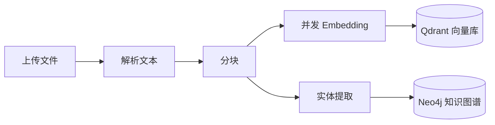
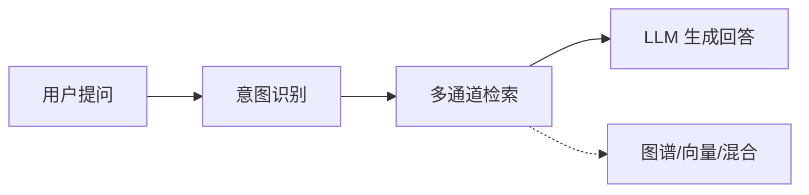
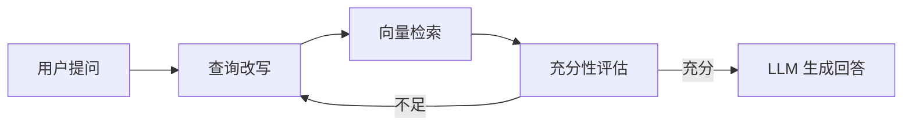
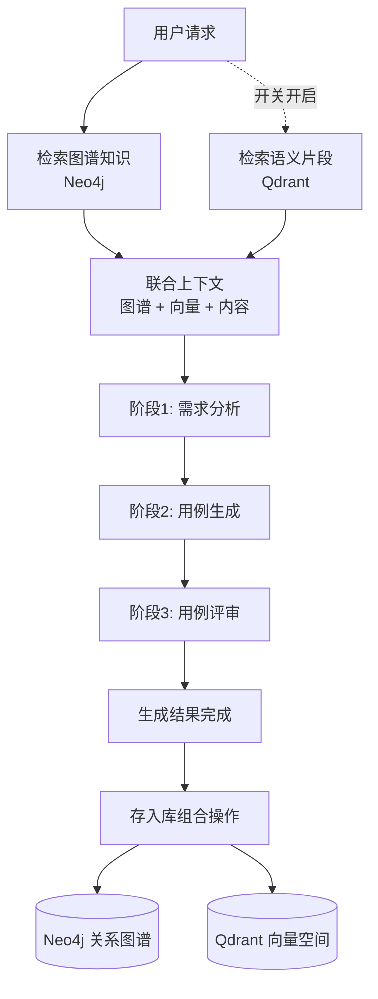

# OpenMelon

基于 **知识图谱 + 向量检索** 的智能文档问答系统，内置 AI 测试用例生成能力。

后端基于 FastAPI + Neo4j，前端基于 React + Material UI，使用 vis.js 渲染图谱，支持多种 LLM Provider 一键切换。

---

## 先看这里

如果你只想先把系统跑起来，推荐优先选下面两种方式之一：

### 方式 A：本机开发（`uv`）

```bash
cp .env.example .env
# 把 .env 里这 2 项先填好：
# LLM_PROVIDER=qwen
# API_KEY=你的大模型密钥

docker compose up -d neo4j
cd backend
uv sync
uvicorn app.main:app --reload --host 0.0.0.0 --port 8000
```

也可以按 3 个终端来启动：

```bash
# 终端 1：依赖服务
cd OpenMelon
docker compose up -d neo4j

# 如果启用了外部向量库，再执行：
docker compose up -d qdrant

# 终端 2：后端
cd OpenMelon/backend
uv sync
uvicorn app.main:app --reload --host 0.0.0.0 --port 8000

# 终端 3：前端
cd OpenMelon/frontend
npm install
npm run dev
```

### 方式 B：Docker 开发模式（后端热更新）

```bash
cp .env.example .env
# 把 .env 里这 2 项先填好：
# LLM_PROVIDER=qwen
# API_KEY=你的大模型密钥

docker compose build app
docker compose -f docker-compose.yml -f docker-compose.dev.yml up -d
docker compose logs -f app
```

Docker 开发模式只托管后端和依赖服务；前端仍建议在本机执行 `npm run dev`，这样刷新和调试体验更好。

然后打开新终端启动前端：

```bash
cd frontend
npm install
npm run dev
```

打开 `http://localhost:3000` 后，第一次建议按这个顺序体验：

1. 进入「导入管理」上传一个 PDF / Markdown / Word 文件
2. 等待文件状态变成“已索引”
3. 进入「问答」页面直接提问
4. 进入「图谱总览」查看自动生成的关系图
5. 进入「测试用例生成」体验 AI 自动出用例

如果你想看完整操作说明，请直接看 [`MANUAL.md`](MANUAL.md)。
如果你只想看页面演示流程，可以直接看 [`DEMO.md`](DEMO.md)。

---

## 核心特性

### 智能问答

- **意图路由**：LLM 自动识别用户问题意图，分为图谱查询、向量查询、混合查询和可视化四种模式
- **多通道检索**：根据意图自动选择最优检索方式，命中精度更高
- **Agentic RAG**：支持多步推理检索模式—自动改写查询、评估答案充分性、迭代检索（最多 3 轮）
- **BGE 重排序**：向量检索后使用 BGE Reranker 对候选文档二次评分，提升相关性
- **引用标注**：每个回答标注数据来源（图谱/向量）和检索方式

###  图谱可视化

- vis.js 实时渲染知识图谱，支持拖拽、缩放、节点高亮
- 实体搜索：输入实体名展示 2 度关系子图
- 多维筛选：按文档类型、模块名过滤，可选显示文档分块节点
- 悬浮式玻璃态详情面板，不占用画布空间

###  测试用例生成

- 基于 AutoGen 多智能体框架，三阶段流水线：**需求分析 → 用例生成 → 用例评审**
- 自动融合 Neo4j 图谱知识（模块结构、实体关系等），并通过开启 **参考检索** 进行局域网全库 Qdrant 语义相似检索
- 阶段时间线实时展示，流式输出生成过程并保存所有动态表单上下文
- 结果支持列表/导图视图切换、模块/优先级筛选
- 库双写机制：一键存入向量库，全自动同步落盘到图谱主库及向量辅助库中，供日后续写和复用
- 支持 Excel 和原生 XMind 脑图文件导出

###  覆盖率分析

- 基于图谱中 Module → Feature 和 Module → TestCase 关系自动计算
- 指标卡片 + 环形总览图 + 覆盖率排行 + 模块明细表

###  导入管理

- 支持 16 种文件格式（PDF/Word/Excel/XMind/PPT/Markdown/CSV/HTML 等）
- 单文件和文件夹两种导入模式
- 异步后台处理，上传后可切换页面不中断
- 文件追踪、重新索引、批量删除

###  其他

- **多 LLM 支持**：OpenAI / Qwen / DeepSeek / Mimo 一键切换
- **图谱与向量分离**：Neo4j 承载高密度的结构化知识图谱，结合独立的外部高性能向量库（如 Qdrant），提供兼顾速度与关系的联合检索引擎
- **企业通知**：钉钉、飞书、企微 Webhook 推送问答结果
- **独立日志**：OpenMelon 和 testcase_gen 各自独立日志，API 在线查看
- **节点类型配置**：前后端联动管理，支持新增/编辑/删除节点类型

---

## 技术栈

| 层级 | 技术 |
|------|------|
| 前端 | React 18 + Material UI 5 + vis.js + markmap + react-markdown |
| 后端 | Python 3.11 + FastAPI + Uvicorn |
| 数据库 | Neo4j 5.15（知识图谱，默认也可承载向量）+ Qdrant（可选外部向量库） |
| AI 框架 | OpenAI SDK + AutoGen 0.6（多智能体） |
| 文档解析 | PyMuPDF + python-docx + openpyxl + python-pptx + BeautifulSoup |
| 重排序 | FlagEmbedding（BGE Reranker） |
| 容器化 | Docker + Docker Compose |

---

## 快速开始

### 前置条件

- Python 3.11+
- Node.js 18+
- Docker（用于运行 Neo4j；如果启用外部向量库，也可直接启动 Qdrant）
- 一个可用的 LLM API Key（OpenAI / Qwen / DeepSeek / Mimo）

### 第一步：克隆项目并配置环境变量

```bash
git clone <repository-url>
cd OpenMelon

# 复制环境变量模板
cp .env.example .env

# 编辑 .env，至少设置以下两项：
# LLM_PROVIDER=qwen        （选择 LLM 提供商）
# API_KEY=sk-your-key       （填入 API Key）
```

> 建议新手第一次直接使用 `qwen` 或 `openai_compat`。
> `deepseek` / `mimo` 默认不提供 Embedding 模型，如需用于文档索引，请额外配置 Embedding 相关参数，详情见 [`MANUAL.md`](MANUAL.md) 和 [`.env.example`](.env.example)。

### 第二步：启动 Neo4j 数据库

```bash
docker compose up -d neo4j

# 等待 Neo4j 启动完成（约 15-30 秒）
docker ps | grep neo4j
# 确认 STATUS 显示 (healthy)
```

> 如果你准备把文档向量存到 Qdrant，请额外执行 `docker compose up -d qdrant`，并在 `.env` 中开启 `USE_EXTERNAL_VECTOR=true`。

### 第三步：安装 Python 依赖

```bash
# 推荐使用 conda 来提供隔离干净的 Python 环境
conda create -n openmlon python=3.11
conda activate openmlon

cd backend
# 选项 1：直接将依赖安装到当前 conda 环境（推荐目前用户）
uv pip install --system -r pyproject.toml

# 选项 2：如果不使用 conda，可直接在 backend 下执行
# uv sync
```

### 第四步：启动后端服务

```bash
cd backend
uvicorn app.main:app --reload --host 0.0.0.0 --port 8000
```

启动成功后会看到：
```
INFO: OpenMelon 服务启动中...
INFO: Neo4j 连接成功: neo4j://localhost:7687
INFO: OpenMelon 服务启动完成
INFO: Uvicorn running on http://0.0.0.0:8000
```

### 第五步：启动前端（开发模式）

```bash
# 打开新的终端窗口
cd frontend
npm install
npm run dev

# 访问 http://localhost:3000
# API 请求自动代理到后端 8000 端口
```

### 本地启动清单（推荐）

```bash
# 终端 1：项目根目录
docker compose up -d neo4j

# 可选：启用外部向量库时再执行
docker compose up -d qdrant

# 终端 2：后端
cd backend
uv sync
uvicorn app.main:app --reload --host 0.0.0.0 --port 8000

# 终端 3：前端
cd frontend
npm install
npm run dev
```

### 本机后端直跑

```bash
cd backend
uvicorn app.main:app --host 0.0.0.0 --port 8000
```

> 如果你在本机先执行了 `cd frontend && npm run build`，后端会自动挂载本地 `frontend/dist` 静态文件；这是本机便利用法，不属于 Docker 后端镜像的一部分。

### Docker 部署

#### Docker 开发模式（推荐后端高频迭代）

```bash
cp .env.example .env
# 编辑 .env 配置
docker compose build app
docker compose -f docker-compose.yml -f docker-compose.dev.yml up -d
```

> 开发模式会把本地 `backend/app` 和 `backend/config` 挂载到容器内，并以 `uvicorn --reload` 启动，适合频繁修改后端代码。
> 日常修改 Python 代码或 `backend/config/node_types.json` 时通常不需要重新 build；只有 `backend/pyproject.toml` 或 `uv.lock` 变更时才需要重新执行 `docker compose build app`。
> 如果你启用了 `USE_EXTERNAL_VECTOR=true`，还需要额外启动 `qdrant`。

#### Docker 生产模式

```bash
cp .env.example .env
# 编辑 .env 配置
docker compose up -d
```

> 生产模式只启动后端及依赖服务，不再包含前端静态资源。
> `docker compose up -d` 会同时启动 `neo4j`、`app` 和 `qdrant`，但只有在 `.env` 里开启 `USE_EXTERNAL_VECTOR=true` 时，后端才会真正使用 `qdrant`。
> 前端需要独立执行 `npm run dev`，或单独构建并部署到静态站点/Nginx。
> 独立部署时可通过 `frontend/.env.production` 中的 `VITE_API_BASE_URL` 指定后端地址，示例见 [docs/FRONTEND_DEPLOYMENT.md](/Users/xiabo/SoftwareTest/CarbonPy/OpenMelon/docs/FRONTEND_DEPLOYMENT.md)。

---

## 访问地址

| 服务 | 地址 | 说明 |
|------|------|------|
| 前端（本机开发） | http://localhost:3000 | Vite 开发服务器，API 自动代理到 8000 |
| 前端（独立部署） | 自行配置 | 建议独立部署到静态站点或 Nginx，API 指向 8000 |
| API 文档 | http://localhost:8000/docs | FastAPI Swagger UI，可在线测试后端接口 |
| Neo4j 浏览器 | http://localhost:7474 | 用户 `neo4j`，密码 `password` |
| Qdrant 控制台 | http://localhost:6333/dashboard | 启用外部向量库时可查看向量集合 |

---

## 启动成功怎么判断

| 检查项 | 成功表现 |
|------|------|
| 后端启动 | 终端出现 `OpenMelon 服务启动完成` |
| 前端启动 | 浏览器能打开 `http://localhost:3000` |
| Neo4j 正常 | `http://localhost:7474` 可以登录 |
| API 正常 | `http://localhost:8000/docs` 可以打开 Swagger 页面 |
| 文档索引正常 | 上传一个文件后，状态能变成“已索引” |

---

## 支持的 LLM Provider

| Provider | `.env` 值 | 默认 Chat 模型 | 默认 Embedding 模型 | 向量维度 |
|----------|-----------|---------------|-------------------|---------|
| 公司 OpenAI 兼容网关 | `openai_compat` | qwen-plus | text-embedding-v3 | 1024 |
| OpenAI 官方 | `openai` | gpt-4o-mini | text-embedding-3-small | 1024（通过 dimensions 统一） |
| 通义千问 | `qwen` | qwen-plus | text-embedding-v3 | 1024 |
| DeepSeek | `deepseek` | deepseek-chat | — | — |
| Mimo | `mimo` | mimo-v2-flash | — | — |

> **说明**：
> - `openai_compat` 模式默认使用 one-api 代理 (`https://one-api.miotech.com/v1`)，用于公司统一中转
> - `openai` 模式默认使用 OpenAI 官方地址 (`https://api.openai.com/v1`)
> - DeepSeek 和 Mimo 不提供 Embedding 模型，需搭配其他 Provider 的 Embedding
> - 详细配置说明见 [.env.example](.env.example)

---

## 数据流

### 写入流（文档索引）



### 读取流（智能问答）



### 读取流（Agentic RAG 多步推理）



### 测试用例生成流（图谱+向量双核驱动）



---

## 典型使用流程

```
1. 上传文档   → 导入管理页面拖拽上传，后台异步解析、分块、构建图谱
2. 智能提问   → 问答页面输入问题，系统自动选择最优检索方式生成回答
3. 探索图谱   → 图谱总览页按类型/模块筛选，点击节点查看详情
4. 生成用例   → 测试用例生成页面，上传文件或输入文本，三阶段流水线输出
5. 存入向量库  → 生成完成后一键存入，支持语义检索已有用例
6. 查覆盖率   → 覆盖率视图，查看模块级功能覆盖和风险模块
7. 管理配置   → 设置页面管理节点类型、颜色、前端样式
8. 查日志     → API 在线查看运行日志和错误日志
```

---

## 第一次使用建议

如果你完全不懂这个系统，建议按下面顺序使用：

| 你现在要做什么 | 去哪个页面 | 预期结果 |
|------|------|------|
| 先把资料喂给系统 | 导入管理 | 文件被解析并建立索引 |
| 想直接问问题 | 问答 | 得到带引用的答案 |
| 想看模块关系 | 图谱总览 | 看到节点和关系图 |
| 想让 AI 写测试用例 | 测试用例生成 | 得到可筛选、可导出的测试用例 |
| 想看哪些模块覆盖不足 | 覆盖率视图 | 看到高风险模块 |

---

## 核心结构

```text
OpenMelon/
├── backend/
│   ├── app/                          # FastAPI 后端主目录
│   │   ├── main.py                   # 应用入口 + 生命周期管理
│   │   ├── config.py                 # 环境配置（读取项目根目录 .env）
│   │   ├── api/                      # API 路由层
│   │   │   ├── routes.py             # 主 API 路由（统一聚合映射层）
│   │   │   ├── deps.py               # 全局依赖注入模块 (DI)
│   │   │   ├── routers/              # 按领域拆分的 5 大路由模块
│   │   │   ├── management_routes.py  # 文件管理路由
│   │   │   └── schemas.py            # Pydantic 请求/响应模型
│   │   ├── engine/                   # RAG 引擎核心
│   │   │   ├── intent/router.py      # 意图路由
│   │   │   ├── retrieval/multi_channel.py # 多通道检索
│   │   │   ├── rag/generator.py      # RAG 答案生成器
│   │   │   ├── agentic_rag.py        # Agentic RAG 多步推理
│   │   │   ├── reranker.py           # BGE Reranker 单例管理
│   │   │   └── reranker_config.py    # Reranker 环境配置
│   │   ├── storage/                  # Neo4j / 向量存储层
│   │   │   ├── neo4j_client.py       # Neo4j 驱动 + 索引初始化
│   │   │   ├── graph_ops.py          # 图谱 CRUD 操作
│   │   │   └── vector_ops.py         # 向量索引 + 相似度搜索
│   │   ├── services/                 # 业务服务层
│   │   │   ├── indexer.py            # 文档索引器
│   │   │   ├── file_parser.py        # 文件格式解析器
│   │   │   ├── file_tracker.py       # 文件追踪器
│   │   │   ├── upload_task_manager.py# 异步上传任务管理
│   │   │   ├── coverage.py           # 覆盖率分析
│   │   │   ├── session_manager.py    # 会话管理
│   │   │   ├── metrics.py            # 性能指标收集
│   │   │   └── enterprise_webhook.py # 企业通知
│   │   ├── models/                   # 领域实体模型
│   │   │   ├── graph_types.py        # 图谱节点类型定义
│   │   │   └── entities.py           # 实体模型
│   │   ├── testcase_gen/             # 测试用例生成子模块
│   │   │   ├── routers.py            # 用例生成 API 路由
│   │   │   ├── config.py             # 上传限制配置
│   │   │   ├── agents/               # AutoGen 多智能体
│   │   │   ├── services/             # 三阶段流水线服务
│   │   │   ├── middleware/           # 性能监控中间件
│   │   │   ├── models/               # 用例数据模型
│   │   │   ├── logs/                 # 用例生成日志
│   │   │   └── utils/                # LLM 客户端、缓存、鉴权等工具
│   │   ├── data/                     # 运行时数据
│   │   │   ├── uploads/              # 上传文件永久存储
│   │   │   └── file_tracker.json     # 文件索引追踪记录
│   │   ├── logs/                     # 运行日志
│   │   └── utils/logger.py           # 主日志配置
│   ├── config/
│   │   └── node_types.json           # 节点类型配置（前后端共享）
│   ├── docker/
│   │   └── Dockerfile                # 后端容器构建文件
│   ├── scripts/
│   │   ├── clear_vector_db.py        # 清理向量库脚本
│   │   └── migrate_vectors_to_qdrant.py # 向量迁移脚本
│   ├── pyproject.toml                # 现代 Python 依赖配置
│   ├── uv.lock                       # uv 环境高速锁定文件
│   └── .dockerignore                 # 后端镜像忽略规则
├── frontend/                         # React 前端应用
│   ├── src/
│   │   ├── App.jsx                   # 应用入口 + 路由
│   │   ├── pages/                    # 页面组件
│   │   ├── components/               # 通用组件
│   │   ├── services/api.js           # 后端 API 封装
│   │   ├── theme/nodeTypes.js        # 共享节点类型配置入口
│   │   └── utils/                    # 工具函数
│   ├── public/                       # 静态资源
│   ├── vite.config.js                # Vite 配置（含 API 代理）
│   ├── .env.production.example       # 前端生产环境变量示例
│   └── dist/                         # 生产构建产物
├── deploy/
│   └── nginx/openmelon-frontend.conf # 前端独立部署 Nginx 示例
├── docs/
│   ├── FRONTEND_DEPLOYMENT.md        # 前端独立部署说明
│   └── FRONTEND_MIGRATION_PLAN.md    # 前端迁移计划
├── docker-compose.yml                # 默认/生产式容器编排
├── docker-compose.dev.yml            # 开发态覆盖配置（挂载源码 + 热更新）
├── MANUAL.md                         # 完整操作手册
└── DEMO.md                           # 快速演示指南
```

## 运行时目录

```text
OpenMelon/
├── backend/app/data/                 # 后端运行时数据
│   ├── uploads/                      # 文档上传后长期保存的位置
│   └── file_tracker.json             # 索引文件追踪记录
├── backend/app/logs/                 # 后端运行日志
├── backend/app/testcase_gen/logs/    # 测试用例生成日志
├── backend/results/                  # 后端侧结果目录（运行时产物）
├── results/                          # 根目录导出的测试用例结果
├── uploads/                          # 根目录临时/历史上传文件
└── tests/                            # 预留测试目录
```

> 这些目录大多是运行过程中自动生成或持续写入的产物目录；排查日志、导出文件、重建索引时通常会用到。

---

## 文档导航

| 文档 | 内容 | 适合谁看 |
|------|------|---------|
| **README.md**（本文） | 项目概览、快速开始、技术栈、数据流 | 所有人 |
| **[MANUAL.md](MANUAL.md)** | 完整操作手册：架构详解、环境配置、功能说明、API 参考、运维排查 | 开发者、运维 |
| **[CHANGELOG.md](CHANGELOG.md)** | 项目版本的变更记录与架构优化历史归档 | 开发者、代码审核者 |
| **[DEMO.md](DEMO.md)** | 快速演示指南：分场景上手操作 | 新用户、演示 |
| **[docs/FRONTEND_DEPLOYMENT.md](/Users/xiabo/SoftwareTest/CarbonPy/OpenMelon/docs/FRONTEND_DEPLOYMENT.md)** | 前端独立部署：Nginx 示例、环境变量、常见问题 | 前端、运维 |
| **[deploy/nginx/openmelon-frontend.conf](/Users/xiabo/SoftwareTest/CarbonPy/OpenMelon/deploy/nginx/openmelon-frontend.conf)** | 前端独立部署用 Nginx 配置示例 | 运维 |
| **[.env.example](.env.example)** | 环境变量配置模板和详细注释 | 部署人员 |
