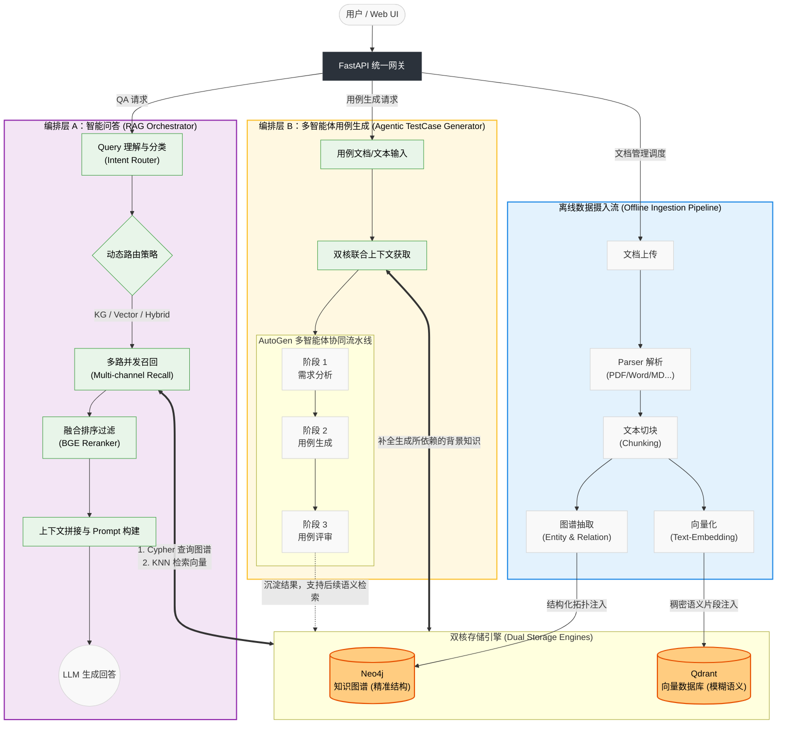
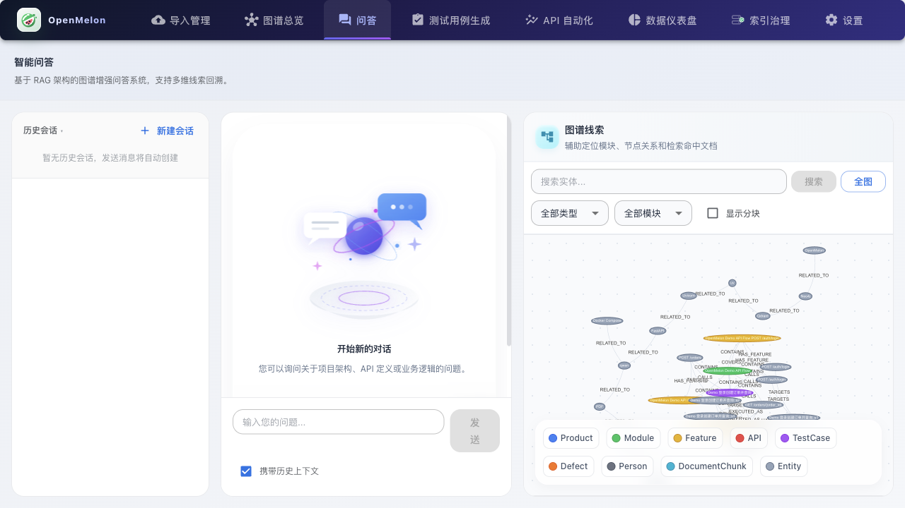
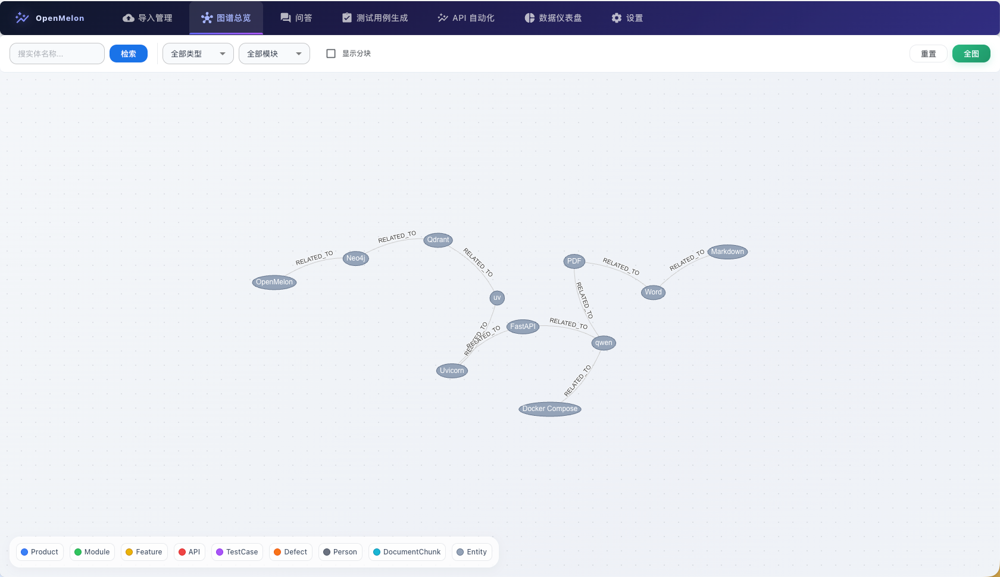
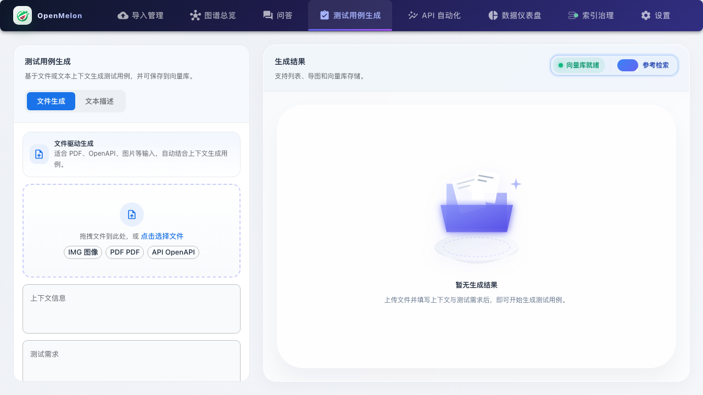
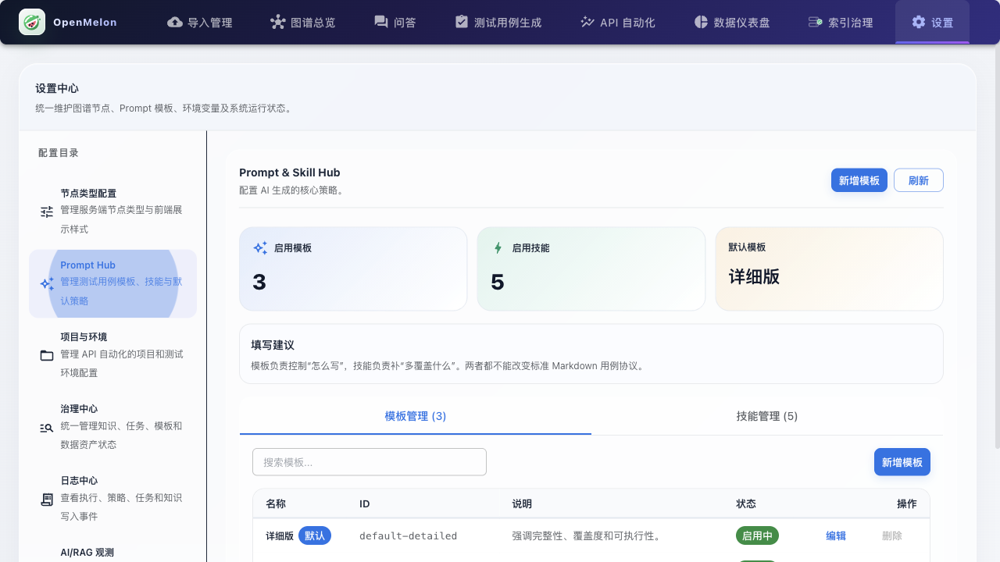

# OpenMelon

基于 **知识图谱 + 向量检索** 的智能文档问答系统，内置 AI 测试用例生成能力。

后端基于 FastAPI + Neo4j，前端基于 React + Material UI，使用 vis.js 渲染图谱，支持多种 LLM Provider 一键切换。

---

## 核心特性

- **多通道智能问答 (Agentic RAG)**：LLM 自动识别用户问题意图（图谱/向量/混合/可视化）。支持自动改写查询、评估答案充分性的多步推理，并搭配 BGE 重排序 (Reranker) 提升精度。所有回答均标注精确引用。
- **多智能体测试用例生成**：基于 AutoGen 的“需求分析 → 用例生成 → 用例评审”三阶段流水线。支持 Prompt Hub 动态配置模板与技能，生成结果自动“双写落盘”至图谱和向量库，支持导出 Excel/XMind。
- **动态图谱可视化**：vis.js 实时渲染，支持拖拽、缩放、节点高亮。支持多维筛选和 2 度关系子图探索。
- **自动化覆盖率分析**：基于图谱关系自动计算测试覆盖率，提供指标大屏与排序，快速定位高风险功能。
- **全格式文档解析与管理**：支持 16 种文件格式的解析（PDF/Word/Markdown/XMind 等），提供异步上传、文件追踪、重新索引及批量管理。
- **灵活的部署与配置**：支持 OpenAI / Qwen / DeepSeek / Mimo 等多 Provider；原生支持企业级通知 Webhook。

---

## 系统架构



---

## 快速开始

### 1. 前置准备
```bash
git clone <repository-url>
cd OpenMelon

# 配置环境变量
cp .env.example .env
# 必须编辑 .env 填写以下两项：
# LLM_PROVIDER=qwen
# API_KEY=你的大模型密钥
```
> 默认不提供 Embedding 的模型（如 DeepSeek）需额外配置 Embedding 参数，详见 [.env.example](.env.example)。

### 2. 启动服务（两种方式任选）

#### 方式 A：本机开发模式（推荐前端或快速调试）
```bash
# 启动依赖服务（图谱数据库）
docker compose up -d neo4j

# 启动后端
cd backend
uv sync
uvicorn app.main:app --reload --host 0.0.0.0 --port 8000

# 启动前端（新开终端）
cd frontend
npm install
npm run dev
```

#### 方式 B：Docker 容器模式（推荐纯后端迭代）
```bash
docker compose build app
docker compose -f docker-compose.yml -f docker-compose.dev.yml up -d
docker compose logs -f app

# 前端同样在本地启动
cd frontend && npm install && npm run dev
```

### 3. 访问系统
- **前端页面**: [http://localhost:3000](http://localhost:3000)
- **API 文档**: [http://localhost:8000/docs](http://localhost:8000/docs)
- **Neo4j 数据库**: [http://localhost:7474](http://localhost:7474)

---

## 使用指南

第一次进入系统，建议按以下顺序体验整个闭环：

| 体验顺序 | 对应页面 | 操作说明 |
|:---:|---|---|
| **1** | **导入管理** | 上传一份需求文档/代码架构图，等待状态变为“已索引” |
| **2** | **问答** | 针对上传的文档直接提问，查看系统给出的回答与引用来源 |
| **3** | **图谱总览** | 查看系统刚为你自动抽取生成的实体与关系图谱 |
| **4** | **测试用例生成** | 体验一键将刚才的文档转换为测试用例，并导出 Excel |
| **5** | **覆盖率视图** | 查看哪些模块缺少测试用例，直观发现风险点 |

### 界面概览

<details>
<summary>点击展开查看各页面截图</summary>

- **问答**：
- **图谱总览**：
- **测试用例生成**：
- **Prompt Hub**：
</details>

---

## 支持的 LLM Provider

| Provider | `.env` 值 | 默认 Chat 模型 | 默认 Embedding 模型 |
|----------|-----------|---------------|-------------------|
| 公司网关 | `openai_compat` | qwen-plus | text-embedding-v3 |
| OpenAI | `openai` | gpt-4o-mini | text-embedding-3-small |
| 通义千问 | `qwen` | qwen-plus | text-embedding-v3 |
| DeepSeek | `deepseek` | deepseek-chat | — |
| Mimo | `mimo` | mimo-v2-flash | — |

---

## 核心代码结构

```text
OpenMelon/
├── backend/app/
│   ├── api/             # FastAPI 路由映射与依赖注入
│   ├── engine/          # RAG 核心编排层（意图路由、多路召回、Rerank）
│   ├── storage/         # 存储底座（Neo4j 知识图谱与 Qdrant 向量库）
│   ├── services/        # 业务逻辑（文档解析、覆盖率计算等）
│   └── testcase_gen/    # 基于 AutoGen 的多智能体测试用例生成模块
├── frontend/src/        # React 前端代码
├── docs/                # 项目补充文档及截图资源
└── docker-compose.yml   # 容器编排文件
```

---

## 文档导航

想要深入了解系统？请查阅以下进阶文档：

| 文档 | 适用对象 | 核心内容 |
|------|---------|---------|
| **[MANUAL.md](MANUAL.md)** | 开发者、运维 | 完整操作手册：架构详解、环境配置、API 参考、运维排查与 Prompt Hub 指南 |
| **[CHANGELOG.md](CHANGELOG.md)** | 开发者 | 项目版本的变更记录与架构优化历史归档 |
| **[docs/FRONTEND_DEPLOYMENT.md](docs/FRONTEND_DEPLOYMENT.md)** | 运维 | 前端独立部署 Nginx 配置示例与环境变量说明 |
