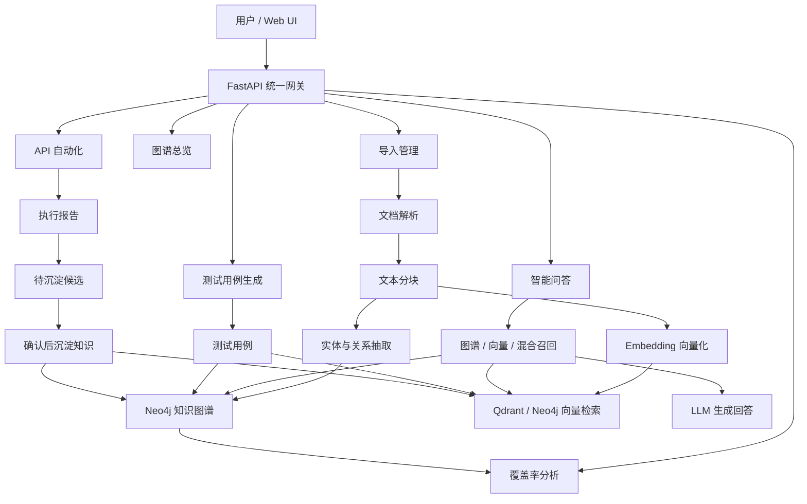
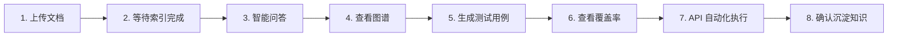
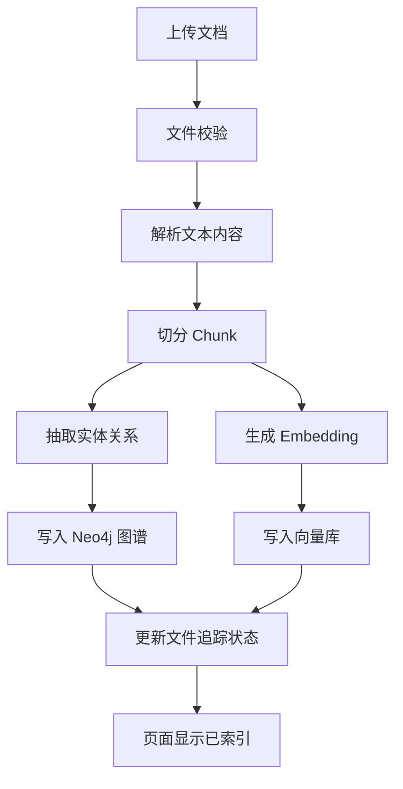
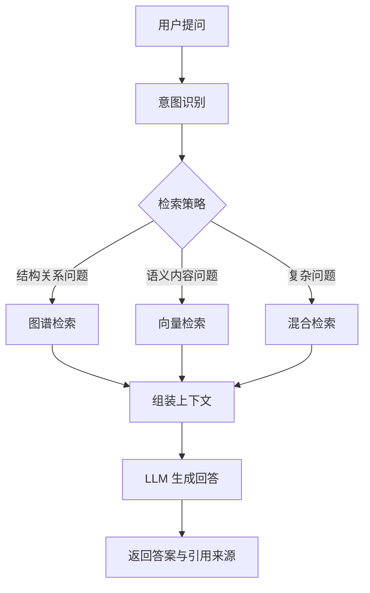
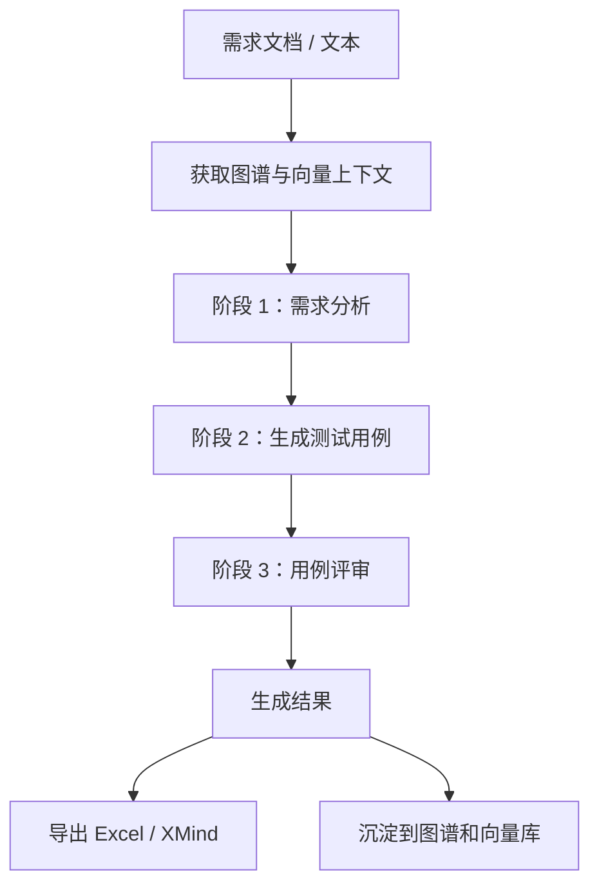
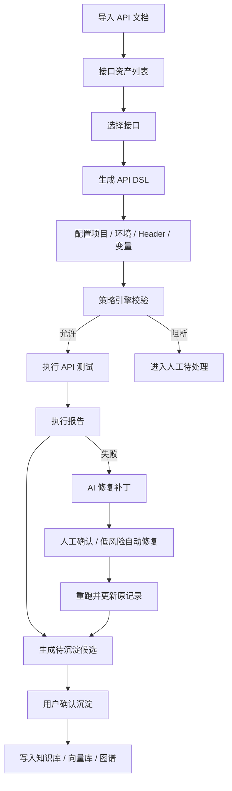
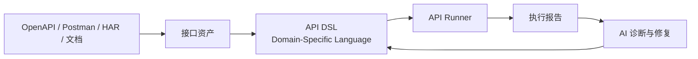
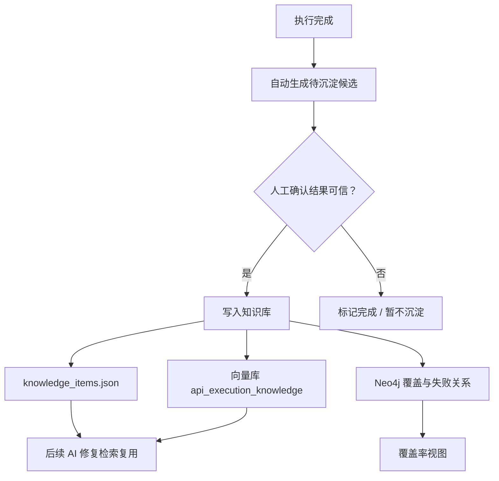

# OpenMelon 操作介绍与使用说明

本文基于 `README.md` 和 `MANUAL.md` 整理，面向第一次接触 OpenMelon 的用户、测试人员、产品/研发同学和演示讲解场景。目标是用一份更顺滑的内容说明：OpenMelon 是什么、能做什么、如何启动、进入系统后该按什么顺序操作。

---

## 1. 产品介绍

OpenMelon 是一个基于 **知识图谱 + 向量检索 + 大模型** 的智能文档问答与测试资产生成平台。

它可以把需求文档、设计文档、接口文档、测试资料等内容解析成可检索的知识，并进一步支持问答、图谱可视化、测试用例生成、覆盖率分析和自动化执行能力。

### 1.1 系统总览流程图



### 1.2 核心能力

| 能力 | 说明 |
|------|------|
| 智能问答 | 基于文档知识库提问，系统自动选择图谱检索、向量检索或混合检索，并返回带引用来源的回答 |
| 知识图谱 | 自动抽取文档中的模块、功能、接口、测试用例等实体关系，并以图谱方式展示 |
| 测试用例生成 | 基于文档、上下文和 Prompt Hub 模板/技能生成测试用例，支持导出 Excel / XMind |
| 覆盖率分析 | 根据图谱中的功能和测试用例关系计算模块覆盖率，帮助定位测试薄弱区域 |
| 文档管理 | 支持多种文档格式上传、索引、重新索引和删除维护 |
| Prompt Hub | 管理用例生成模板和技能，让生成风格、规则和审查要求可配置 |
| API 自动化 | 支持接口资产导入、DSL 生成、执行、报告、历史重跑、AI 修复和受控知识沉淀 |

### 1.3 适用场景

- 需求文档很多，需要快速问答和定位内容。
- 想把业务文档转换成测试用例。
- 希望通过图谱查看模块、功能、接口、用例之间的关系。
- 需要看哪些模块测试覆盖不足。
- 希望把接口文档转成可执行 API 自动化用例，并沉淀执行经验。

---

## 2. 启动与访问

### 2.1 本机开发模式

适合日常开发、前端调试和快速体验。

```bash
cp .env.example .env
# 至少填写：
# LLM_PROVIDER=qwen
# API_KEY=你的大模型密钥

docker compose up -d neo4j

cd backend
uv sync
uvicorn app.main:app --reload --host 0.0.0.0 --port 8000

cd ../frontend
npm install
npm run dev
```

### 2.2 Docker 开发模式

适合后端容器化调试。

```bash
cp .env.example .env
# 至少填写：
# LLM_PROVIDER=qwen
# API_KEY=你的大模型密钥

docker compose build app
docker compose -f docker-compose.yml -f docker-compose.dev.yml up -d
docker compose logs -f app
```

前端仍建议本机启动：

```bash
cd frontend
npm install
npm run dev
```

### 2.3 访问地址

| 地址 | 说明 |
|------|------|
| `http://localhost:3000` | 前端页面 |
| `http://localhost:8000/docs` | 后端 API 文档 |
| `http://localhost:7474` | Neo4j 管理页面 |

### 2.4 启动成功检查

| 检查项 | 正常表现 |
|------|------|
| 后端 | 日志出现 `OpenMelon 服务启动完成` |
| 前端 | 浏览器能打开 `http://localhost:3000` |
| API 文档 | `http://localhost:8000/docs` 可访问 |
| Neo4j | `http://localhost:7474` 可访问 |
| 文档索引 | 上传文件后状态能变为已索引 |
| 问答 | 提问后能返回回答和引用来源 |

---

## 3. 推荐体验路径

第一次使用建议按下面顺序体验完整闭环：

1. 进入「导入管理」，上传需求文档、接口文档或测试资料。
2. 等待文档状态变成“已索引”。
3. 进入「问答」，基于刚上传的文档提问。
4. 进入「图谱总览」，查看自动抽取出的实体和关系。
5. 进入「测试用例生成」，把文档内容转成测试用例。
6. 进入「覆盖率分析」，查看模块和用例覆盖情况。
7. 如需接口执行，进入「API 自动化」，导入接口文档并运行 API 用例。
8. 在执行确认有效后，沉淀执行知识，供后续 AI 修复复用。



---

## 4. 页面操作说明

### 4.1 导入管理

导入管理负责把文档资料进入系统。



常见操作：

- 上传 PDF、Word、Markdown、Excel、XMind 等文件。
- 查看文件索引状态。
- 对已上传文件重新索引。
- 删除不需要的文件记录。

建议：

- 第一次使用时先上传一份结构清晰的需求文档。
- 如果问答或图谱结果不完整，可以尝试重新索引。

### 4.2 问答

问答页面用于基于知识库直接提问。



常见操作：

- 输入业务问题、功能问题、接口问题或测试问题。
- 查看回答内容和引用来源。
- 通过会话历史继续追问。

系统会自动判断适合使用图谱检索、向量检索还是混合检索。

### 4.3 图谱总览

图谱总览用于查看知识结构。

常见操作：

- 浏览全图。
- 搜索实体名称。
- 按模块、文档类型或节点类型筛选。
- 点击节点查看详情。

适合用于理解系统自动抽取了哪些模块、功能、接口和测试资产。

### 4.4 测试用例生成

测试用例生成用于把需求或上下文转换为测试用例。



常见操作：

- 上传文件或输入文本。
- 选择模块。
- 选择 Prompt Hub 模板和技能。
- 生成测试用例。
- 导出 Excel 或 XMind。
- 将用例沉淀到图谱和向量库。

建议：

- 需求越清晰，生成质量越稳定。
- 可以通过 Prompt Hub 调整用例风格、字段要求和审查标准。

### 4.5 覆盖率分析

覆盖率分析用于查看模块、功能和测试用例覆盖关系。

常见操作：

- 查看各模块覆盖率。
- 按覆盖率排序。
- 进入模块详情查看功能和测试用例。

如果覆盖率为空，通常说明还没有足够的图谱关系或测试用例沉淀。

### 4.6 设置

设置页面用于管理系统规则。

常见操作：

- 管理节点类型。
- 管理 Prompt Hub 模板。
- 管理 Prompt Hub 技能。
- 调整生成规则和展示规则。

### 4.7 API 自动化

API 自动化用于把接口资产转成可执行测试。



常见操作：

- 导入 OpenAPI、Swagger UI、Postman Collection、HAR、Markdown/Excel/Word 接口文档或接口地址列表。
- 选择接口并生成 API DSL。
- 配置项目、环境、Base URL、Header、变量和策略。
- 单步执行、批量执行或后台执行。
- 查看执行报告和历史记录。
- 对失败记录生成 AI 修复补丁。
- 在低风险策略允许下受控自动修复重跑。
- 执行完成后生成“待沉淀候选”，确认后再写入知识库/向量库/图谱。

知识沉淀采用质量门机制：系统不会默认把每次执行直接写入向量库，避免错误执行污染 AI 修复经验。

---

## 5. API 自动化推荐流程

如果要体验接口自动化，可以按下面流程：

1. 在「API 自动化」页面导入接口文档。
2. 选择需要测试的接口。
3. 生成 API DSL。
4. 配置项目和环境。
5. 设置 Base URL、Header、变量和超时。
6. 运行单步或批量执行。
7. 查看执行报告。
8. 如果失败，先查看失败诊断。
9. 使用 AI 修复补丁生成建议。
10. 确认补丁后应用并重跑。
11. 执行结果可信后，在待处理队列中确认沉淀知识。

### 5.1 API DSL 在流程中的位置



### 5.2 知识沉淀质量门



---

## 6. 常见配置说明

### 6.1 大模型配置

`.env` 至少需要配置：

```bash
LLM_PROVIDER=qwen
API_KEY=你的大模型密钥
```

常见 Provider：

| Provider | `.env` 值 | 说明 |
|------|------|------|
| 公司 OpenAI-compatible 网关 | `openai_compat` | 适合公司统一代理 |
| OpenAI | `openai` | 使用 OpenAI 官方接口 |
| 通义千问 | `qwen` | 使用 DashScope 兼容接口 |
| DeepSeek | `deepseek` | 默认无 Embedding，需要额外配置 |
| Mimo | `mimo` | 使用 Mimo Provider |

### 6.2 Neo4j

Neo4j 是知识图谱底座，用于保存实体、关系、覆盖率和 API 执行覆盖关系。

默认地址：

```text
bolt://localhost:7687
```

### 6.3 Qdrant

Qdrant 是可选外部向量库。默认不开启。

只有在 `.env` 设置：

```bash
USE_EXTERNAL_VECTOR=true
VECTOR_PROVIDER=qdrant
```

才会启用外部向量库。未启用时，系统仍可使用 Neo4j 向量能力或本地 JSON 回退能力。

---

## 7. 运维与排查

### 7.1 后端启动失败

检查：

- `.env` 是否存在。
- `API_KEY` 是否填写。
- Neo4j 是否启动。
- Python 环境依赖是否完整。
- `http://localhost:8000/docs` 是否能打开。

### 7.2 Neo4j 连接失败

检查：

```bash
docker compose ps
docker compose logs neo4j
```

确认 `.env` 中：

```bash
NEO4J_URI=bolt://localhost:7687
NEO4J_USER=neo4j
NEO4J_PASSWORD=你的密码
```

### 7.3 问答没有结果

常见原因：

- 还没有上传并索引文档。
- 文档索引失败。
- 向量或图谱服务不可用。
- 问题与现有知识无关。

建议先到「导入管理」确认文件状态，再到「图谱总览」确认是否有实体关系。

### 7.4 覆盖率没有数据

常见原因：

- 图谱中还没有模块、功能、测试用例关系。
- 测试用例未沉淀。
- API 执行结果尚未确认沉淀。

可以先生成测试用例或确认 API 执行知识沉淀，再查看覆盖率。

### 7.5 API 自动化执行失败

检查：

- Base URL 是否正确。
- 目标服务是否启动。
- Header、Token、变量是否配置正确。
- 断言是否过严。
- 项目策略是否阻断了高风险接口。

可以使用 AI 修复补丁辅助定位，但是否应用和沉淀仍建议人工确认。

---

## 8. 演示讲解话术

可以用下面这段作为产品演示开场：

> OpenMelon 是一个面向测试和研发协作的智能知识与测试资产平台。它可以把需求、设计、接口和测试资料自动解析为知识图谱和向量知识库，支持基于文档的智能问答、图谱关系浏览、测试用例生成、覆盖率分析以及 API 自动化执行。系统不是只做一次性生成，而是把文档、用例、执行结果、失败诊断和修复经验持续沉淀下来，让后续问答、覆盖率分析和 AI 修复可以复用历史知识。

演示路径建议：

1. 上传文档，展示索引过程。
2. 进入问答，提一个与文档相关的问题。
3. 打开图谱总览，展示自动抽取的实体关系。
4. 进入测试用例生成，生成并导出用例。
5. 打开覆盖率分析，说明如何发现风险模块。
6. 进入 API 自动化，导入接口文档并执行。
7. 展示失败诊断、AI 修复补丁和确认沉淀知识。

---

## 9. 一句话总结

OpenMelon 的核心价值是：**把文档知识、测试用例、图谱关系、接口执行和修复经验连接起来，形成一个可查询、可生成、可执行、可沉淀的测试知识闭环。**
