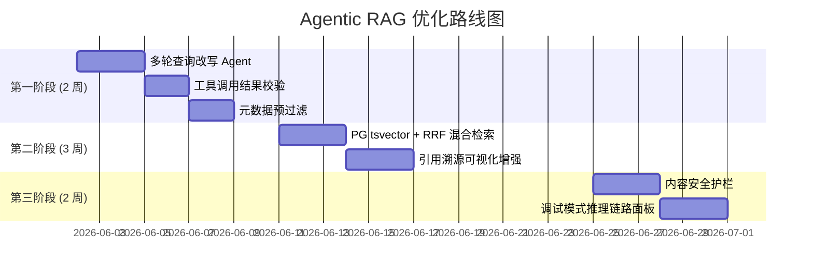

# Agentic RAG 深度优化 — 可行性方案

## 背景

当前 OpenMelon 的 RAG 管道已打通向量检索、知识图谱双引擎及流式生成，底层已具备：

- `MultiChannelRetriever`：并发执行向量 + 图谱检索，已集成 Cross-Encoder 重排序框架（`FlagReranker` / sidecar）
- `AgenticRAG`：多步推理、查询改写（基于上下文）与充分性自评
- `IntentRouter`：LLM 驱动的意图分类 + 实体抽取，路由到 `graph_query / vector_query / hybrid_query / visualization` 四类
- `RAGGenerator`：多轮对话历史注入（最近 6 条），流式 & 非流式双通道
- 基础的引用（Citation）跟踪与反馈存储（`useFeedbacks`, `setFeedback`）

以下方案按优先级与实施难度进行分组，每项均给出**改造切入点**、**最小可行方案（MVP）**与**产品价值评估**。

---

## 优先级排序

| 优先级 | 方向 | 估计工期 | 产品价值 | 实施难度 |
|--------|------|----------|----------|----------|
| P0 | 多轮查询改写 Agent | 3 天 | ⭐⭐⭐⭐⭐ | 低 |
| P1 | 工具调用结果校验 | 2 天 | ⭐⭐⭐⭐ | 低 |
| P1 | BM25 + 向量混合检索（PostgreSQL tsvector） | 3 天 | ⭐⭐⭐⭐⭐ | 低 |
| P2 | 元数据预过滤 | 2 天 | ⭐⭐⭐ | 低 |
| P2 | 引用溯源可视化增强 | 3 天 | ⭐⭐⭐⭐ | 中 |
| P3 | 调试模式推理链路面板 | 3 天 | ⭐⭐⭐ | 中 |
| P3 | 内容安全护栏 | 3 天 | ⭐⭐⭐⭐ | 中 |

---

## P0 — 多轮对话查询改写 Agent（指代消解）

### 当前问题
`IntentRouter.classify_intent` 接收**单轮孤立问题**；`AgenticRAG._rewrite_query` 仅在多步检索失败后改写，且改写 prompt 不感知对话历史，无法处理"它"、"那个"等指代词。

### 改造方案
在 `intent/router.py` 增加 `rewrite_with_history(question, chat_history)` 方法，在 IntentRouter 进入检索前**优先运行指代消解**：

```python
# engine/intent/router.py 新增
async def rewrite_with_history(self, question: str, chat_history: list[dict]) -> str:
    """多轮指代消解：结合历史改写问题为自完备的独立查询句。"""
    if not chat_history:
        return question

    # 取最近 6 轮历史拼成对话文本
    history_text = "\n".join(
        f"{'用户' if m.get('role') == 'user' else '助手'}: {m.get('content', '')}"
        for m in chat_history[-6:]
    )
    system_prompt = (
        "你是一位查询改写专家。根据下面的对话历史，将用户最新问题中的所有指代词（如'它'、'那个'、'这些'）"
        "替换为具体的实体名称，使问题能够独立被理解。若问题本已完整，则原样返回。只返回改写后的问题，不要解释。"
    )
    user_message = f"对话历史:\n{history_text}\n\n当前问题: {question}\n\n改写后的独立问题:"
    try:
        resp = await call_llm_with_retry(
            self.openai_client,
            model=settings.CHAT_MODEL,
            messages=[
                {"role": "system", "content": system_prompt},
                {"role": "user",   "content": user_message},
            ],
            temperature=0.1,
            max_tokens=256,
        )
        rewritten = resp.choices[0].message.content.strip()
        return rewritten if rewritten else question
    except Exception:
        return question
```

在 `knowledge_rag/facade.py`（或主查询路由）调用该方法：

```python
# 在调用 retriever.retrieve() 之前插入
question_for_retrieval = await intent_router.rewrite_with_history(question, chat_history)
intent = await intent_router.process(question_for_retrieval)
# 后续以 question_for_retrieval 作为检索 query，以原始 question 作为生成入参
```

### 产品价值
用户可以像在 Claude/GPT 中一样自然追问，"它的安全风险是什么？""那个接口还有哪些参数？"等自然语言均能被正确展开，多轮对话体验从「能用」直接跳跃到「自然」。

---

## P1 — 工具调用结果校验与故障降级

### 当前问题
`AgenticRAG.query` 在检索后直接使用原始 chunks，若向量库返回空或异常内容，会直接影响最终生成质量甚至产生幻觉。

### 改造方案

在 `agentic_rag.py` 增加 `_validate_retrieval_result(result)` 守卫：

```python
def _validate_retrieval_result(self, chunks: list) -> tuple[bool, str]:
    """
    校验检索结果，返回 (is_valid, reason)。
    空集、内容过短、重复率超阈值均视为无效。
    """
    if not chunks:
        return False, "empty_results"
    
    valid_chunks = [
        c for c in chunks
        if isinstance(c.get("content"), str) and len(c["content"].strip()) > 30
    ]
    if not valid_chunks:
        return False, "low_quality_content"
    
    # 去重检测：若所有 chunk 内容几乎相同则降级
    unique_contents = set(c["content"][:100] for c in valid_chunks)
    if len(unique_contents) < max(1, len(valid_chunks) // 2):
        return False, "high_duplication"

    return True, "ok"
```

在检索失败时执行**策略切换**：
- 向量检索结果无效 → 自动降级到图谱检索（`graph_query`）
- 图谱也无效 → 回答"当前知识库中未找到相关信息，建议检查知识入库状态"，而非幻觉作答

### 产品价值
从根本上杜绝因检索层空结果导致的"AI 编造答案"问题，提升回答可信度。在知识库未覆盖的领域，AI 会明确告知而非胡说。

---

## P1 — PostgreSQL tsvector + 向量混合检索（Hybrid Search）

### 当前问题
`vector_retrieve` 仅依赖 Embedding 余弦相似度，对专业缩写（如 API 名称、错误码）的精确匹配较弱，关键词检索能有效补充。

### 改造方案（分三步实施）

**Step 1 — PG 全文检索索引**

PostgreSQL 已是项目依赖（`psycopg` 已安装，`DATABASE_URL` 已配置）。在文档入库时同步维护 `tsvector` 列：

```sql
-- 在现有 document_chunks 表上扩展
ALTER TABLE document_chunks ADD COLUMN IF NOT EXISTS tsv tsvector;
CREATE INDEX IF NOT EXISTS idx_chunks_tsv ON document_chunks USING GIN(tsv);

-- 中文按字符拆分 + 英文按空格拆分（simple 配置即可覆盖中英混合场景）
UPDATE document_chunks SET tsv = to_tsvector('simple', coalesce(content, ''));

-- 新数据入库时自动更新（触发器）
CREATE OR REPLACE FUNCTION chunks_tsv_trigger() RETURNS trigger AS $$
BEGIN
  NEW.tsv := to_tsvector('simple', coalesce(NEW.content, ''));
  RETURN NEW;
END;
$$ LANGUAGE plpgsql;

CREATE TRIGGER trg_chunks_tsv
  BEFORE INSERT OR UPDATE OF content ON document_chunks
  FOR EACH ROW EXECUTE FUNCTION chunks_tsv_trigger();
```

**Step 2 — 关键词检索服务**

```python
# engine/retrieval/pg_bm25_retriever.py（新建）
class PGBM25Retriever:
    """PostgreSQL tsvector 全文检索，无需外部依赖。"""

    def __init__(self, db_pool):
        self._pool = db_pool

    async def search(self, query: str, top_k: int = 10) -> list[dict]:
        tsquery = " & ".join(query.split())  # 空格分词，AND 连接
        sql = """
            SELECT filename, chunk_index, doc_type, module, content,
                   ts_rank(tsv, query) AS rank
            FROM document_chunks,
                 plainto_tsquery('simple', %s) AS query
            WHERE tsv @@ query
            ORDER BY rank DESC
            LIMIT %s
        """
        async with self._pool.connection() as conn:
            rows = await conn.execute(sql, (query, top_k))
            return [dict(r) for r in rows]
```

**Step 3 — RRF 融合（Reciprocal Rank Fusion）**

在 `MultiChannelRetriever` 中新增 `hybrid_vector_bm25_retrieve()`，将向量检索排名和 tsvector 排名通过 RRF 公式融合：

```python
# engine/retrieval/multi_channel.py 新增方法
async def hybrid_vector_bm25_retrieve(self, question: str, top_k: int = 10) -> dict:
    vector_results = await self.vector_retrieve(question, top_k=top_k * 2, use_reranker=False)
    bm25_results = await self.pg_bm25_retriever.search(question, top_k=top_k * 2)

    scores: dict[str, float] = {}
    doc_map: dict[str, dict] = {}
    K = 60

    for rank, chunk in enumerate(vector_results.get("chunks", [])):
        key = f"{chunk.get('filename')}#{chunk.get('chunk_index')}"
        scores[key] = scores.get(key, 0) + 1 / (K + rank + 1)
        doc_map[key] = chunk

    for rank, chunk in enumerate(bm25_results):
        key = f"{chunk.get('filename')}#{chunk.get('chunk_index')}"
        scores[key] = scores.get(key, 0) + 1 / (K + rank + 1)
        doc_map[key] = chunk

    merged = sorted(scores.items(), key=lambda x: x[1], reverse=True)
    final_chunks = [doc_map[k] for k, _ in merged[:top_k]]

    # 再经现有 Cross-Encoder reranker 精排
    if settings.USE_RERANKER and final_chunks:
        contents = [c.get("content", "") for c in final_chunks]
        rerank_results = await reranker.rerank(question, contents, top_k=min(settings.RERANKER_TOP_K, len(final_chunks)))
        if rerank_results:
            final_chunks = [final_chunks[i] for i, _ in rerank_results]

    return {"chunks": final_chunks, "context_text": "\n\n".join(c.get("content", "") for c in final_chunks)}
```

### 与原 BM25 方案对比

| 维度 | 原方案（rank_bm25 + jieba） | 新方案（PG tsvector） |
|------|---------------------------|---------------------|
| 额外依赖 | `rank_bm25` + `jieba` Python 包 | 零 -- PostgreSQL 已有 |
| 索引维护 | 内存中，需手动 build/refresh | 触发器自动，入库即更新 |
| 分词质量 | jieba 中文分词（精确） | `simple` 按字符拆分（够用） |
| 数据规模 | 万级 OK，超 10 万需 ES | 千万级 OK |
| 运维成本 | 内存占用随数据增长 | PG 索引，已有运维体系 |
| 查询延迟 | 内存计算 < 1ms | GIN 索引 < 5ms（万级数据） |

### 产品价值
对精确术语（API 名称、错误码、方法名）的召回准确率预计提升 15–30%，且零额外基础设施依赖。

---

## P2 — 元数据预过滤

### 当前问题
`vector_ops.similarity_search` 未使用 Qdrant 的 `filter` 参数，所有文档类型混合在同一个 collection 中参与检索，跨领域干扰明显。

### 改造方案

在 `MultiChannelRetriever.retrieve()` 增加 `metadata_filter` 参数透传：

```python
# 检索时传入 Qdrant filter 条件
filter_condition = None
if doc_type_hint:  # 由 IntentRouter 或用户指定
    filter_condition = {
        "must": [{"key": "doc_type", "match": {"value": doc_type_hint}}]
    }
results = await self.vector_ops.similarity_search(
    embedding, top_k=top_k, filter=filter_condition
)
```

同时在前端「对话窗口」顶部增加轻量级的**检索范围选择器**（可选的 Chip 组），如："全部 / 接口文档 / 设计文档 / 用例"，方便用户主动缩小范围。

### 产品价值
用户查询"登录接口的参数"时，系统只在接口文档范围内检索，避免将设计文档或用例中的"登录"相关内容混入，答案精准度显著提升。

---

## P2 — 引用溯源可视化增强

### 当前问题
后端已返回 `citations`（含 source_type、filename、doc_type、chunk_index），前端在 `MessageBubble.jsx` 中以 Chip 形式展示，但缺少完整的文档片段内容预览，用户点击 Chip 后无法查阅原文。

### 改造方案

**后端**：在 `/query/stream` 响应末尾以 SSE 特殊帧附加引用片段预览（content 截取前 300 字符）：

```
data: {"type": "citations", "data": [{"idx": 1, "source": "...", "preview": "...前300字..."}]}
```

**前端 `MessageBubble.jsx`**：将 Citation Chip 改造为可展开的抽屉（`Collapse`），点击后显示原文片段预览并高亮关键词。

现有的「点赞/踩」功能已存在（`ThumbUpOutlined / ThumbDownOutlined`），可在后续直接接入微调反馈收集管道，无需二次开发。

### 产品价值
让 AI 的答案从"黑盒输出"变为"有据可查"，是 RAG 产品建立用户信任最直接的手段，也是后续基于反馈数据优化排序模型的数据来源基础。

---

## P3 — 调试模式：Agent 推理链路面板

### 当前问题
`AgenticRAG.query` 已生成 `reasoning_steps`（步骤 + 充分性分数），但前端仅通过「展开推理步骤」Button 以纯文本展示，无法直观看到 Thought → Action → Observation 的完整链路。

### 改造方案

**后端**：在流式响应前注入 `__debug__` 元数据帧，包含完整的推理链路 JSON：

```json
{
  "type": "debug",
  "trace": [
    {"step": 1, "thought": "用户查询较宽泛，先用向量检索", "action": "vector_retrieve", "query": "...", "observation": "找到 8 个 chunk，充分性 0.62"},
    {"step": 2, "thought": "充分性低于阈值，尝试改写查询", "action": "query_rewrite", "query": "OpenMelon Qdrant 索引治理模块重建逻辑", "observation": "找到 5 个 chunk，充分性 0.91 > 0.85，停止迭代"}
  ],
  "intent": "vector_query",
  "rewritten_query": "...",
  "total_chunks": 13,
  "retrieval_latency_ms": 342
}
```

**前端**：在 `MessageBubble.jsx` 助手消息底部新增「查看推理链路」Toggle，展开一个 Timeline 型可视化面板（MUI `Stepper` 或自定义 Timeline）。

### 产品价值
核心受益者是开发者与系统管理员，能在几十秒内定位"答非所问"的根因（是意图识别错误？还是检索召回不足？或是改写 Agent 未生效？），大幅降低 RAG 系统的调试成本。

---

## P3 — 内容安全护栏（Output Safety Guard）

### 当前问题
在测试用例生成等高风险场景下，模型输出可能（低概率）包含密钥泄露、恶意 Payload 等内容，当前没有后置过滤。

### 改造方案

在 `RAGGenerator.generate_answer` 和 `generate_answer_stream` 的最终输出节点后增加**轻量规则过滤层**（无需调用额外 LLM）：

```python
# utils/safety_guard.py（新建）
import re

_PATTERNS = [
    # API Key / Token 泄露
    (r"(?i)(sk-[a-z0-9]{20,}|eyj[a-z0-9_-]{10,})", "masked_token"),
    # SQL/NoSQL 注入特征
    (r"(?i)(drop\s+table|delete\s+from|;\s*--)", "injection_attempt"),
    # 私钥结构
    (r"-----BEGIN (RSA|EC|OPENSSH) PRIVATE KEY-----", "private_key"),
]

def scan_and_sanitize(text: str) -> tuple[str, list[str]]:
    """扫描文本并脱敏，返回 (处理后文本, 触发规则列表)。"""
    triggered = []
    for pattern, label in _PATTERNS:
        if re.search(pattern, text):
            triggered.append(label)
            text = re.sub(pattern, "[REDACTED]", text)
    return text, triggered
```

对于复杂语义安全（如有害内容生成），可选择接入 OpenAI Moderation API 或 `alibaba-nlp/gte-guard` 等开源模型作为可选 sidecar 服务，通过 `SAFETY_GUARD_URL` 环境变量挂载，与现有 reranker sidecar 模式一致。

---

## 实施路径建议



## 开放问题

> [!IMPORTANT]
> 1. **tsvector 分词精度**：PostgreSQL `simple` 配置按字符拆分，中英文混合场景够用，但对专业术语（如 `QaFeedbackStore`）会拆成单字符。如需更精确分词，后续可加装 `pg_jieba` 或 `zhparser` 扩展。
> 2. **查询改写的 Token 消耗**：每次提问前调用一次改写 LLM 会增加约 500–1000 Token 的消耗（约 0.001 美元 / 次）。是否可以接受这个额外开销，或者是否应该加一个"仅在检测到指代词时才改写"的判断？
> 3. **安全护栏的范围**：规则过滤 + Moderation API 的方案是否满足需求？还是有更严格的合规要求（如 ISO/SOC 标准），需要引入专用安全模型？
